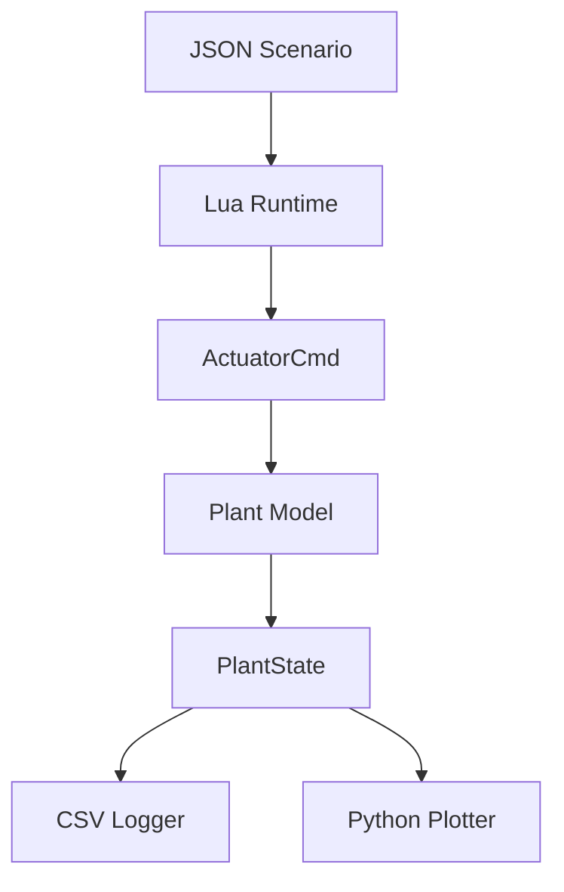
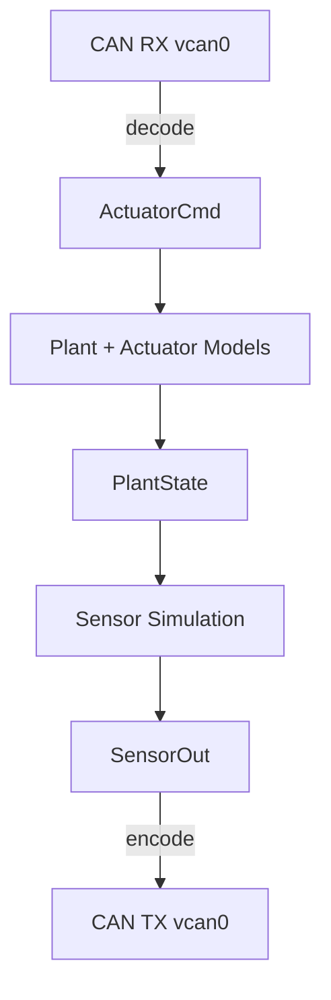
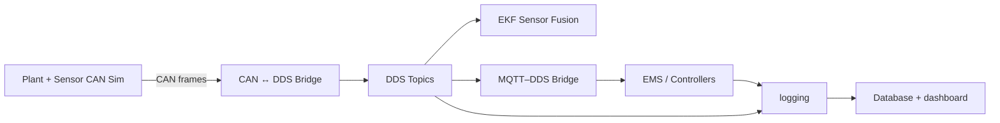

# Plant–Sensor–CAN Simulation (C++)

This repository implements a **deterministic plant + sensor simulation framework** built around
**SocketCAN (vCAN)**, with a clean separation between:

- **Plant / actuator dynamics (truth)** - Vehicle physics, battery, motors
- **Sensor simulation (measurements)** - IMU, GNSS, wheel speeds, radar
- **CAN encode/decode utilities (CSV-driven)** - No hardcoded frames
- **JSON scenario system** - Test scenarios without recompiling

The goal is to support a smooth progression from:
**pure software simulation → SIL → HIL → DDS/EMS integration**
without rewriting core logic.

---

## Current Status

✅ **Complete:**
- Kinematic bicycle model with Ackermann steering
- Longitudinal dynamics (motor torque, braking, resistive forces)
- Battery plant with SOC tracking and regenerative braking
- JSON-driven scenario system (Lua runtime)
- CSV logging and Python visualization
- Speed-dependent steering limits
- Power limiting (90 kW motor)

🚧 **In Progress:**
- CAN TX/RX integration with plant simulation
- Sensor noise models
- DDS embedded bus bridge

📋 **Planned:**
- EKF sensor fusion
- MQTT / EMS integration
- HIL with real CAN hardware

---

## High-level goals

- Deterministic fixed-timestep simulation
- Realistic vehicle dynamics with battery modeling
- CSV-driven CAN mapping (no hardcoded frames)
- JSON scenario system for rapid testing
- Modular C++ architecture (plants, sensors, CAN utils)
- Ready for DDS + EKF upstream integration

---

## Repository structure

```
plant-sensor-can-sim/
├── CMakeLists.txt
├── README.md
├── build.sh
├── config/
│   ├── scenarios/              # JSON scenario files
│   │   ├── brake_test.json
│   │   ├── full_power.json
│   │   ├── lane_change.json
│   │   └── slalom_aggressive.json
│   ├── lua/
│   │   ├── scenario.lua        # Lua runtime for scenarios
│   │   └── json.lua            # Pure-Lua JSON parser
│   ├── set-upvcan0.sh          # vCAN setup script
│   └── can_map.csv             # CAN signal definitions
├── src/
│   ├── can/                    # CAN utilities and tools
│   │   ├── socketcan_iface.hpp/.cpp
│   │   ├── can_map.hpp/.cpp
│   │   ├── can_codec.hpp/.cpp
│   │   ├── vcan_listener.cpp
│   │   └── vcan_random_sender.cpp
│   ├── plant/                  # Plant / actuator simulation (truth)
│   │   ├── plant_model.hpp/.cpp
│   │   ├── steer_plant.hpp/.cpp
│   │   ├── drive_plant.hpp/.cpp
│   │   ├── battery_plant.hpp/.cpp
│   │   └── vehicle_bicycle_ackermann.hpp/.cpp
│   ├── sim/                    # Simulation runtime
│   │   ├── sim_app.hpp/.cpp
│   │   ├── sim_main.cpp
│   │   ├── lua_runtime.hpp/.cpp
│   │   ├── actuator_cmd.hpp
│   │   └── plant_state.hpp
│   └── utils/                  # Shared helpers
│       ├── csv.hpp
│       ├── bitpack.hpp/.cpp
│       └── logging.hpp
├── docs/                       # Documentation
│   ├── SCENARIOS.md            # Scenario creation guide
│   └── VEHICLE_DYNAMICS.md     # Physics and API reference
└── sim_plotter.py              # Python visualization tool
```

---

## Conceptual architecture

### Plant-only simulation (current)



**Key components:**
- **JSON scenarios** define time-based control inputs (torque, brake, steering)
- **Lua runtime** evaluates scenarios and generates commands
- **Plant model** simulates vehicle physics and battery
- **CSV logger** records all state variables
- **Python plotter** visualizes results

### Future: CAN integration



### Future: DDS embedded bus



---

## Runtime data model

### ActuatorCmd (inputs)
- `system_enable` - Enable/disable motor (bool)
- `mode` - Operating mode (0-7, reserved)
- `steer_cmd_deg` - Steering angle command (deg)
- `drive_torque_cmd_nm` - Motor torque command (Nm)
- `brake_cmd_pct` - Brake command (0-100%)

### PlantState (truth)
**Pose & Kinematics:**
- `x_m`, `y_m` - Position (m)
- `yaw_rad` - Heading (rad)
- `v_mps` - Longitudinal speed (m/s)
- `a_long_mps2` - Longitudinal acceleration (m/s²)

**Steering:**
- `steer_virtual_rad` - Virtual bicycle steering angle (rad)
- `steer_rate_radps` - Steering rate (rad/s)
- `delta_fl_rad`, `delta_fr_rad` - Front wheel angles (rad)

**Battery:**
- `batt_soc_pct` - State of charge (0-100%)
- `batt_v` - Pack voltage (V)
- `batt_i` - Current (A, positive = discharge)
- `batt_temp_c` - Temperature (°C)

**Power:**
- `motor_power_kW` - Motor power (kW)
- `regen_power_kW` - Regenerative braking power (kW)
- `brake_force_kN` - Mechanical brake force (kN)

---

## Scenario System

### Quick Start

```bash
# Run a scenario
./build/src/sim/sim_main config/scenarios/slalom_aggressive.json

# Plot results
python3 sim_plotter.py sim_out.csv
```
### Results Plot
-  https://github.com/mtilocca/plant-sensor-can-sim/blob/main/figures/slalom.png  SLALOM
-  https://github.com/mtilocca/plant-sensor-can-sim/blob/main/figures/brake_test.png  BRAKE TEST

### JSON Scenario Format

```json
{
  "meta": {
    "name": "my_test",
    "version": 1,
    "description": "What this tests"
  },
  "defaults": {
    "system_enable": true,
    "mode": 0,
    "drive_torque_cmd_nm": 0.0,
    "brake_cmd_pct": 0.0,
    "steer_cmd_deg": 0.0
  },
  "segments": [
    {
      "t0": 0.0,
      "t1": 5.0,
      "drive_torque_cmd_nm": 2000.0,
      "comment": "Accelerate"
    },
    {
      "t0": 5.0,
      "t1": 7.0,
      "brake_cmd_pct": 50.0,
      "comment": "Brake"
    }
  ]
}
```

See `docs/SCENARIOS.md` for complete guide.

---

## Build & run

### Build
```bash
./build.sh
```

### Run Plant-Only Simulation (Recommended)

```bash
# Run with specific scenario
./build/src/sim/sim_main config/scenarios/slalom_aggressive.json

# Run with default scenario (configured in Lua)
./build/src/sim/sim_main

# Visualize results
python3 sim_plotter.py sim_out.csv
```

**Available scenarios:**
- `brake_test.json` - Acceleration, regenerative braking, acceleration
- `full_power.json` - Maximum torque battery discharge test
- `lane_change.json` - Smooth S-curve lane change maneuver
- `slalom_aggressive.json` - Repeated acceleration/braking with aggressive steering
- `s_curve.json` - Simple S-curve steering test

### Output Files

- `sim_out.csv` - Time-series data (all state variables)
- `sim_debug.log` - Detailed debug logging (optional)
- Console output - Real-time progress

### Setup vCAN (Optional - for CAN testing)
```bash
sudo ./config/set-upvcan0.sh
```

### Run CAN Tools (Optional)

```bash
# Random CAN traffic generator
./build/src/can/vcan_random_sender vcan0 config/can_map.csv

# CAN listener with decoding
./build/src/can/vcan_listener vcan0 config/can_map.csv --decode-tx=1

# Inspect raw traffic
candump vcan0
```

---

## Visualization

The Python plotter generates 8 plots:

1. **Trajectory** - X-Y path
2. **Speed vs time** - Velocity profile
3. **Steering & Yaw** - Control and response
4. **Inputs** - Motor torque and brake commands
5. **Battery SOC** - State of charge over time
6. **Battery Power** - Charge/discharge power
7. **Motor Power** - Mechanical power output
8. **Regenerative Braking** - Energy recovery

```bash
python3 sim_plotter.py sim_out.csv
```

---

## Development philosophy

- **Simple first** - Start with kinematics, add complexity incrementally
- **Determinism over realism** - Reproducible before realistic
- **CSV as contract** - CAN layout separate from logic
- **JSON scenarios** - No recompilation for testing
- **Modular design** - Plants, sensors, CAN independent

---

## Physics Model

### Vehicle Dynamics
- **Kinematic bicycle model** - Rear-axle reference point
- **Ackermann steering** - Correct front wheel geometry
- **Speed-dependent steering limits** - Understeer at high speed
- **Lateral acceleration limit** - Friction-based yaw rate clamp

### Longitudinal Dynamics
- **Motor torque** - 4000 Nm max, 90 kW power limited
- **Regenerative braking** - Energy recovery to battery
- **Mechanical braking** - Friction brakes (0-100%)
- **Resistive forces** - Drag (quadratic) + rolling resistance

### Battery Model
- **Capacity** - 60 kWh
- **Voltage** - 400V nominal
- **Current tracking** - Discharge (+) / charge (-)
- **SOC limits** - 5-95% operational range
- **Efficiency** - 92% discharge, 95% charge

See `docs/VEHICLE_DYNAMICS.md` for detailed physics.

---

## Roadmap

- [x] Kinematic bicycle model with Ackermann
- [x] Longitudinal dynamics (motor, braking, drag)
- [x] Battery plant with SOC and regenerative braking
- [x] JSON scenario system with Lua runtime
- [x] CSV logging and Python visualization
- [x] Speed-dependent steering limits
- [ ] CAN TX/RX integration with plant loop
- [ ] Sensor noise models (IMU, GNSS, wheels)
- [ ] DDS embedded bus container
- [ ] EKF sensor fusion
- [ ] MQTT / EMS integration
- [ ] HIL with real CAN hardware

---

## Documentation

- `README.md` (this file) - Overview and quick start
- `docs/SCENARIOS.md` - Complete scenario creation guide
- `docs/VEHICLE_DYNAMICS.md` - Physics model and API reference
- `src/plant/README.md` - Plant layer architecture

---

## License

Internal / personal R&D project.
