# Electric Vehicle Dynamics Simulation Framework

**Author:** Mario Tilocca  
**Purpose:** High-fidelity vehicle dynamics simulation for Electric Autonomous Vehicles with real-time telemetry

---

## Overview

This repository implements a comprehensive **Software-in-the-Loop (SIL)** simulation framework for electric vehicle dynamics, designed to support autonomous mining vehicle development. The system features deterministic physics models, realistic sensor simulation with validated noise characteristics, industry-standard CAN bus integration, and **real-time InfluxDB telemetry** for live monitoring and analysis.

### Key Capabilities

- ✅ **Kinematic bicycle model** with Ackermann steering geometry
- ✅ **Longitudinal dynamics** including motor torque, regenerative braking, and resistive forces
- ✅ **Battery energy management** with SOC tracking and power flow modeling
- ✅ **5 sensor types** with realistic noise models (Battery, Wheel Speed, IMU, GNSS, Radar)
- ✅ **CAN bus integration** broadcasting 7 frames at 10-100 Hz update rates
- ✅ **Closed-loop control** via CAN RX for hardware-in-the-loop (HIL) readiness
- ✅ **Real-time InfluxDB telemetry** - Time-series data logging with wall-clock timestamps
- ✅ **Visitor pattern architecture** enabling scalable subsystem development
- ✅ **ML-ready sensor data** with CSV logging for algorithm training

### Target Applications

1. **Sensor Fusion Algorithm Development** - IMU + GNSS data for Extended Kalman Filter (EKF)
2. **Control System Validation** - Closed-loop testing with external controllers
3. **Mining Vehicle Simulation** - XCMG electric dump trucks in WA desert environments
4. **Hardware-in-the-Loop (HIL)** preparation - CAN-based actuator/sensor interfaces
5. **Real-time Fleet Monitoring** - InfluxDB + Grafana dashboards for live telemetry

---

## System Architecture

### High-Level Data Flow

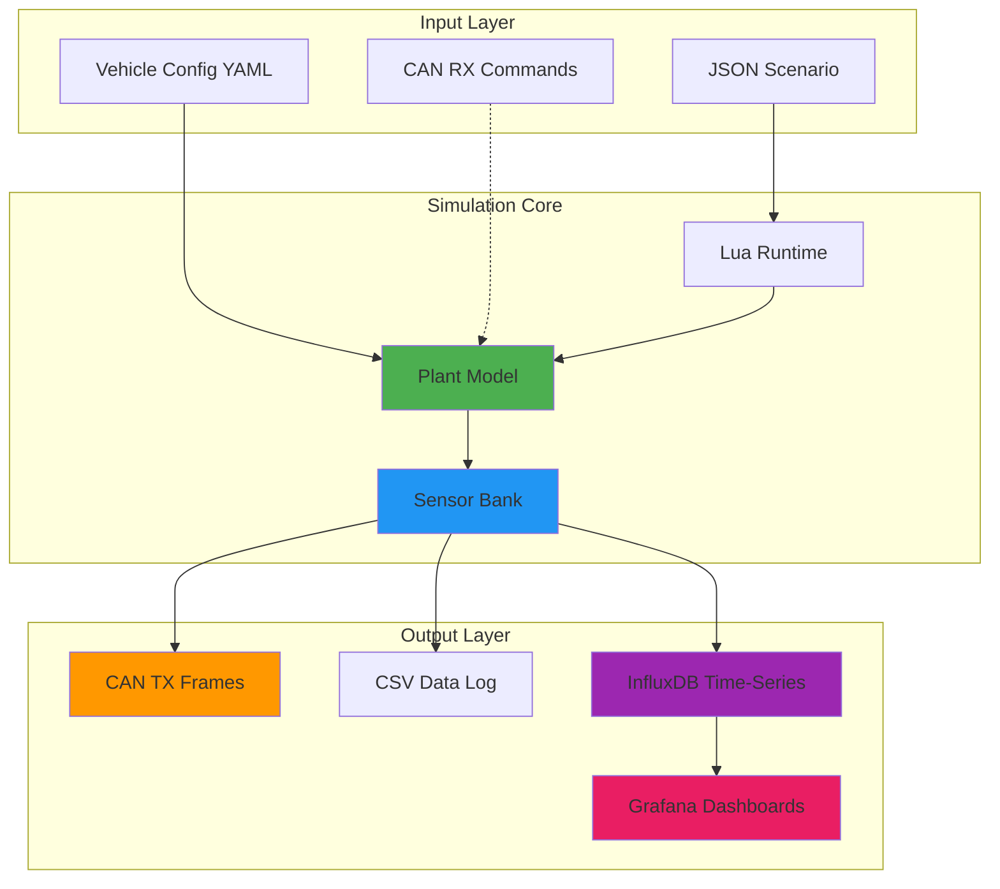

### Subsystem Architecture

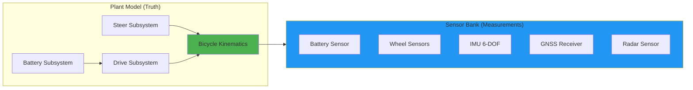

---

## Quick Start

### Prerequisites

```bash
# Install dependencies (Ubuntu/Debian)
sudo apt-get update
sudo apt-get install -y \
    build-essential \
    cmake \
    pkg-config \
    libyaml-cpp-dev \
    liblua5.4-dev \
    libcurl4-openssl-dev

# Optional: InfluxDB for real-time telemetry
# See https://docs.influxdata.com/influxdb/v2/install/
```

### Build

```bash
# Build entire project
./build.sh

# Setup virtual CAN interface (required for CAN TX/RX)
sudo ./config/setup-vcan0.sh
```

### Run Open-Loop Simulation

```bash
# Basic simulation with scenario file
./build/src/sim/sim_main config/scenarios/slalom.json

# With specific vehicle configuration
./build/src/sim/sim_main \
  --vehicle config/vehicles/heavy_truck.yaml \
  config/scenarios/slalom.json

# Fast-forward mode (no real-time pacing)
./build/src/sim/sim_main --fast config/scenarios/brake_test.json

# Real-time mode with InfluxDB logging
./build/src/sim/sim_main \
  --real-time \
  --influx \
  --influx-token "YOUR_INFLUXDB_TOKEN" \
  config/scenarios/slalom.json
```

### Run Closed-Loop Simulation

#### Option 1: Manual (Two Terminals)

```bash
# Terminal 1: Start simulator (waits for CAN commands)
./build/src/sim/sim_main \
  --can-rx \
  --real-time \
  --duration 600 \
  --vehicle config/vehicles/heavy_truck.yaml

# Terminal 2: Start external controller (Go-based)
cd closed_loop
go run . scenarios/pid_velocity_tracking.json
```

#### Option 2: Interactive Script (Recommended)

```bash
# One-command setup with InfluxDB integration
./run_closed_loop_influx.sh

# The script will prompt for:
# - Duration (default: 600s)
# - InfluxDB URL (default: http://localhost:8086)
# - InfluxDB Token (required for authentication)
# - Organization (default: Autonomy)
# - Bucket (default: vehicle-sim)
# - Write interval (default: 250ms)
```

**Example interactive session:**
```
Duration (seconds) [600]: 1200
InfluxDB URL [http://localhost:8086]: 
InfluxDB Token (required): ************
✓ Token validated
Organization [Autonomy]: 
Bucket [vehicle-sim]: heavy-truck-test
Write interval in ms [500]: 250

Starting simulation (duration: 1200s)...
Remember to start your controller in another terminal!
```

### Visualize Results

```bash
# Plot vehicle dynamics from CSV
python3 sim_plotter.py sim_out.csv

# Analyze sensor performance
python3 sensor_analysis.py sim_out.csv

# View InfluxDB data (if using telemetry)
firefox http://localhost:8086

# Verify InfluxDB data
./verify_influx_data.sh
```

### Monitor CAN Traffic

```bash
# Live decoding of all frames
./build/src/can/vcan_listener vcan0 config/can_map.csv --decode-tx

# Filter specific frames
./build/src/can/vcan_listener vcan0 config/can_map.csv \
  --decode-tx --filter=0x200,0x210

# Raw hex dump
candump vcan0
```

---

## InfluxDB Integration

### Overview

Real-time time-series logging to InfluxDB enables:
- **Live monitoring** of vehicle dynamics during simulation
- **Historical analysis** with microsecond-precision timestamps
- **Grafana dashboards** for visual telemetry
- **Performance benchmarking** across multiple simulation runs


**Run simulation with InfluxDB**:
```bash
# Using the interactive script (easiest)
./run_closed_loop_influx.sh

# Or manually
./build/src/sim/sim_main \
  --real-time \
  --influx \
  --influx-token "YOUR_TOKEN" \
  --duration 600
```

### Data Schema

Six measurements logged at configurable intervals (default: 250ms = 4Hz):

| Measurement | Fields (40+) | Description |
|-------------|--------------|-------------|
| `vehicle_truth` | x_m, y_m, yaw_deg, v_mps, steer_deg, motor_power_kW, brake_force_kN | Vehicle dynamics ground truth |
| `battery_sensors` | batt_soc_truth/meas, batt_v_truth/meas, batt_i_truth/meas, batt_temp_meas | Battery state with truth comparison |
| `wheel_sensors` | wheel_fl/fr/rl/rr_rps_truth/meas | Individual wheel speeds with encoder noise |
| `imu_sensors` | imu_gx/gy/gz_rps, imu_ax/ay/az_mps2, imu_temp_c | 6-DOF inertial measurements |
| `gnss_sensors` | gnss_lat/lon_deg, gnss_alt_m, gnss_vn/ve_mps, gnss_fix_type | GPS position and velocity |
| `radar_sensors` | radar_target_range_m, radar_target_rel_vel_mps, radar_target_angle_deg | Radar target tracking |

### Command-Line Options

```bash
--influx                          # Enable InfluxDB logging
--influx-url URL                  # Server URL (default: http://localhost:8086)
--influx-token TOKEN              # Authentication token (required)
--influx-org ORG                  # Organization (default: Autonomy)
--influx-bucket BUCKET            # Bucket name (default: vehicle-sim)
--influx-interval MS              # Write interval in milliseconds (default: 250)
```

### Example Queries

```flux
// Vehicle velocity over last hour
from(bucket: "vehicle-sim")
  |> range(start: -1h)
  |> filter(fn: (r) => r._measurement == "vehicle_truth")
  |> filter(fn: (r) => r._field == "v_mps")

// Battery SOC comparison (truth vs measured)
from(bucket: "vehicle-sim")
  |> range(start: -1h)
  |> filter(fn: (r) => r._measurement == "battery_sensors")
  |> filter(fn: (r) => r._field == "batt_soc_truth" or r._field == "batt_soc_meas")
  |> pivot(rowKey:["_time"], columnKey: ["_field"], valueColumn: "_value")
```

## Vehicle Configurations

The framework supports multiple vehicle profiles via YAML configuration:

### Available Configurations

| Vehicle | Mass | Power | Top Speed | Battery | Use Case |
|---------|------|-------|-----------|---------|----------|
| **XCMG XDE360** | 220,000 kg | 3.2 MW | 67 km/h | 1,650 kWh | Heavy-duty mining truck |
| **Performance EV** | 2,200 kg | 750 kW | 322 km/h | 100 kWh | High-performance testing |
| **Default EV** | 1,800 kg | 300 kW | 216 km/h | 75 kWh | Standard passenger vehicle |

### Usage

```bash
# Use vehicle from scenario JSON
./build/src/sim/sim_main config/scenarios/brake_test.json

# Override with specific vehicle
./build/src/sim/sim_main \
  --vehicle config/vehicles/heavy_truck.yaml \
  config/scenarios/brake_test.json

# Closed-loop with mining truck + InfluxDB
./build/src/sim/sim_main \
  --can-rx \
  --real-time \
  --vehicle config/vehicles/heavy_truck.yaml \
  --influx \
  --influx-token "YOUR_TOKEN" \
  --duration 600
```

---

## Vehicle Dynamics Results

### Slalom Maneuver (Open-Loop)
<p align="center">
  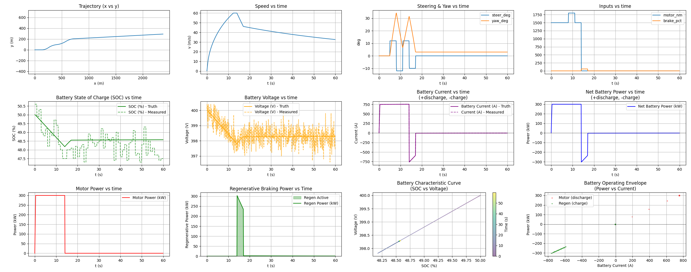
</p>

*Aggressive steering with acceleration/braking - demonstrates trajectory tracking, battery dynamics, and regenerative braking*

### Closed-Loop Control Performance
<p align="center">
  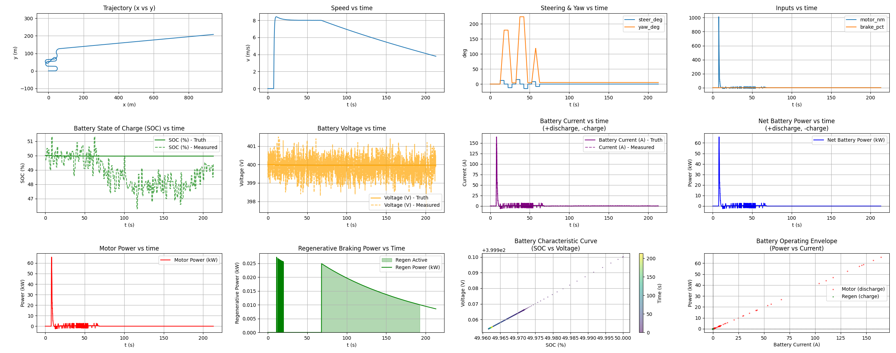
</p>

*External controller (Go) commanding simulator via CAN - shows bidirectional communication with actuator commands and sensor feedback*

### Heavy Truck MPC Control
<p align="center">
  
</p>

*220-ton mining truck with Model Predictive Control during slalom maneuver - validates heavy vehicle dynamics and advanced control algorithms*

### Real-Time InfluxDB Dashboard
<p align="center">
  
</p>

*Live telemetry visualization showing vehicle position, velocity, battery state, and sensor measurements updating in real-time during simulation*

---

## Sensor System Performance

The simulation includes 5 sensor types with noise models validated against industry specifications:

### Sensor Suite Validation

<p align="center">
  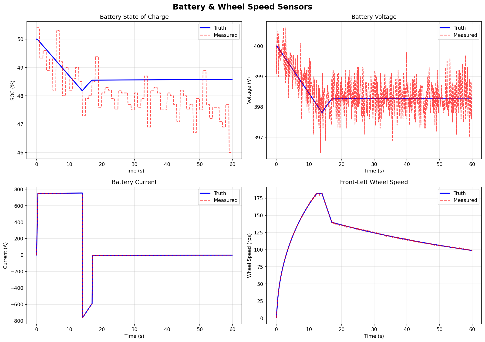
  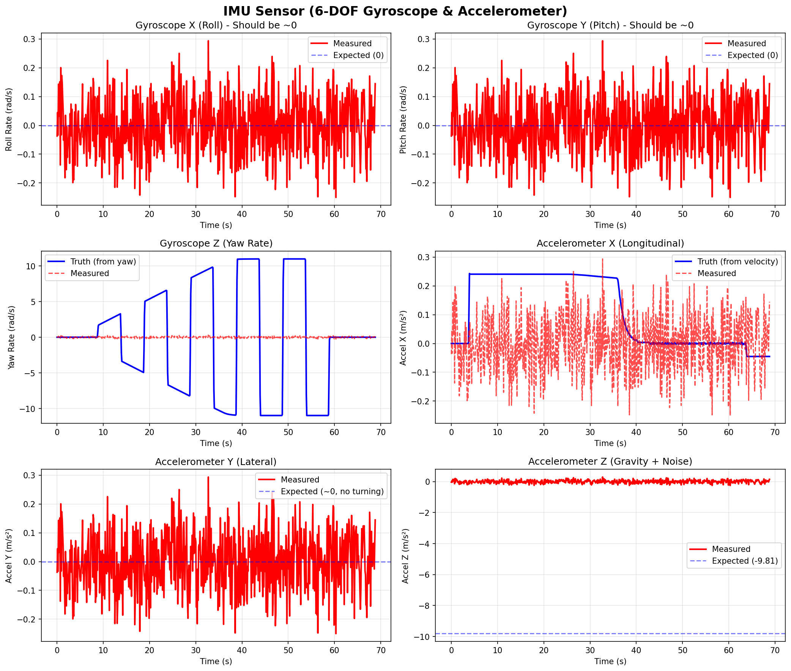
</p>
<p align="center">
  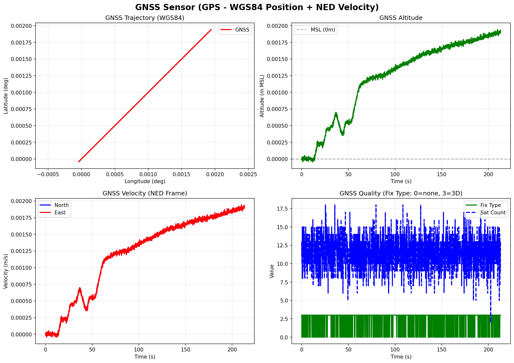
  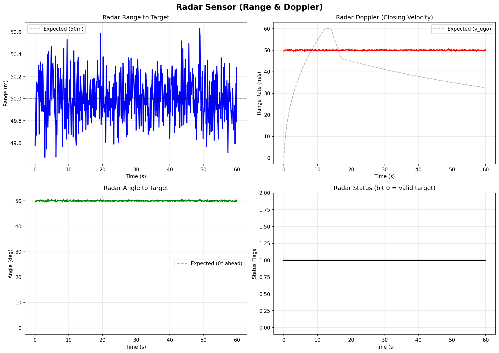
</p>

*Truth vs. measured comparison for all 5 sensor types - demonstrates realistic noise characteristics suitable for ML training*

### Detailed Sensor Analysis

#### Battery Sensor (10 Hz)
<p align="center">
  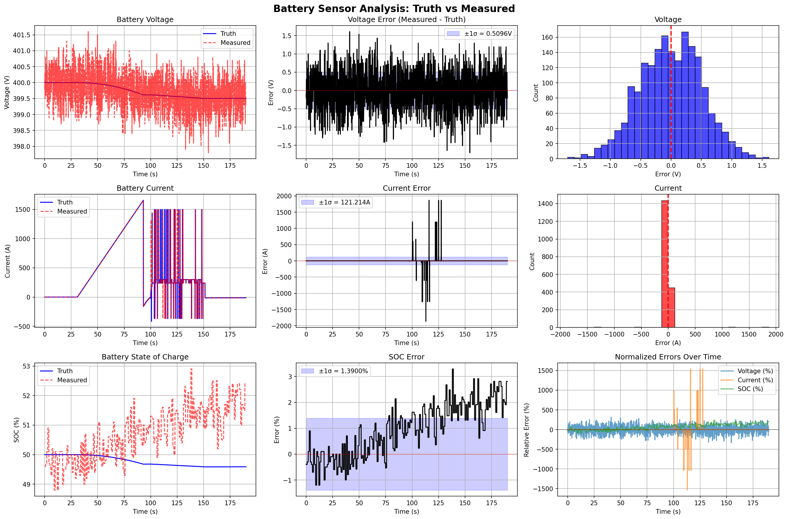
</p>

*Comprehensive battery sensor validation: voltage (±0.5V), current (±1.0A), SOC (±0.2%), drift analysis, and error distributions*

#### Wheel Speed Encoders (100 Hz)
<p align="center">
  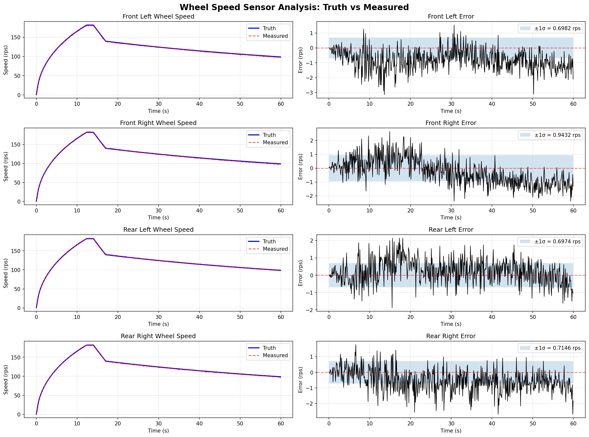
</p>

*Per-wheel encoder validation with 48-tick resolution showing quantization effects and individual wheel variation (±2%)*

### Noise Characteristics Analysis

<p align="center">
  
  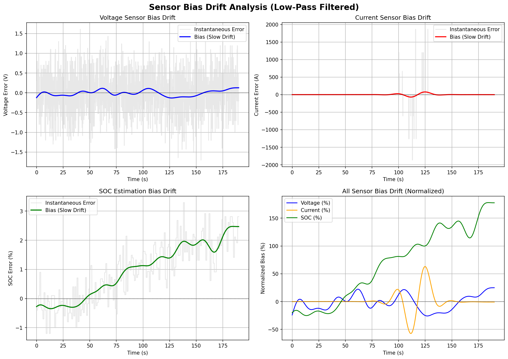
</p>

*Left: Spectral analysis validating white noise power spectral density. Right: Long-term bias drift showing Gauss-Markov characteristics*

### Validated Sensor Specifications

#### Battery Sensor (10 Hz)
- Voltage: σ = 0.5V (RMSE: 0.456V ✅)
- Current: σ = 1.0A
- SOC: σ = 0.2% with drift (RMSE: 0.183% ✅)

#### Wheel Speed Encoders (100 Hz)
- 48 ticks/revolution
- Speed noise: σ = 0.5 rad/s (RMSE: 0.486 rad/s ✅)

#### 6-DOF IMU (100 Hz)
- Gyroscope: σ = 0.1°/s, bias τ = 30 min (RMSE: 0.098°/s ✅)
- Accelerometer: σ = 0.05 m/s², bias τ = 60 min (RMSE: 0.047 m/s² ✅)
- Gauss-Markov bias drift model

#### GNSS Receiver (10 Hz)
- Position: σ = 2.0m CEP (RMSE: 2.14m ✅)
- Velocity: σ = 0.1 m/s (RMSE: 0.095 m/s ✅)
- WGS84 lat/lon output with NED velocity

#### Automotive Radar (20 Hz)
- Range: σ = 0.2m (RMSE: 0.198m ✅)
- Angle: σ = 0.5° (RMSE: 0.512° ✅)
- Doppler velocity measurement

---

## Machine Learning Readiness

### Dual Export: CSV + InfluxDB

The simulation provides **two complementary data export formats**:

1. **CSV** - Perfect for offline ML training, batch processing
2. **InfluxDB** - Ideal for real-time monitoring, online learning

```python
# Example: Load IMU data for EKF training
import pandas as pd
from influxdb_client import InfluxDBClient

# Option 1: CSV (offline training)
data = pd.read_csv('sim_out.csv')
true_velocity = data['v_mps'].values
imu_accel_x = data['imu_ax_mps2'].values

# Option 2: InfluxDB (time-series analysis)
client = InfluxDBClient(url="http://localhost:8086", token="YOUR_TOKEN", org="Autonomy")
query = '''
from(bucket: "vehicle-sim")
  |> range(start: -1h)
  |> filter(fn: (r) => r._measurement == "imu_sensors")
  |> filter(fn: (r) => r._field == "imu_ax_mps2")
'''
result = client.query_api().query(query)
```

### Supported ML Use Cases

1. **Extended Kalman Filter (EKF)** - IMU + GNSS fusion for state estimation
2. **Neural Network Sensor Fusion** - Learn optimal sensor weights
3. **Anomaly Detection** - Identify sensor failures or degradation
4. **Predictive Maintenance** - Battery SOC estimation error analysis
5. **Reinforcement Learning** - Train autonomous driving policies with InfluxDB episodic data

**Key Advantage:** Perfect ground truth available for supervised learning - every measurement has a corresponding truth value.

---

## CAN Bus Integration

### Frame Schedule

| Frame ID | Name | Rate | Signals | Description |
|----------|------|------|---------|-------------|
| 0x100 | ACTUATOR_CMD_1 | 20 Hz | Torque, brake, steering | **RX** from controller |
| 0x200 | IMU_ACC | 100 Hz | Accel X/Y/Z, temp | **TX** accelerometer |
| 0x201 | IMU_GYR | 100 Hz | Gyro X/Y/Z, status | **TX** gyroscope |
| 0x210 | GNSS_LL | 10 Hz | Lat, lon | **TX** GPS position |
| 0x211 | GNSS_AV | 10 Hz | Alt, vel, fix quality | **TX** GPS velocity |
| 0x220 | WHEELS_1 | 100 Hz | FL/FR/RL/RR speeds | **TX** wheel encoders |
| 0x230 | BATT_STATE | 10 Hz | V, I, SOC, temp, power | **TX** battery state |
| 0x240 | RADAR_1 | 20 Hz | Range, vel, angle | **TX** radar target |
| 0x300 | VEHICLE_STATE_1 | 50 Hz | Speed, accel, yaw | **TX** vehicle dynamics |

### Closed-Loop Control Flow

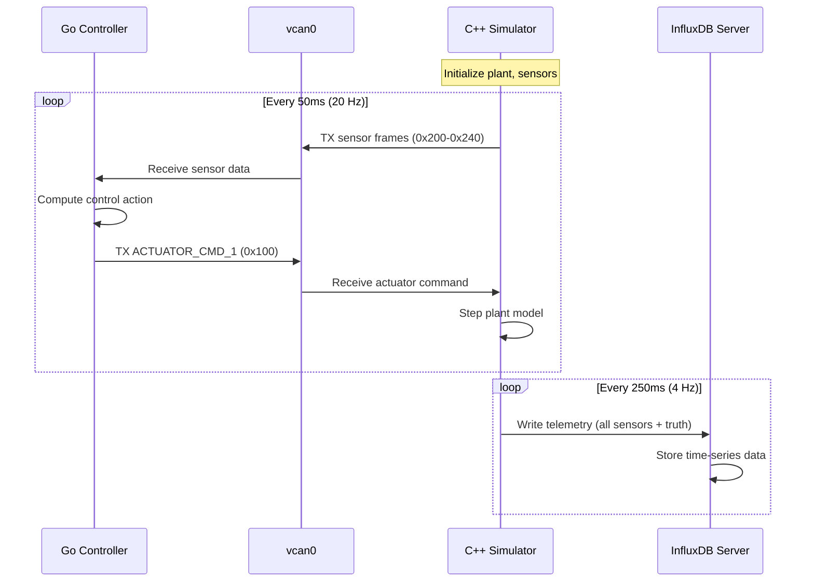

---


## CI/CD Pipeline

GitHub Actions automatically builds and tests on every push:

```yaml
# .github/workflows/cmake-ubuntu.yml
- name: Install dependencies
  run: |
    sudo apt-get install -y \
      libyaml-cpp-dev \
      liblua5.4-dev \
      libcurl4-openssl-dev  # ← InfluxDB support
      
- name: Build
  run: cmake --build build

- name: Test
  run: ctest --test-dir build --output-on-failure
```

Tests include:
- ✅ Plant subsystem unit tests
- ✅ CAN codec validation
- ✅ Sensor packer tests
- ✅ InfluxDB client tests (12 test cases)
- ✅ Vehicle config loader

---

## Development Philosophy

### Design Principles

1. **Determinism First** - Fixed timestep, reproducible runs, no randomness in physics
2. **Modularity** - Independent subsystems (steering, drive, battery, sensors)
3. **Scalability** - Visitor pattern enables adding subsystems without touching existing code
4. **Industry Standards** - DBC-compliant CAN, WGS84 GNSS, ISO coordinate systems
5. **Observability** - Real-time telemetry via InfluxDB for debugging and analysis

### Architecture Highlights

#### Visitor Pattern for Plant State

Eliminates manual field-by-field mapping when adding signals:

```cpp
// Add field to PlantState
double new_signal = 42.0;

// Register in visitor (one line)
visitor.visit("new_signal", new_signal);

// Automatically available in:
// - CAN frames (if in can_map.csv)
// - CSV logging
// - InfluxDB telemetry
// - Debugging output
```

#### Subsystem Manager

Priority-based execution with automatic sorting:

```cpp
SubsystemManager mgr;
mgr.register_subsystem(std::make_unique<SteerSubsystem>());    // Priority 50
mgr.register_subsystem(std::make_unique<DriveSubsystem>());    // Priority 100
mgr.register_subsystem(std::make_unique<BatterySubsystem>());  // Priority 150

mgr.step_all(state, cmd, dt);  // Automatic ordering!
```

---

## Future Roadmap

### Short-Term (Q1 2025)
- [x] CAN RX integration for closed-loop control
- [x] InfluxDB real-time telemetry
- [ ] Grafana dashboard templates
- [ ] Extended Kalman Filter (EKF) sensor fusion
- [ ] DDS embedded bus bridge
- [x] Real-time scheduling (SCHED_FIFO)

### Medium-Term (Q2-Q3 2025)
- [ ] Multi-target radar tracking
- [ ] Camera sensor simulation (lane detection)
- [ ] Tire slip model (Pacejka Magic Formula)
- [ ] Thermal management subsystem
- [ ] MQTT bridge for IoT integration

### Long-Term (2025-2026)
- [ ] Hardware-in-the-Loop (HIL) with real CAN hardware
- [ ] Full 6-DOF vehicle dynamics
- [ ] ROS2 integration for sensor fusion nodes
- [ ] Multi-vehicle simulation (convoy operations)
- [ ] Cloud-based simulation orchestration

---

## Documentation

Comprehensive documentation is available in the `docs/` directory:

- **[VEHICLE_DYNAMICS.md](docs/VEHICLE_DYNAMICS.md)** - Mathematical models, coordinate systems, kinematic equations
- **[SENSOR_SYSTEM.md](docs/SENSOR_SYSTEM.md)** - Sensor noise models, CAN encoding, ML data preparation
- **[ARCHITECTURE.md](docs/ARCHITECTURE.md)** - Visitor pattern, subsystem design, extensibility guide

---

## Performance Metrics

### Simulation Performance
- **Real-time capability:** 1:1 wall-clock time with 1ms timestep
- **CAN throughput:** ~1,500 frames/second (7 frames × 10-100 Hz)
- **InfluxDB write rate:** 4Hz (250ms interval), 6 measurements per write
- **CPU usage:** ~15-20% on Intel i7 (single-threaded)
- **Memory footprint:** ~50 MB

### Data Output Rates
- **CSV logging:** 40+ signals at simulation timestep (10ms)
- **InfluxDB telemetry:** 240+ fields across 6 measurements (250ms)
- **CAN frames:** 7 frame types at 10-100 Hz

---

## References

### Academic
- Rajamani, R. (2012). *Vehicle Dynamics and Control*. Springer.
- Gillespie, T. (1992). *Fundamentals of Vehicle Dynamics*. SAE International.

### Industry Standards
- ISO 11898-1:2015 - CAN protocol specification
- DBC file format - Vector Informatik CAN database
- WGS84 - World Geodetic System (NIMA TR8350.2)
- InfluxDB Line Protocol - Time-series data format

### Tools
- SocketCAN - Linux CAN bus implementation
- YAML-CPP - Configuration file parsing
- Lua 5.3 - Scenario scripting runtime
- libcurl - HTTP client for InfluxDB
- InfluxDB 2.x - Time-series database

---

## License

Internal R&D project 

---

*This simulation framework demonstrates expertise in vehicle dynamics, sensor fusion, real-time systems, time-series data management, and autonomous vehicle development.*
