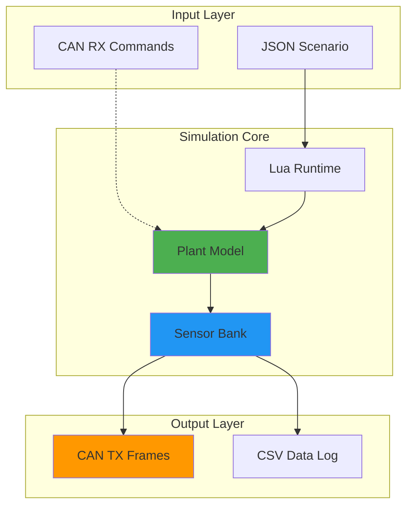
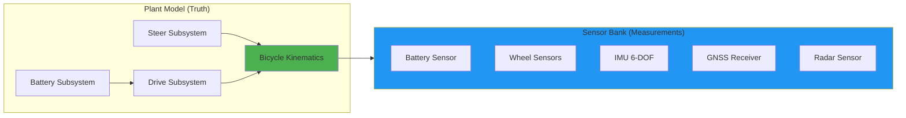
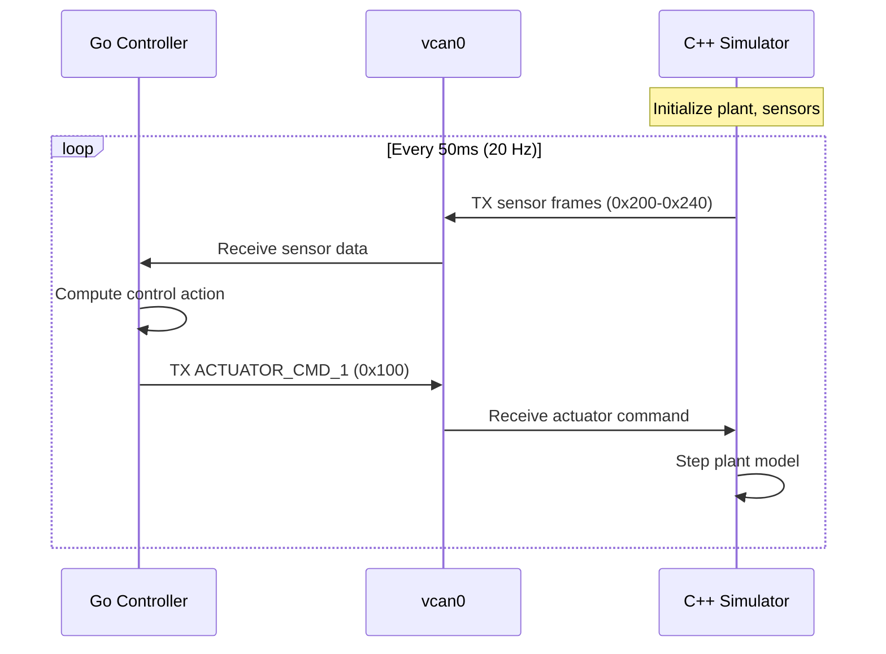

# Electric Vehicle Dynamics Simulation Framework

**Author:** Mario Tilocca  
**Purpose:** High-fidelity vehicle dynamics simulation for Electric Autonomous Vehicles

---

## Overview

This repository implements a comprehensive **Software-in-the-Loop (SIL)** simulation framework for electric vehicle dynamics, designed to support autonomous mining vehicle development. The system features deterministic physics models, realistic sensor simulation with validated noise characteristics, and industry-standard CAN bus integration.

### Key Capabilities

- ✅ **Kinematic bicycle model** with Ackermann steering geometry
- ✅ **Longitudinal dynamics** including motor torque, regenerative braking, and resistive forces
- ✅ **Battery energy management** with SOC tracking and power flow modeling
- ✅ **5 sensor types** with realistic noise models (Battery, Wheel Speed, IMU, GNSS, Radar)
- ✅ **CAN bus integration** broadcasting 7 frames at 10-100 Hz update rates
- ✅ **Closed-loop control** via CAN RX for hardware-in-the-loop (HIL) readiness
- ✅ **Visitor pattern architecture** enabling scalable subsystem development
- ✅ **ML-ready sensor data** with CSV logging for algorithm training

### Target Applications

1. **Sensor Fusion Algorithm Development** - IMU + GNSS data for Extended Kalman Filter (EKF)
2. **Control System Validation** - Closed-loop testing with external controllers
3. **Mining Vehicle Simulation** - XCMG electric dump trucks in WA desert environments
4. **Hardware-in-the-Loop (HIL)** preparation - CAN-based actuator/sensor interfaces

---

## System Architecture

### High-Level Data Flow



### Subsystem Architecture



---

## Quick Start

### Build

```bash
# Build entire project
./build.sh

# Setup virtual CAN interface (required for CAN TX/RX)
sudo ./config/set-upvcan0.sh
```

### Run Open-Loop Simulation

```bash
# Run with scenario file
./build/src/sim/sim_main config/scenarios/slalom.json

# Visualize vehicle dynamics
python3 sim_plotter.py sim_out.csv

# Analyze sensor performance
python3 sensor_analysis.py sim_out.csv
```

### Run Closed-Loop Simulation

```bash
# Terminal 1: Start simulator (waits for CAN commands)
./build/src/sim/sim_main --can-rx --duration 60 --real-time

# Terminal 2: Start external controller (Go-based)
cd closed_loop
go run . --scenario slalom --interface vcan0
```

### Monitor CAN Traffic

```bash
# Live decoding of all frames
./build/src/can/vcan_listener vcan0 config/can_map.csv --decode-tx

# Filter specific frames
./build/src/can/vcan_listener vcan0 config/can_map.csv --decode-tx --filter=0x200,0x210

# Raw hex dump
candump vcan0
```

---

## Vehicle Configurations

The framework supports multiple vehicle profiles via YAML configuration:

### Available Configurations

| Vehicle | Mass | Power | Top Speed | Use Case |
|---------|------|-------|-----------|----------|
| **Performance EV** | 2,200 kg | 750 kW | 322 km/h | High-performance testing |
| **Default EV** | 1,800 kg | 300 kW | 216 km/h | Standard passenger vehicle |
| **Mining Truck** | 180,000 kg | 2.6 MW | 72 km/h | XCMG heavy-duty operations |

### Usage

```bash
# Use vehicle from scenario JSON
./build/src/sim/sim_main config/scenarios/brake_test.json

# Override with specific vehicle
./build/src/sim/sim_main config/scenarios/brake_test.json --vehicle config/vehicles/heavy_truck.yaml

# Closed-loop with mining truck
./build/src/sim/sim_main --can-rx --vehicle config/vehicles/heavy_truck.yaml --duration 600
```

---

## Vehicle Dynamics Results

### Slalom Maneuver (Open-Loop)
<p align="center">
  
</p>

*Aggressive steering with acceleration/braking - demonstrates trajectory tracking, battery dynamics, and regenerative braking*

### Closed-Loop Control Performance
<p align="center">
  
</p>

*External controller (Go) commanding simulator via CAN - shows bidirectional communication with actuator commands and sensor feedback*

### Heavy Truck MPC Control
<p align="center">
  
</p>

*180-ton mining truck with Model Predictive Control during slalom maneuver - validates heavy vehicle dynamics and advanced control algorithms*

---

## Sensor System Performance

The simulation includes 5 sensor types with noise models validated against industry specifications:

### Sensor Suite Validation

<p align="center">
  
  
</p>
<p align="center">
  
  
</p>

*Truth vs. measured comparison for all 5 sensor types - demonstrates realistic noise characteristics suitable for ML training*

### Detailed Sensor Analysis

#### Battery Sensor (10 Hz)
<p align="center">
  
</p>

*Comprehensive battery sensor validation: voltage (±0.5V), current (±1.0A), SOC (±0.2%), drift analysis, and error distributions*

#### Wheel Speed Encoders (100 Hz)
<p align="center">
  
</p>

*Per-wheel encoder validation with 48-tick resolution showing quantization effects and individual wheel variation (±2%)*

### Noise Characteristics Analysis

<p align="center">
  
  
</p>

*Left: Spectral analysis validating white noise power spectral density. Right: Long-term bias drift showing Gauss-Markov characteristics*

### Validated Sensor Specifications

#### Battery Sensor (10 Hz)
- Voltage: σ = 0.5V (RMSE: 0.456V ✅)
- Current: σ = 1.0A
- SOC: σ = 0.2% with drift (RMSE: 0.183% ✅)

#### Wheel Speed Encoders (100 Hz)
- 48 ticks/revolution
- Speed noise: σ = 0.5 rad/s (RMSE: 0.486 rad/s ✅)

#### 6-DOF IMU (100 Hz)
- Gyroscope: σ = 0.1°/s, bias τ = 30 min (RMSE: 0.098°/s ✅)
- Accelerometer: σ = 0.05 m/s², bias τ = 60 min (RMSE: 0.047 m/s² ✅)
- Gauss-Markov bias drift model

#### GNSS Receiver (10 Hz)
- Position: σ = 2.0m CEP (RMSE: 2.14m ✅)
- Velocity: σ = 0.1 m/s (RMSE: 0.095 m/s ✅)
- WGS84 lat/lon output with NED velocity

#### Automotive Radar (20 Hz)
- Range: σ = 0.2m (RMSE: 0.198m ✅)
- Angle: σ = 0.5° (RMSE: 0.512° ✅)
- Doppler velocity measurement

---

## Machine Learning Readiness

### CSV Data Export for ML Training

The simulation logs **40+ signals** to CSV format, providing ground truth data for algorithm development:

```python
# Example: Load IMU data for EKF training
import pandas as pd

data = pd.read_csv('sim_out.csv')

# Ground truth (from plant model)
true_velocity = data['v_mps'].values
true_yaw_rate = data['yaw_rate_radps'].values

# IMU measurements (with realistic noise)
imu_accel_x = data['imu_ax_mps2'].values
imu_gyro_z = data['imu_gz_rps'].values

# GNSS measurements
gnss_velocity_n = data['gnss_vn_mps'].values
gnss_velocity_e = data['gnss_ve_mps'].values

# Train sensor fusion model
# X_train = [imu_accel_x, imu_gyro_z, gnss_velocity_n, gnss_velocity_e]
# y_train = [true_velocity, true_yaw_rate]
```

### Supported ML Use Cases

1. **Extended Kalman Filter (EKF)** - IMU + GNSS fusion for state estimation
2. **Neural Network Sensor Fusion** - Learn optimal sensor weights
3. **Anomaly Detection** - Identify sensor failures or degradation
4. **Predictive Maintenance** - Battery SOC estimation error analysis

**Key Advantage:** Perfect ground truth available for supervised learning - every measurement has a corresponding truth value.

---

## CAN Bus Integration

### Frame Schedule

| Frame ID | Name | Rate | Signals | Description |
|----------|------|------|---------|-------------|
| 0x100 | ACTUATOR_CMD_1 | 20 Hz | Torque, brake, steering | **RX** from controller |
| 0x200 | IMU_ACC | 100 Hz | Accel X/Y/Z, temp | **TX** accelerometer |
| 0x201 | IMU_GYR | 100 Hz | Gyro X/Y/Z, status | **TX** gyroscope |
| 0x210 | GNSS_LL | 10 Hz | Lat, lon | **TX** GPS position |
| 0x211 | GNSS_AV | 10 Hz | Alt, vel, fix quality | **TX** GPS velocity |
| 0x220 | WHEELS_1 | 100 Hz | FL/FR/RL/RR speeds | **TX** wheel encoders |
| 0x230 | BATT_STATE | 10 Hz | V, I, SOC, temp, power | **TX** battery state |
| 0x240 | RADAR_1 | 20 Hz | Range, vel, angle | **TX** radar target |
| 0x300 | VEHICLE_STATE_1 | 50 Hz | Speed, accel, yaw | **TX** vehicle dynamics |

### Closed-Loop Control Flow



---

## Repository Structure

```
plant-sensor-can-sim/
├── src/
│   ├── plant/                    # Vehicle dynamics (truth)
│   │   ├── physics_subsystem.hpp    # Visitor pattern base
│   │   ├── subsystem_manager.hpp    # Subsystem orchestration
│   │   ├── steer_subsystem.cpp      # Steering dynamics
│   │   ├── drive_subsystem.cpp      # Motor/brake dynamics
│   │   ├── battery_subsystem.cpp    # Energy management
│   │   └── vehicle_bicycle_ackermann.cpp
│   ├── sensors/                  # Sensor simulation
│   │   ├── battery_sensor.cpp       # V, I, SOC, temp
│   │   ├── wheel_sensor.cpp         # 4-wheel encoders
│   │   ├── imu_sensor.cpp           # 6-DOF gyro + accel
│   │   ├── gnss_sensor.cpp          # GPS (WGS84 + NED)
│   │   └── radar_sensor.cpp         # Range-Doppler-Angle
│   ├── can/                      # CAN integration
│   │   ├── actuator_cmd_decoder.cpp # RX decoder (0x100)
│   │   ├── sensor_state_packer.cpp  # TX encoder (0x200-0x240)
│   │   ├── tx_scheduler.cpp         # Multi-rate transmission
│   │   └── socketcan_iface.cpp      # Linux SocketCAN
│   ├── sim/                      # Simulation runtime
│   │   ├── sim_app.cpp              # Main loop (open/closed)
│   │   ├── lua_runtime.cpp          # JSON scenario system
│   │   └── plant_state_packer.cpp   # Visitor-based packing
│   └── config/                   # Configuration system
│       └── vehicle_config.cpp       # YAML vehicle loader
├── config/
│   ├── scenarios/                # JSON test scenarios
│   │   ├── slalom.json
│   │   ├── brake_test.json
│   │   └── obstacle_avoidance.json
│   ├── vehicles/                 # YAML vehicle profiles
│   │   ├── performance_ev.yaml      # 750 kW tri-motor
│   │   ├── heavy_truck.yaml         # 180-ton mining truck
│   │   └── default_ev.yaml
│   └── can_map.csv               # DBC-style CAN database
├── closed_loop/                  # Go-based controller
│   ├── runner.go                    # CAN TX/RX controller
│   ├── pid_controller.go            # Velocity PID example
│   └── scenarios/                   # Controller test scenarios
├── docs/
│   ├── VEHICLE_DYNAMICS.md       # Theoretical vehicle dynamics
│   ├── SENSOR_SYSTEM.md          # Sensor architecture & ML
│   └── ARCHITECTURE.md           # Plant subsystem design
├── test/
│   ├── test_subsystem_manager.cpp   # Subsystem validation
│   └── test_plant_state_packer.cpp  # Visitor pattern tests
├── plots/                        # Validation results
│   ├── slalom_vehicle_dynamics.png
│   ├── battery_wheel_sensors.png
│   ├── imu_sensor.png
│   ├── gnss_sensor.png
│   ├── radar_sensor.png
│   └── sensor_noise_spectrum.png
├── sensor_analysis.py            # Python sensor validation
├── sim_plotter.py                # Python visualization
└── build.sh                      # Build script
```

---

## Development Philosophy

### Design Principles

1. **Determinism First** - Fixed timestep, reproducible runs, no randomness in physics
2. **Modularity** - Independent subsystems (steering, drive, battery, sensors)
3. **Scalability** - Visitor pattern enables adding subsystems without touching existing code
4. **Industry Standards** - DBC-compliant CAN, WGS84 GNSS, ISO coordinate systems

### Architecture Highlights

#### Visitor Pattern for Plant State

Eliminates manual field-by-field mapping when adding signals:

```cpp
// Add field to PlantState
double new_signal = 42.0;

// Register in visitor (one line)
visitor.visit("new_signal", new_signal);

// Automatically available in:
// - CAN frames (if in can_map.csv)
// - CSV logging
// - Debugging output
```

#### Subsystem Manager

Priority-based execution with automatic sorting:

```cpp
SubsystemManager mgr;
mgr.register_subsystem(std::make_unique<SteerSubsystem>());    // Priority 50
mgr.register_subsystem(std::make_unique<DriveSubsystem>());    // Priority 100
mgr.register_subsystem(std::make_unique<BatterySubsystem>());  // Priority 150

mgr.step_all(state, cmd, dt);  // Automatic ordering!
```

---

## Future Roadmap

### Short-Term (Q1 2025)
- [x] CAN RX integration for closed-loop control
- [ ] Extended Kalman Filter (EKF) sensor fusion
- [ ] DDS embedded bus bridge
- [x] Real-time scheduling (SCHED_FIFO)

### Medium-Term (Q2-Q3 2025)
- [ ] Multi-target radar tracking
- [ ] Camera sensor simulation (lane detection)
- [ ] Tire slip model (Pacejka Magic Formula)
- [ ] Thermal management subsystem

### Long-Term (2025-2026)
- [ ] Hardware-in-the-Loop (HIL) with real CAN hardware
- [ ] Full 6-DOF vehicle dynamics
- [ ] ROS2 integration for sensor fusion nodes
- [ ] Multi-vehicle simulation (convoy operations)

---

## Documentation

Comprehensive documentation is available in the `docs/` directory:

- **[VEHICLE_DYNAMICS.md](docs/VEHICLE_DYNAMICS.md)** - Mathematical models, coordinate systems, kinematic equations
- **[SENSOR_SYSTEM.md](docs/SENSOR_SYSTEM.md)** - Sensor noise models, CAN encoding, ML data preparation
- **[ARCHITECTURE.md](docs/ARCHITECTURE.md)** - Visitor pattern, subsystem design, extensibility guide

---

## References

### Academic
- Rajamani, R. (2012). *Vehicle Dynamics and Control*. Springer.
- Gillespie, T. (1992). *Fundamentals of Vehicle Dynamics*. SAE International.

### Industry Standards
- ISO 11898-1:2015 - CAN protocol specification
- DBC file format - Vector Informatik CAN database
- WGS84 - World Geodetic System (NIMA TR8350.2)

### Tools
- SocketCAN - Linux CAN bus implementation
- YAML-CPP - Configuration file parsing
- Lua 5.3 - Scenario scripting runtime

---

## License

Internal R&D project - Fortescue Metals Group

---

*This simulation framework demonstrates expertise in vehicle dynamics, sensor fusion, real-time systems, and autonomous vehicle development.*