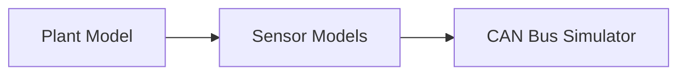

# plant-sensor-can-sim

## Purpose
This repository models the **physical world abstraction layer** of the system.
It simulates the plant dynamics, sensors, and CAN bus communication exactly as real hardware would behave.

This layer is **deterministic, replayable, and hardware-ready**.

## Responsibilities
- Plant / system dynamics simulation
- Sensor models (noise, drift, latency, faults)
- CAN message encoding/decoding
- Scenario replay & fault injection

## What happens here
1. The plant state evolves over time
2. Sensors sample the plant state
3. Sensor data is encoded into CAN frames
4. CAN frames are published to downstream consumers

## Architecture

## Notes
- No DDS, MQTT, or cloud logic allowed here
- Can later be replaced by real hardware or HIL rigs

