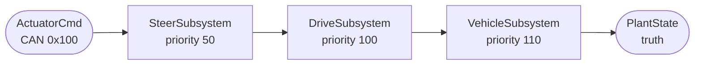
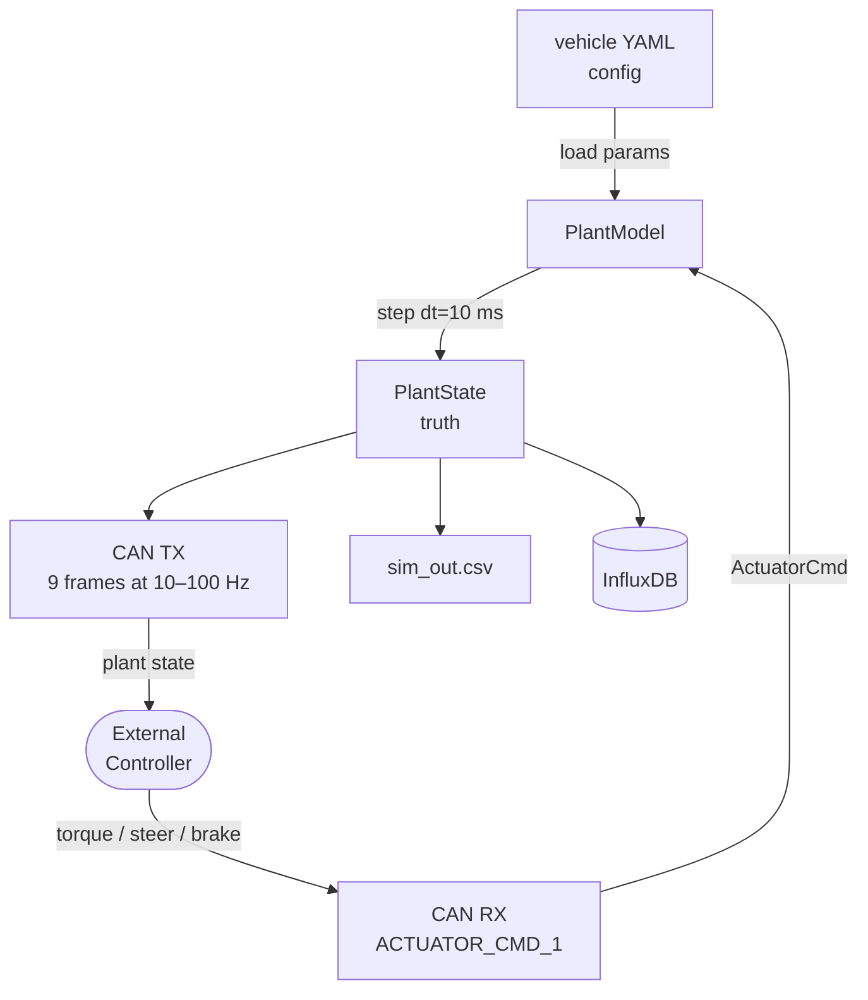
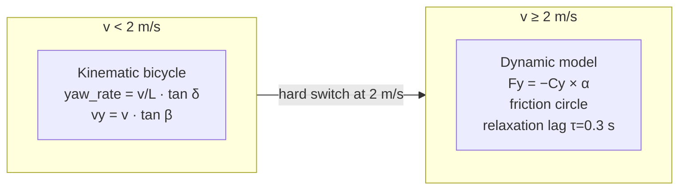
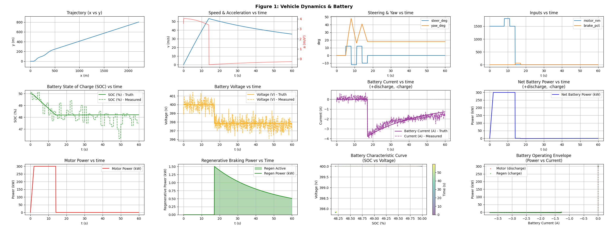
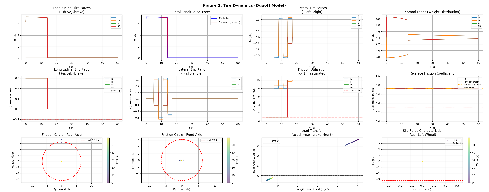
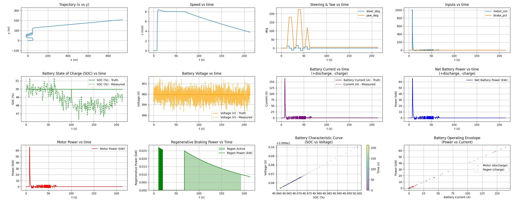
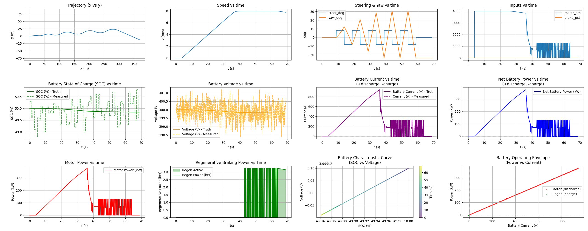

# Vehicle Dynamics Simulation Framework

**Author:** Mario Tilocca
**Purpose:** 3-DOF Software-in-the-Loop (SIL) simulation for electric autonomous vehicles with real-time CAN telemetry

---

## Overview

A C++17 physics-first vehicle dynamics simulator built around a modular subsystem architecture. The plant integrates a **hybrid kinematic/dynamic 3-DOF model** — pure kinematic below 4 m/s, smoothly transitioning to a full dynamic model above — with a linear tire force model, Ackermann steering geometry, and RWD powertrain. All inputs and outputs are exchanged over a virtual CAN bus, making it straightforward to connect an external controller in closed-loop.

### What is Modelled

| Layer | Implementation |
| ----- | -------------- |
| Steering geometry | Rate-limited Ackermann model; front-left/right angles from single steer command |
| Tire forces | Linear: Fy = −Cy × α, with friction circle saturation and first-order relaxation lag |
| Vehicle rigid body | 3-DOF Euler integration: longitudinal (vx), lateral (vy), yaw (ψ) with centrifugal coupling |
| Drive | RWD; motor torque → traction force at rear wheels; brake force split front/rear |
| Low-speed model | Pure kinematic bicycle below 2 m/s; hard switch to full dynamic model at 2 m/s |

---

## Architecture

### Subsystem Pipeline


```mermaid
flowchart LR
    CMD([ActuatorCmd\nCAN 0x100])
    S[SteerSubsystem\npriority 50]
    D[DriveSubsystem\npriority 100]
    V[VehicleSubsystem\npriority 110]
    PS([PlantState\ntruth])

    CMD --> S --> D --> V --> PS
```

Each subsystem implements a `pre_step → step → post_step` lifecycle. The `SubsystemManager` sorts them by priority and drives the loop.

| Priority | Subsystem | Responsibility |
| -------- | --------- | -------------- |
| 50 | **SteerSubsystem** | Rate-limits steer command; computes Ackermann `delta_fl`, `delta_fr` |
| 100 | **DriveSubsystem** | Motor/brake torque → per-wheel Fx; linear lateral tire forces Fy; wheel speeds |
| 110 | **VehicleSubsystem** | Integrates vx, vy, ψ; kinematic/dynamic blend; gear clamps; position |

### System Data Flow


```mermaid
flowchart TB
    YAML[vehicle YAML\nconfig]
    PM[PlantModel]
    PS[PlantState\ntruth]
    CANTX[CAN TX\n9 frames at 10–100 Hz]
    CSV[sim_out.csv]
    INFLUX[(InfluxDB)]
    CANRX[CAN RX\nACTUATOR_CMD_1]
    EXT([External\nController])

    YAML -->|load params| PM
    CANRX -->|ActuatorCmd| PM
    PM -->|step dt=10 ms| PS
    PS --> CANTX
    PS --> CSV
    PS --> INFLUX
    CANTX -->|plant state| EXT
    EXT -->|torque / steer / brake| CANRX
```

### Hybrid Tire Model


```mermaid
flowchart LR
    subgraph low["v < 2 m/s"]
        KIN["Kinematic bicycle\nyaw_rate = v/L · tan δ\nvy = v · tan β"]
    end
    subgraph high["v ≥ 2 m/s"]
        DYN["Dynamic model\nFy = −Cy × α\nfriction circle\nrelaxation lag τ=0.3 s"]
    end

    low -->|hard switch at 2 m/s| high
```

---

## Quick Start

### Prerequisites

```bash
# Ubuntu / Debian
sudo apt-get install -y \
    build-essential cmake pkg-config \
    libyaml-cpp-dev libcurl4-openssl-dev
```

### Build

```bash
./build.sh

# One-time: set up virtual CAN interface
sudo ./config/setup-vcan0.sh
```

### Run Open-Loop

The simulator runs an internal fixed scenario and writes all plant-state signals to `sim_out.csv` at 10 ms resolution.

```bash
# Default vehicle (heavy truck), compact gravel surface, run until Ctrl+C
./build/src/sim/sim_main

# Specify vehicle config and duration
./build/src/sim/sim_main \
  --vehicle  config/vehicles/heavy_truck.yaml \
  --duration 90

# Override surface friction (0.85 dry / 0.72 gravel / 0.45 wet / 0.25 mud)
./build/src/sim/sim_main --surface-mu 0.45

# Real-time pacing + InfluxDB telemetry
./build/src/sim/sim_main \
  --real-time \
  --influx \
  --influx-token "YOUR_TOKEN" \
  --duration 90
```

On startup the simulator prints the active vehicle parameters and begins stepping at 10 ms. `sim_out.csv` is written continuously and can be plotted immediately after the run.

### Run Closed-Loop — Gentle Slalom at 5 m/s

The closed-loop test drives the XCMG heavy truck through a **4-gate slalom at 5 m/s** in approximately 90 seconds. The controller and plant communicate over `vcan0`: the plant broadcasts state frames (position, speed, yaw rate) and the controller replies with actuator commands (torque, steer, brake).

**Phase sequence executed by the controller:**

| Phase | Action | Duration |
| ----- | ------ | -------- |
| ACCEL | Forward torque until v ≥ 5 m/s | ~10 s (speed-based) |
| CRUISE | Straight, hold 5 m/s | 5 s |
| STEER_L | −8° left steer, hold 5 m/s (gate 1) | 10 s |
| SETTLE1 | Straight, hold 5 m/s | 5 s |
| STEER_R | +8° right steer, hold 5 m/s (gate 2) | 10 s |
| SETTLE2 | Straight, hold 5 m/s | 5 s |
| STEER_L2 | −8° left steer, hold 5 m/s (gate 3) | 10 s |
| SETTLE3 | Straight, hold 5 m/s | 5 s |
| STEER_R2 | +8° right steer, hold 5 m/s (gate 4) | 10 s |
| SETTLE4 | Straight, hold 5 m/s | 5 s |
| BRAKE_STOP | Brake to standstill | ~15 s (speed-based) |

Open **three terminals** from the repository root:

```bash
# Terminal 1 — plant simulator (CAN RX enabled, real-time pacing)
./build/src/sim/sim_main \
  --can-rx --real-time \
  --vehicle config/vehicles/heavy_truck.yaml \
  --duration 100
```

```bash
# Terminal 2 — slalom controller (start after Terminal 1 is running)
./build/src/sim/closed_loop_control_script
```

```bash
# Terminal 3 — optional live CAN monitor
./build/src/can/vcan_listener vcan0 config/can_map.csv --live
```

The controller logs a phase-transition line every time it advances, and a telemetry line every 2 s:

```text
[t=  0.0s] *** Phase: WAIT_CAN → ACCEL | v=0.00 m/s ***
[t= 10.3s] *** Phase: ACCEL → CRUISE   | v=4.88 m/s ***
[t= 10.0s|CRUISE    ] COAST | v=+5.01 m/s ( +18.0 km/h) | steer=  +0.0° | ...
[t= 15.4s] *** Phase: CRUISE → STEER_L | v=5.02 m/s ***
...
[t= 75.2s] *** Phase: SETTLE4 → BRAKE_STOP | v=5.00 m/s ***
[t= 89.8s] *** Phase: BRAKE_STOP → STOPPED  | v=0.04 m/s ***
```

To adjust target speed, steer angles, or phase durations, edit [src/sim/controller_schedule.hpp](src/sim/controller_schedule.hpp) and rebuild with `./build.sh`.

### Visualise Results

```bash
python3 sim_plotter.py sim_out.csv
python3 plot_sim.py sim_out.csv
```

---

## CAN Bus Interface

### Frame Schedule

| Frame ID | Name | Rate | Dir | Key Signals |
| -------- | ---- | ---- | --- | ----------- |
| `0x100` | `ACTUATOR_CMD_1` | 10 Hz | **RX** | `system_enable`, `gear_position`, `steer_cmd_deg`, `drive_torque_cmd_nm`, `brake_cmd_pct` |
| `0x220` | `WHEELS_1` | 10 Hz | TX | `wheel_fl/fr/rl/rr_rps` |
| `0x221` | `STEER_STATE` | 10 Hz | TX | `steer_deg`, `delta_fl/fr_deg` |
| `0x300` | `VEHICLE_STATE_1` | 10 Hz | TX | `vehicle_speed_mps`, `yaw_rate_radps` |
| `0x310` | `MOTOR_STATE_1` | 10 Hz | TX | `motor_torque_nm`, `motor_speed_rpm` |
| `0x320` | `BRAKE_STATE` | 10 Hz | TX | `brake_force_kN`, `brake_pct_actual` |
| `0x330` | `POSITION_STATE` | 50 Hz | TX | `pos_x_m`, `pos_y_m` |
| `0x331` | `ORIENTATION_STATE` | 50 Hz | TX | `yaw_deg`, `yaw_rate_dps` |
| `0x3F0` | `DIAGNOSTIC_STATE` | 100 Hz | TX | `sim_time_s`, `loop_time_us` |

Signal encoding: little-endian (LSB0), bit-packed, with per-signal factor/offset/min/max defined in [config/can_map.csv](config/can_map.csv).

### Actuator Command Convention

| Signal | Range | Note |
| ------ | ----- | ---- |
| `gear_position` | 0 / 1 / 2 | PARK / FORWARD / REVERSE |
| `steer_cmd_deg` | −35 to +35 | Positive = right turn |
| `drive_torque_cmd_nm` | −9500 to +9500 | Positive = forward traction |
| `brake_cmd_pct` | 0–100 | Fraction of `brake_torque_max_nm` |

---

## Vehicle Configuration

Parameters are loaded from YAML. The included profile is an XCMG XDE320 electric haul truck (218 tonnes):

```yaml
# config/vehicles/heavy_truck.yaml
vehicle:
  geometry:
    mass_kg:               218000.0
    wheelbase_m:           6.30
    track_width_m:         7.20
    wheel_radius_m:        1.93      # 40.00R57 tyres
    cg_height_m:           3.20
    yaw_inertia_kgm2:      6800000.0
  drivetrain:
    motor_torque_max_nm:   95000.0   # Input shaft
    gear_ratio:            25.0
    efficiency:            0.92
  brakes:
    brake_torque_max_nm:   80000.0
    brake_bias_front:      0.40
  resistance:
    drag_coefficient:      3.3       # N/(m/s)²
    rolling_resistance:    15000.0   # N (Crr ≈ 0.007)
  limits:
    v_max_mps:             16.667    # 60 km/h
    v_kinematic_blend_mps: 2.0       # hard switch: kinematic below, dynamic above
  dynamics:
    mu_surface:            0.72      # compact gravel
    Cy_front_Npm:          2500000.0 # front axle cornering stiffness [N/rad]
    Cy_rear_Npm:           2000000.0
    tire_relax_tau_s:      0.3       # first-order Fy lag [s]
```

---

## Using the Libraries

Three static libraries are available for embedding in your own C++ application. None of them require `sim_main`.

| Library | `add_subdirectory` path | Link target | What it provides |
| ------- | ----------------------- | ----------- | ---------------- |
| `plant` | `src/plant` | `plant` | `PlantModel`, `PlantState`, all subsystems |
| `config` | `src/config` | `config` | `VehicleConfig::load()` — YAML → `PlantModelParams` |
| `can` | `src/can` | `can` | `CanMap`, `CanCodec`, `SocketCanIface`, `TxScheduler`, `ActuatorCmdDecoder` |

The `can` library is independently usable — it has no dependency on `plant` or `config`. Use it on its own if you only need to encode/decode CAN frames or communicate over a SocketCAN interface.

### CMakeLists.txt

```cmake
cmake_minimum_required(VERSION 3.16)
project(my_sim CXX)
set(CMAKE_CXX_STANDARD 17)

# Point at the simulator source tree
add_subdirectory(path/to/vehicle-Dynamics-Sim-Can/src/plant  plant_lib)
add_subdirectory(path/to/vehicle-Dynamics-Sim-Can/src/config config_lib)
add_subdirectory(path/to/vehicle-Dynamics-Sim-Can/src/can    can_lib)

add_executable(my_sim main.cpp)

# Link only what you need — can is independent of plant/config
target_link_libraries(my_sim PRIVATE plant config can)
target_include_directories(my_sim PRIVATE
    path/to/vehicle-Dynamics-Sim-Can/src)
```

### Minimal Step Loop

```cpp
#include "plant/plant_model.hpp"
#include "config/vehicle_config.hpp"
#include "plant/plant_main/plant_state.hpp"
#include "sim/actuator_cmd.hpp"

int main()
{
    // Load vehicle parameters
    auto cfg = config::VehicleConfig::load("config/vehicles/heavy_truck.yaml");
    cfg.validate();

    // Instantiate plant and initialise state
    plant::PlantModel plant(cfg.params);
    plant::PlantState  state{};
    plant.subsystem_manager().initialize_all(state);

    // Build an actuator command
    sim::ActuatorCmd cmd{};
    cmd.system_enable       = true;
    cmd.gear_position       = 1;       // FORWARD
    cmd.steer_cmd_deg       = 0.0;
    cmd.drive_torque_cmd_nm = 5000.0;
    cmd.brake_cmd_pct       = 0.0;

    // Step at 10 ms
    const double dt_s = 0.01;
    for (int i = 0; i < 5000; ++i) {
        plant.step(state, cmd, dt_s);

        // Key outputs available after each step:
        // state.v_mps           — longitudinal speed [m/s]
        // state.vy_mps          — lateral speed [m/s]
        // state.yaw_rate_radps  — yaw rate [rad/s]
        // state.x_m, state.y_m — global position [m]
        // state.yaw_rad         — heading [rad]
        // state.Fx_rl/rr        — rear tyre longitudinal forces [N]
        // state.Fy_fl/fr/rl/rr  — lateral tyre forces [N]
        // state.Fz_fl/fr/rl/rr  — normal loads [N]
        // state.motor_torque_nm — actual motor torque [Nm]
        // state.brake_force_kN  — total brake force [kN]
    }
}
```

### Loading with Default Fallback

```cpp
// Falls back to hard-coded heavy truck profile if no YAML is provided
auto cfg = config::VehicleConfig::get_default();
plant::PlantModel plant(cfg.params);
```

### Closed-Loop via CAN

```cpp
#include "can/can_map.hpp"
#include "can/can_codec.hpp"
#include "can/socketcan_iface.hpp"
#include "can/actuator_cmd_decoder.hpp"
#include "can/tx_scheduler.hpp"

// Load CAN signal database and open interface
can::CanMap can_map;
can_map.load("config/can_map.csv");

can::SocketCanIface iface;
iface.open("vcan0");

// TX scheduler — respects per-frame cycle times from can_map.csv
can::TxScheduler scheduler;
for (const auto& f : can_map.tx_frames())
    scheduler.add_frame(f);

const auto* rx_def = can_map.find_rx_frame(0x100);  // ACTUATOR_CMD_1

double sim_t = 0.0;
const double dt_s = 0.01;

while (true) {
    // 1. Non-blocking RX — decode controller command
    struct can_frame rx{};
    if (iface.read_nonblocking(rx) &&
        (rx.can_id & CAN_SFF_MASK) == 0x100) {
        cmd = can::ActuatorCmdDecoder::decode_from_can(*rx_def, rx);
    }

    // 2. Step the plant
    plant.step(state, cmd, dt_s);
    sim_t += dt_s;

    // 3. Transmit scheduled state frames
    for (const auto& frame_def : can_map.tx_frames()) {
        if (!scheduler.should_transmit(frame_def.frame_id, sim_t)) continue;

        can::SignalMap vals;
        vals["vehicle_speed_mps"] = state.v_mps;
        vals["yaw_rate_radps"]    = state.yaw_rate_radps;
        vals["pos_x_m"]           = state.x_m;
        vals["pos_y_m"]           = state.y_m;
        // ... populate remaining signals

        struct can_frame tx{};
        can::CanCodec::encode_from_map(frame_def, vals, tx);
        iface.write_frame(tx);
    }
}
```

---

## InfluxDB Telemetry

Real-time telemetry when running with `--real-time --influx`:

```bash
./build/src/sim/sim_main \
  --real-time \
  --influx \
  --influx-url    http://localhost:8086 \
  --influx-token  "YOUR_TOKEN" \
  --influx-org    Autonomy \
  --influx-bucket vehicle-sim \
  --influx-interval 250
```

| Measurement | Key Fields |
| ----------- | ---------- |
| `vehicle_truth` | x_m, y_m, yaw_deg, v_mps, vy_mps, yaw_rate_radps |
| `tire_dynamics` | Fx/Fy/Fz per wheel, slip angles |
| `motor_state` | motor_torque_nm, brake_force_kN |
| `wheel_speeds` | wheel_fl/fr/rl/rr_rps |

---

## Physics Results

### Slalom Trajectory



### Tire Force Analysis



### Closed-Loop Control



### Heavy Truck Slalom



---

## Testing

```bash
./build.sh
ctest --test-dir build --output-on-failure

# Individual suites
./build/test/test_can_codec
./build/test/test_subsystem_manager
./build/test/test_vehicle_config
./build/test/test_plant_state_packer
```

---

## Project Layout

```text
.
├── build.sh                          # CMake + parallel build
├── run_closed_loop.sh                # Interactive closed-loop helper
├── sim_plotter.py / plot_sim.py      # CSV visualisation
├── config/
│   ├── can_map.csv                   # Signal database (9 frames, 40 signals)
│   ├── setup-vcan0.sh                # Virtual CAN setup
│   └── vehicles/
│       └── heavy_truck.yaml          # XCMG XDE320 parameters
├── src/
│   ├── plant/                        # Physics engine (link this)
│   ├── config/                       # YAML vehicle config loader (link this)
│   ├── can/                          # CAN codec, map, SocketCAN, scheduler (link this)
│   └── sim/                          # sim_main + closed-loop controller example
│       ├── sim_main.cpp
│       ├── closed_loop_control_script.cpp
│       └── controller_schedule.hpp   # ← edit to change test scenario
├── test/                             # CTest unit tests
└── docs/
    ├── vehicle_dynamics_dugoff_model.pdf
    ├── VEHICLE_DYNAMICS.md
    └── ARCHITECTURE.md
```

---

## References

- Rajamani, R. (2012). *Vehicle Dynamics and Control*. Springer.
- Gillespie, T. (1992). *Fundamentals of Vehicle Dynamics*. SAE International.
- ISO 11898-1:2015 — CAN protocol specification
- SocketCAN — Linux CAN bus implementation (`linux/can.h`)

---

MIT License
