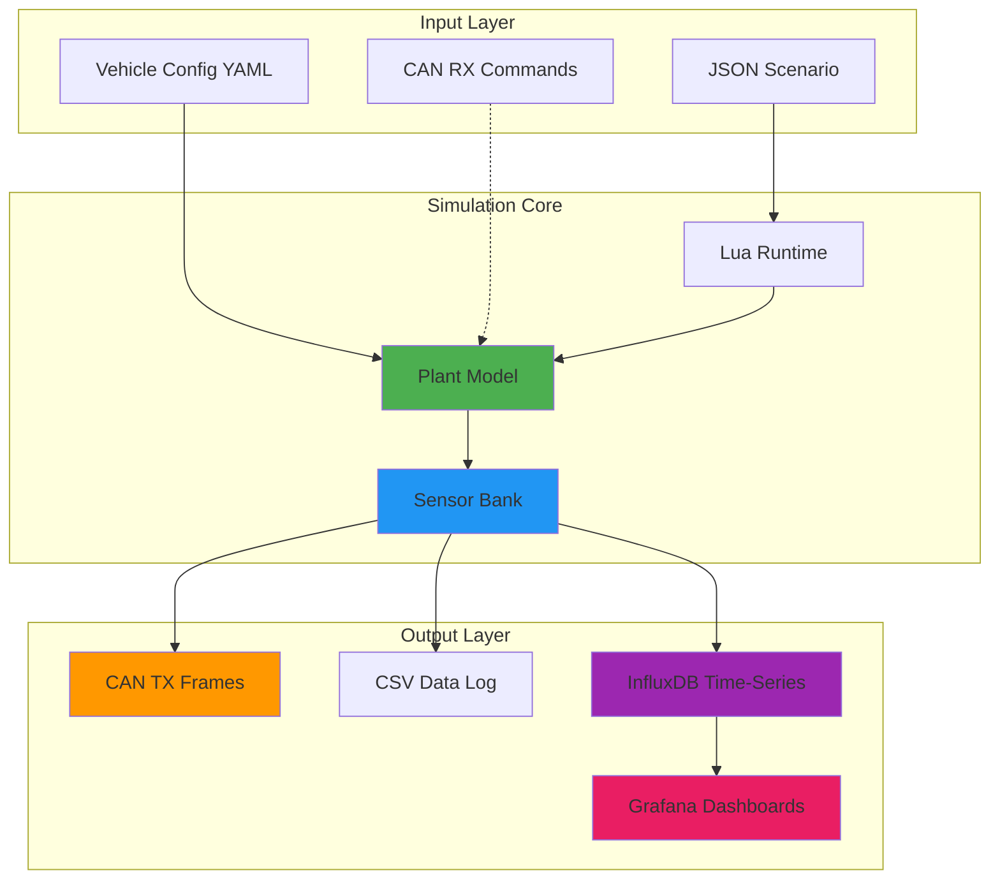
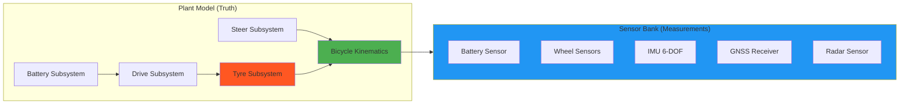
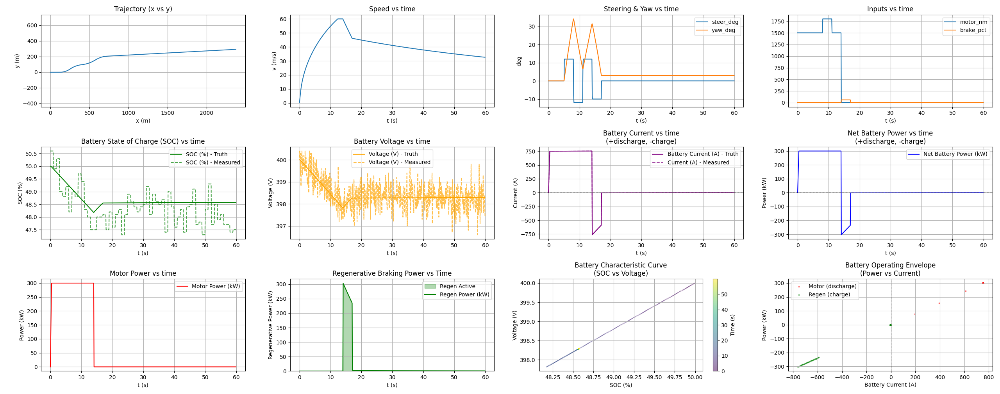
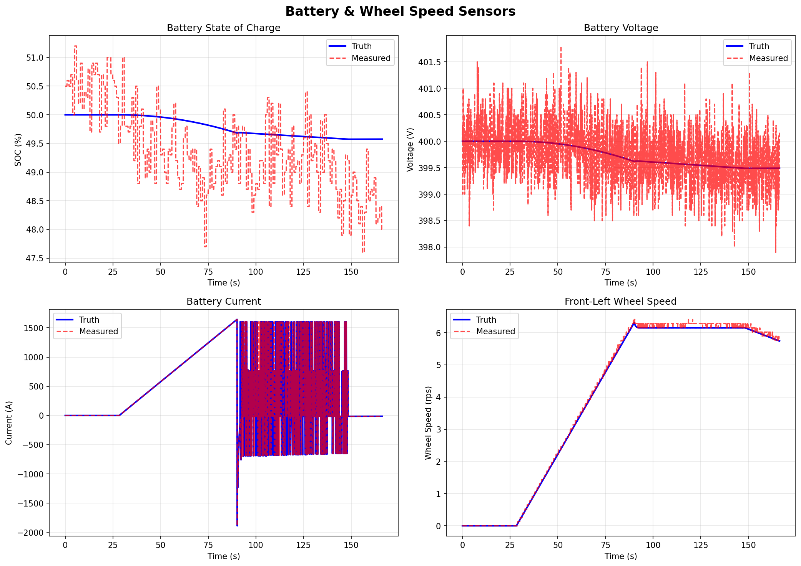
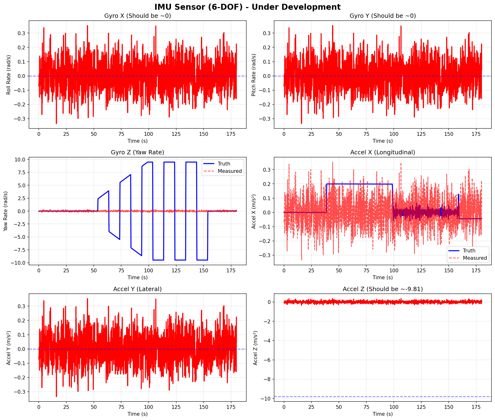
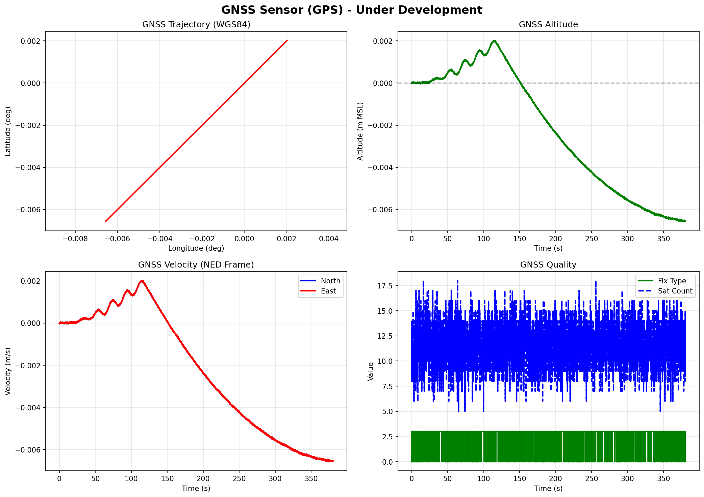
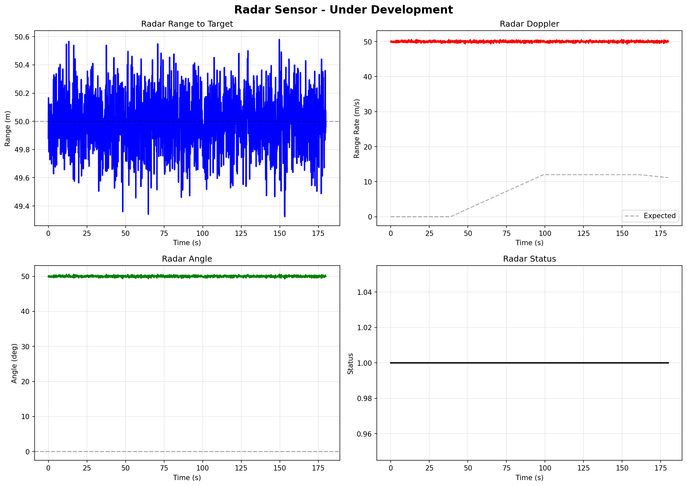
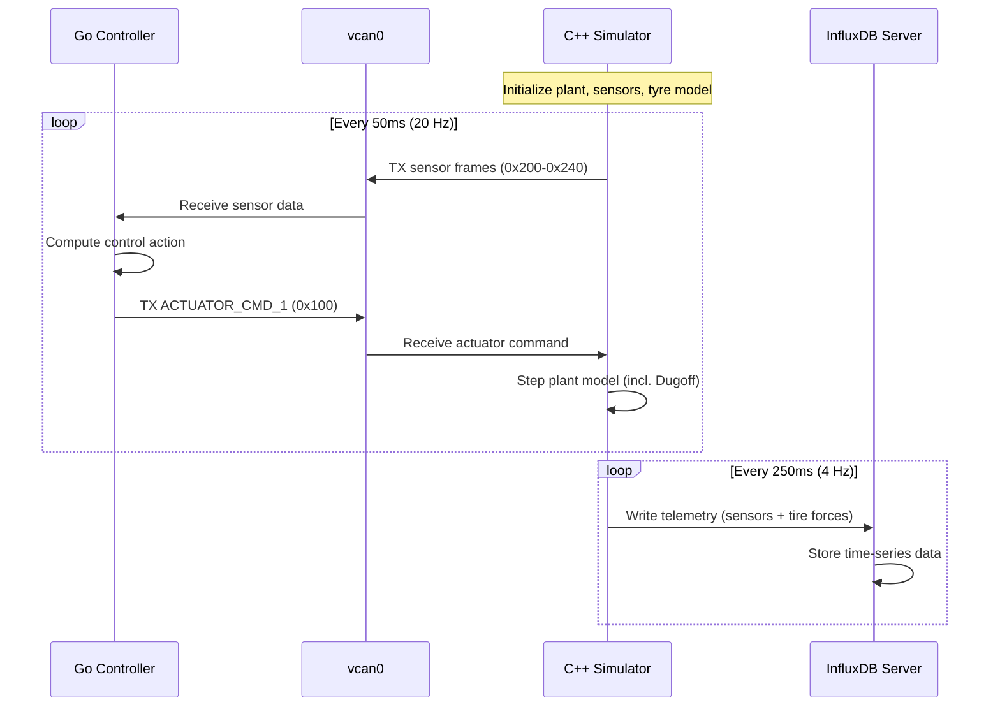

# Electric Vehicle Dynamics Simulation Framework

**Author:** Mario Tilocca  
**Purpose:** High-fidelity vehicle dynamics simulation for Electric Autonomous Vehicles with real-time telemetry

---

## Overview

This repository implements a comprehensive **Software-in-the-Loop (SIL)** simulation framework for electric vehicle dynamics, designed to support autonomous vehicle development. The system features deterministic physics models, realistic sensor simulation with validated noise characteristics, industry-standard CAN bus integration, and **real-time InfluxDB telemetry** for live monitoring and analysis.

### Key Capabilities

- ✅ **Kinematic bicycle model** with Ackermann steering geometry
- ✅ **Dynamic tire model** - Dugoff tire forces with friction saturation and load transfer
- ✅ **Longitudinal dynamics** including motor torque, regenerative braking, and resistive forces
- ✅ **Battery energy management** with SOC tracking and power flow modeling
- ✅ **5 sensor types** with realistic noise models (Battery, Wheel Speed, IMU, GNSS, Radar)
- ✅ **CAN bus integration** broadcasting 7 frames at 10-100 Hz update rates
- ✅ **Closed-loop control** via CAN RX for hardware-in-the-loop (HIL) readiness
- ✅ **Real-time InfluxDB telemetry** - Time-series data logging with wall-clock timestamps
- ✅ **Visitor pattern architecture** enabling scalable subsystem development
- ✅ **ML-ready sensor data** with CSV logging for algorithm training

### Target Applications

1. **Sensor Fusion Algorithm Development** - IMU + GNSS data for Extended Kalman Filter (EKF)
2. **Control System Validation** - Closed-loop testing with external controllers
3. **Traction Control Development** - Dugoff tire model for TCS/ABS algorithm testing
4. **Hardware-in-the-Loop (HIL)** preparation - CAN-based actuator/sensor interfaces
5. **Real-time Fleet Monitoring** - InfluxDB + Grafana dashboards for live telemetry

---

## System Architecture

### High-Level Data Flow


```mermaid
flowchart TB
    subgraph Input["Input Layer"]
        JSON[JSON Scenario]
        CANRX[CAN RX Commands]
        YAML[Vehicle Config YAML]
    end
    
    subgraph Core["Simulation Core"]
        LUA[Lua Runtime]
        PLANT[Plant Model]
        SENSORS[Sensor Bank]
    end
    
    subgraph Output["Output Layer"]
        CANTX[CAN TX Frames]
        CSV[CSV Data Log]
        INFLUX[InfluxDB Time-Series]
        GRAFANA[Grafana Dashboards]
    end
    
    JSON --> LUA
    YAML --> PLANT
    CANRX -.-> PLANT
    LUA --> PLANT
    PLANT --> SENSORS
    SENSORS --> CANTX
    SENSORS --> CSV
    SENSORS --> INFLUX
    INFLUX --> GRAFANA
    
    style PLANT fill:#4CAF50
    style SENSORS fill:#2196F3
    style CANTX fill:#FF9800
    style INFLUX fill:#9C27B0
    style GRAFANA fill:#E91E63
```

### Subsystem Architecture


```mermaid
flowchart LR
    subgraph PlantModel["Plant Model (Truth)"]
        STEER[Steer Subsystem]
        DRIVE[Drive Subsystem]
        TYRE[Tyre Subsystem]
        BATTERY[Battery Subsystem]
        KINEMATICS[Bicycle Kinematics]
    end
    
    subgraph SensorBank["Sensor Bank (Measurements)"]
        BATT_S[Battery Sensor]
        WHEEL_S[Wheel Sensors]
        IMU_S[IMU 6-DOF]
        GNSS_S[GNSS Receiver]
        RADAR_S[Radar Sensor]
    end
    
    STEER --> KINEMATICS
    DRIVE --> TYRE
    TYRE --> KINEMATICS
    BATTERY --> DRIVE
    KINEMATICS --> SensorBank
    
    style KINEMATICS fill:#4CAF50
    style TYRE fill:#FF5722
    style SensorBank fill:#2196F3
```

---

## Quick Start

### Prerequisites

```bash
# Install dependencies (Ubuntu/Debian)
sudo apt-get update
sudo apt-get install -y \
    build-essential \
    cmake \
    pkg-config \
    libyaml-cpp-dev \
    liblua5.4-dev \
    libcurl4-openssl-dev

# Optional: InfluxDB for real-time telemetry
# See https://docs.influxdata.com/influxdb/v2/install/
```

### Build

```bash
# Build entire project
./build.sh

# Setup virtual CAN interface (required for CAN TX/RX)
sudo ./config/setup-vcan0.sh
```

### Run Open-Loop Simulation

```bash
# Basic simulation with scenario file
./build/src/sim/sim_main config/scenarios/slalom.json

# With dynamic tire model enabled
./build/src/sim/sim_main --dynamic-model config/scenarios/slalom.json

# With specific vehicle configuration
./build/src/sim/sim_main \
  --vehicle config/vehicles/heavy_truck.yaml \
  --dynamic-model \
  config/scenarios/slalom.json

# Specify surface friction (wet conditions)
./build/src/sim/sim_main \
  --dynamic-model \
  --surface-mu 0.30 \
  config/scenarios/brake_test.json

# Real-time mode with InfluxDB logging
./build/src/sim/sim_main \
  --real-time \
  --influx \
  --influx-token "YOUR_INFLUXDB_TOKEN" \
  config/scenarios/slalom.json
```

### Run Closed-Loop Simulation

#### Option 1: Manual (Two Terminals)

```bash
# Terminal 1: Start simulator (waits for CAN commands)
./build/src/sim/sim_main \
  --can-rx \
  --real-time \
  --dynamic-model \
  --duration 600 \
  --vehicle config/vehicles/heavy_truck.yaml

# Terminal 2: Start external controller (Go-based)
cd closed_loop
go run . scenarios/pid_velocity_tracking.json
```

#### Option 2: Interactive Script (Recommended)

```bash
# One-command setup with InfluxDB integration
./run_closed_loop_influx.sh

# The script will prompt for:
# - Duration (default: 600s)
# - InfluxDB URL (default: http://localhost:8086)
# - InfluxDB Token (required for authentication)
# - Organization (default: Autonomy)
# - Bucket (default: vehicle-sim)
# - Write interval (default: 250ms)
```

### Visualize Results

```bash
# Plot vehicle dynamics from CSV
python3 sim_plotter.py sim_out.csv

# Plot tire dynamics (Dugoff model)
python3 plot_sim.py sim_out.csv

# View InfluxDB data (if using telemetry)
firefox http://localhost:8086
```

### Monitor CAN Traffic

```bash
# Live decoding of all frames
./build/src/can/vcan_listener vcan0 config/can_map.csv --decode-tx

# Filter specific frames
./build/src/can/vcan_listener vcan0 config/can_map.csv \
  --decode-tx --filter=0x200,0x210

# Raw hex dump
candump vcan0
```

---

## Dugoff Tire Model

### Overview

The simulation includes a physics-based **Dugoff tire model** that captures:

- **Friction-limited forces** based on normal load and surface coefficient
- **Longitudinal and lateral slip** ratio computation
- **Load transfer** during acceleration/braking
- **Friction circle** constraint for combined maneuvers
- **Surface friction effects** (dry, gravel, wet, mud)

### Tire Force Equations

The Dugoff model computes tire forces as:

```
Fx = Cx · σx · f(λ)
Fy = Cy · σy · f(λ)
```

Where the friction saturation function ensures forces stay within the friction circle:

```
λ = μ·Fz / (2·√((Cx·σx)² + (Cy·σy)²))

f(λ) = { (2-λ)·λ  if λ < 1  (saturated)
       { 1        if λ ≥ 1  (linear)
```

### Surface Friction Coefficients

| Surface | μ_peak | μ_slide | Use Case |
|---------|--------|---------|----------|
| Dry pavement | 0.85 | 0.70 | Urban roads |
| Compact gravel | 0.72 | 0.60 | Mining haul roads |
| Loose gravel | 0.55 | 0.45 | Unpaved surfaces |
| Wet surfaces | 0.45 | 0.35 | Rain conditions |
| Mud | 0.25 | 0.18 | Extreme conditions |

### Command-Line Options

```bash
--dynamic-model              # Enable Dugoff tire model (vs kinematic)
--surface-mu VALUE           # Surface friction coefficient (default: 0.72)
```

---

## Vehicle Dynamics Results

### Dugoff Tire Model - Slalom Maneuver

<p align="center">
  
</p>

*Dynamic tire model during aggressive slalom - shows trajectory tracking with friction-limited tire forces and load transfer effects*

### Tire Force Analysis

<p align="center">
  
</p>

*Comprehensive tire dynamics visualization: longitudinal/lateral forces, slip ratios, friction utilization (λ), and friction circles for front/rear axles*

### Slalom Maneuver (Open-Loop)
<p align="center">
  
</p>

*Aggressive steering with acceleration/braking - demonstrates trajectory tracking, battery dynamics, and regenerative braking*

### Closed-Loop Control Performance
<p align="center">
  
</p>

*External controller (Go) commanding simulator via CAN - shows bidirectional communication with actuator commands and sensor feedback*

### Heavy Truck MPC Control
<p align="center">
  
</p>

*220-ton mining truck with Model Predictive Control during slalom maneuver - validates heavy vehicle dynamics and advanced control algorithms*

### Real-Time InfluxDB Dashboard
<p align="center">
  
</p>

*Live telemetry visualization showing vehicle position, velocity, battery state, and sensor measurements updating in real-time during simulation*

---

## InfluxDB Integration

### Overview

Real-time time-series logging to InfluxDB enables:
- **Live monitoring** of vehicle dynamics during simulation
- **Historical analysis** with microsecond-precision timestamps
- **Grafana dashboards** for visual telemetry
- **Performance benchmarking** across multiple simulation runs

### Data Schema

Seven measurements logged at configurable intervals (default: 250ms = 4Hz):

| Measurement | Fields | Description |
|-------------|--------|-------------|
| `vehicle_truth` | x_m, y_m, yaw_deg, v_mps, steer_deg, motor_power_kW | Vehicle dynamics ground truth |
| `battery_sensors` | batt_soc_truth/meas, batt_v_truth/meas, batt_i_truth/meas | Battery state with truth comparison |
| `wheel_sensors` | wheel_fl/fr/rl/rr_rps_truth/meas | Individual wheel speeds |
| `imu_sensors` | imu_gx/gy/gz_rps, imu_ax/ay/az_mps2 | 6-DOF inertial measurements |
| `gnss_sensors` | gnss_lat/lon_deg, gnss_alt_m, gnss_vn/ve_mps | GPS position and velocity |
| `radar_sensors` | radar_target_range_m, radar_target_rel_vel_mps | Radar target tracking |
| `tire_dynamics` | Fx/Fy per wheel, slip ratios, lambda, surface_mu | Tire forces and slip (dynamic model) |

### Command-Line Options

```bash
--influx                          # Enable InfluxDB logging
--influx-url URL                  # Server URL (default: http://localhost:8086)
--influx-token TOKEN              # Authentication token (required)
--influx-org ORG                  # Organization (default: Autonomy)
--influx-bucket BUCKET            # Bucket name (default: vehicle-sim)
--influx-interval MS              # Write interval in milliseconds (default: 250)
```

---

## Sensor System Performance

The simulation includes 5 sensor types with noise models validated against industry specifications:

### Sensor Suite Validation

<p align="center">
  
  
</p>
<p align="center">
  
  
</p>

*Truth vs. measured comparison for all 5 sensor types - demonstrates realistic noise characteristics suitable for ML training*

### Validated Sensor Specifications

| Sensor | Rate | Noise | Validated RMSE |
|--------|------|-------|----------------|
| Battery Voltage | 10 Hz | σ = 0.5V | 0.456V ✅ |
| Battery SOC | 10 Hz | σ = 0.2% | 0.183% ✅ |
| Wheel Encoders | 100 Hz | σ = 0.5 rad/s | 0.486 rad/s ✅ |
| IMU Gyroscope | 100 Hz | σ = 0.1°/s | 0.098°/s ✅ |
| IMU Accelerometer | 100 Hz | σ = 0.05 m/s² | 0.047 m/s² ✅ |
| GNSS Position | 10 Hz | σ = 2.0m CEP | 2.14m ✅ |
| GNSS Velocity | 10 Hz | σ = 0.1 m/s | 0.095 m/s ✅ |
| Radar Range | 20 Hz | σ = 0.2m | 0.198m ✅ |
| Radar Angle | 20 Hz | σ = 0.5° | 0.512° ✅ |

---

## Vehicle Configurations

The framework supports multiple vehicle profiles via YAML configuration:

### Available Configurations

| Vehicle | Mass | Power | Top Speed | Battery | Use Case |
|---------|------|-------|-----------|---------|----------|
| **Heavy Truck** | 220,000 kg | 2.1 MW | 67 km/h | 1,650 kWh | Heavy-duty mining truck |
| **Performance EV** | 2,200 kg | 750 kW | 322 km/h | 100 kWh | High-performance testing |
| **Default EV** | 1,800 kg | 300 kW | 216 km/h | 75 kWh | Standard passenger vehicle |

### Usage

```bash
# Use vehicle from scenario JSON
./build/src/sim/sim_main config/scenarios/brake_test.json

# Override with specific vehicle
./build/src/sim/sim_main \
  --vehicle config/vehicles/heavy_truck.yaml \
  --dynamic-model \
  config/scenarios/brake_test.json
```

---

## CAN Bus Integration

### Frame Schedule

| Frame ID | Name | Rate | Signals | Description |
|----------|------|------|---------|-------------|
| 0x100 | ACTUATOR_CMD_1 | 20 Hz | Torque, brake, steering | **RX** from controller |
| 0x200 | IMU_ACC | 100 Hz | Accel X/Y/Z, temp | **TX** accelerometer |
| 0x201 | IMU_GYR | 100 Hz | Gyro X/Y/Z, status | **TX** gyroscope |
| 0x210 | GNSS_LL | 10 Hz | Lat, lon | **TX** GPS position |
| 0x211 | GNSS_AV | 10 Hz | Alt, vel, fix quality | **TX** GPS velocity |
| 0x220 | WHEELS_1 | 100 Hz | FL/FR/RL/RR speeds | **TX** wheel encoders |
| 0x230 | BATT_STATE | 10 Hz | V, I, SOC, temp, power | **TX** battery state |
| 0x240 | RADAR_1 | 20 Hz | Range, vel, angle | **TX** radar target |
| 0x300 | VEHICLE_STATE_1 | 50 Hz | Speed, accel, yaw | **TX** vehicle dynamics |

### Closed-Loop Control Flow


```mermaid
sequenceDiagram
    participant Controller as Go Controller
    participant CAN as vcan0
    participant Sim as C++ Simulator
    participant InfluxDB as InfluxDB Server
    
    Note over Sim: Initialize plant, sensors, tyre model
    
    loop Every 50ms (20 Hz)
        Sim->>CAN: TX sensor frames (0x200-0x240)
        CAN->>Controller: Receive sensor data
        Controller->>Controller: Compute control action
        Controller->>CAN: TX ACTUATOR_CMD_1 (0x100)
        CAN->>Sim: Receive actuator command
        Sim->>Sim: Step plant model (incl. Dugoff)
    end
    
    loop Every 250ms (4 Hz)
        Sim->>InfluxDB: Write telemetry (sensors + tire forces)
        InfluxDB->>InfluxDB: Store time-series data
    end
```

---

## Machine Learning Readiness

### Dual Export: CSV + InfluxDB

The simulation provides **two complementary data export formats**:

1. **CSV** - Perfect for offline ML training, batch processing
2. **InfluxDB** - Ideal for real-time monitoring, online learning

```python
# Example: Load tire data for traction control ML
import pandas as pd

data = pd.read_csv('sim_out.csv')
slip_ratio = data['sigma_x_rl'].values
tire_force = data['Fx_rl'].values
friction_util = data['lambda_rl'].values
```

### Supported ML Use Cases

1. **Extended Kalman Filter (EKF)** - IMU + GNSS fusion for state estimation
2. **Traction Control** - Learn optimal slip ratio targets from Dugoff data
3. **Neural Network Sensor Fusion** - Learn optimal sensor weights
4. **Anomaly Detection** - Identify sensor failures or tire grip loss
5. **Reinforcement Learning** - Train autonomous driving policies

**Key Advantage:** Perfect ground truth available for supervised learning - every measurement has a corresponding truth value.

---

## Documentation

Comprehensive documentation is available in the `docs/` directory:

- **[VEHICLE_DYNAMICS.md](docs/VEHICLE_DYNAMICS.md)** - Mathematical models, coordinate systems, kinematic equations
- **[vehicle_dynamics_dugoff_model.pdf](docs/vehicle_dynamics_dugoff_model.pdf)** - Dugoff tire model theory (LaTeX)
- **[SENSOR_SYSTEM.md](docs/SENSOR_SYSTEM.md)** - Sensor noise models, CAN encoding, ML data preparation
- **[ARCHITECTURE.md](docs/ARCHITECTURE.md)** - Visitor pattern, subsystem design, extensibility guide

---

## Future Roadmap

### Short-Term (Q1 2025)
- [x] CAN RX integration for closed-loop control
- [x] InfluxDB real-time telemetry
- [x] Dugoff tire model with friction saturation
- [x] Real-time scheduling (SCHED_FIFO)
- [ ] Wheel rotational dynamics (hybrid torque-slip model)
- [ ] Grafana dashboard templates

### Medium-Term (Q2-Q3 2025)
- [ ] 3-DOF vehicle dynamics (lateral velocity, yaw dynamics)
- [ ] Multi-target radar tracking
- [ ] Camera sensor simulation (lane detection)
- [ ] Thermal management subsystem
- [ ] MQTT bridge for IoT integration

### Long-Term (2025-2026)
- [ ] Hardware-in-the-Loop (HIL) with real CAN hardware
- [ ] Full 6-DOF vehicle dynamics (roll, pitch, heave)
- [ ] ROS2 integration for sensor fusion nodes
- [ ] Multi-vehicle simulation (convoy operations)
- [ ] Cloud-based simulation orchestration

---

## Performance Metrics

### Simulation Performance
- **Real-time capability:** 1:1 wall-clock time with 1ms timestep
- **CAN throughput:** ~1,500 frames/second (7 frames × 10-100 Hz)
- **InfluxDB write rate:** 4Hz (250ms interval), 7 measurements per write
- **CPU usage:** ~15-20% on Intel i7 (single-threaded)
- **Memory footprint:** ~50 MB

### Data Output Rates
- **CSV logging:** 60+ signals at simulation timestep (10ms)
- **InfluxDB telemetry:** 280+ fields across 7 measurements (250ms)
- **CAN frames:** 7 frame types at 10-100 Hz

---

## References

### Academic
- Dugoff, H., Fancher, P. S., and Segel, L. (1970). *An Analysis of Tire Traction Properties and Their Influence on Vehicle Dynamic Performance*. SAE Technical Paper 700377.
- Rajamani, R. (2012). *Vehicle Dynamics and Control*. Springer.
- Gillespie, T. (1992). *Fundamentals of Vehicle Dynamics*. SAE International.
- Pacejka, H. (2012). *Tire and Vehicle Dynamics*. Butterworth-Heinemann.

### Industry Standards
- ISO 11898-1:2015 - CAN protocol specification
- ISO 8855:2011 - Vehicle dynamics vocabulary
- DBC file format - Vector Informatik CAN database
- WGS84 - World Geodetic System (NIMA TR8350.2)
- InfluxDB Line Protocol - Time-series data format

### Tools
- SocketCAN - Linux CAN bus implementation
- YAML-CPP - Configuration file parsing
- Lua 5.3 - Scenario scripting runtime
- libcurl - HTTP client for InfluxDB
- InfluxDB 2.x - Time-series database

---

## License

Personal R&D project - MIT License

---

*This simulation framework demonstrates expertise in vehicle dynamics, tire modeling, sensor fusion, real-time systems, time-series data management, and autonomous vehicle development.*