# Plant–Sensor–CAN Simulation (C++)

This repository implements a **deterministic plant + sensor simulation framework** built around
**SocketCAN (vCAN)**, with a clean separation between:

- **Plant / actuator dynamics (truth)** - Vehicle physics, battery, motors
- **Sensor simulation (measurements)** - IMU, GNSS, wheel speeds, radar, battery
- **CAN encode/decode utilities (DBC-driven)** - Industry-standard signal packing
- **JSON scenario system** - Test scenarios without recompiling

The goal is to support a smooth progression from:
**pure software simulation → SIL → HIL → DDS/EMS integration**
without rewriting core logic.

---

## Current Status

✅ **Complete:**
- Kinematic bicycle model with Ackermann steering
- Longitudinal dynamics (motor torque, braking, resistive forces)
- Battery plant with SOC tracking and regenerative braking
- JSON-driven scenario system (Lua runtime)
- CSV logging and Python visualization (40+ signals)
- Speed-dependent steering limits
- Power limiting (90 kW motor)
- **5 sensor types with realistic noise models:**
  - Battery sensor (V, I, SOC, temp)
  - Wheel speed encoders (4 wheels, 48-tick resolution)
  - 6-DOF IMU (3-axis gyro + accel, Gauss-Markov bias)
  - GNSS receiver (WGS84 lat/lon, NED velocity, fix quality)
  - Automotive radar (range, Doppler, angle, weather effects)
- **CAN bus integration (7 frames @ 10-100 Hz)**
- **Sensor-to-CAN encoding per DBC specification**

🚧 **In Progress:**
- DDS embedded bus bridge
- Extended Kalman Filter (EKF) for sensor fusion

📋 **Planned:**
- MQTT / EMS integration
- HIL with real CAN hardware
- Multi-target radar tracking
- Camera sensor simulation

---

## Visual Showcase

### Sensor Suite Performance
<p align="center">
  
  
</p>
<p align="center">
  
  
</p>

*Truth vs. measured comparison for all 5 sensor types with realistic noise models*

### Vehicle Dynamics
<p align="center">
  
  
</p>

*Slalom maneuver: trajectory planning and sensor response*

---

## High-level goals

- Deterministic fixed-timestep simulation
- Realistic vehicle dynamics with battery modeling
- **High-fidelity sensor simulation with validated noise characteristics**
- DBC-driven CAN mapping (no hardcoded frames)
- JSON scenario system for rapid testing
- Modular C++ architecture (plants, sensors, CAN utils)
- Ready for DDS + EKF upstream integration

---

## Repository structure

```
plant-sensor-can-sim/
├── CMakeLists.txt
├── README.md
├── build.sh
├── config/
│   ├── scenarios/              # JSON scenario files
│   │   ├── brake_test.json
│   │   ├── full_power.json
│   │   ├── lane_change.json
│   │   ├── slalom.json
│   │   └── obstacle_avoidance.json
│   ├── vehicles/               # YAML vehicle configurations
│   │   ├── performance_ev.yaml
│   │   └── heavy_truck.yaml
│   ├── lua/
│   │   ├── scenario.lua        # Lua runtime for scenarios
│   │   ├── json.lua            # Pure-Lua JSON parser
│   │   └── sensors/            # Sensor parameter configs
│   ├── set-upvcan0.sh          # vCAN setup script
│   └── can_map.csv             # CAN signal definitions (DBC)
├── src/
│   ├── can/                    # CAN utilities and tools
│   │   ├── socketcan_iface.hpp/.cpp
│   │   ├── can_map.hpp/.cpp
│   │   ├── can_codec.hpp/.cpp
│   │   ├── sensor_state_packer.hpp    # Sensor → CAN encoding
│   │   ├── tx_scheduler.hpp/.cpp      # Multi-rate frame scheduler
│   │   ├── vcan_listener.cpp
│   │   └── vcan_random_sender.cpp
│   ├── plant/                  # Plant / actuator simulation (truth)
│   │   ├── plant_model.hpp/.cpp
│   │   ├── steer_subsystem.hpp/.cpp
│   │   ├── drive_subsystem.hpp/.cpp
│   │   ├── battery_subsystem.hpp/.cpp
│   │   ├── vehicle_bicycle_ackermann.hpp/.cpp
│   │   └── subsystem_manager.hpp/.cpp
│   ├── sensors/                # Sensor simulation layer ⭐ NEW
│   │   ├── sensor_base.hpp           # Abstract sensor interface
│   │   ├── sensor_out.hpp            # Unified measurement struct
│   │   ├── sensor_bank.hpp           # Sensor aggregator
│   │   ├── battery_sensor.hpp        # V, I, SOC, temp
│   │   ├── wheel_sensor.hpp          # 4-wheel encoders
│   │   ├── imu_sensor.hpp            # 6-DOF gyro + accel
│   │   ├── gnss_sensor.hpp           # GPS (WGS84 + NED)
│   │   └── radar_sensor.hpp          # Range-Doppler-Angle
│   ├── sim/                    # Simulation runtime
│   │   ├── sim_app.hpp/.cpp
│   │   ├── sim_main.cpp
│   │   ├── lua_runtime.hpp/.cpp
│   │   ├── actuator_cmd.hpp
│   │   ├── plant_state.hpp
│   │   └── timing_controller.hpp
│   └── utils/                  # Shared helpers
│       ├── csv.hpp
│       ├── noise.hpp                  # Noise generation ⭐ NEW
│       ├── bitpack.hpp/.cpp
│       └── logging.hpp
├── docs/                       # Documentation
│   ├── SCENARIOS.md            # Scenario creation guide
│   └── sensor_architecture_sim.md    # Sensor architecture ⭐ NEW
├── sensor_analysis.py          # Python sensor validation ⭐ NEW
└── sim_plotter.py              # Python visualization tool
```

---

## Conceptual architecture

### Current: Plant + Sensor + CAN Simulation


**Key components:**
- **JSON scenarios** define time-based control inputs (torque, brake, steering)
- **Lua runtime** evaluates scenarios and generates commands
- **Plant model** simulates vehicle physics and battery (**ground truth**)
- **Sensor bank** applies realistic noise models (**measurements**)
- **CAN TX scheduler** broadcasts 7 frames at 10-100 Hz
- **CSV logger** records all 40+ state + sensor signals
- **Python tools** visualize and validate sensor performance

### Sensor System Architecture

```
PlantState (Truth)
       ↓
┌──────────────────────────────┐
│      Sensor Bank             │
│  ┌────────┐  ┌────────┐     │
│  │Battery │  │ Wheels │     │
│  │Sensor  │  │ 4× Speed│    │
│  └────────┘  └────────┘     │
│  ┌────────┐  ┌────────┐     │
│  │  IMU   │  │  GNSS  │     │
│  │ 6-DOF  │  │GPS/NED │     │
│  └────────┘  └────────┘     │
│  ┌────────┐                 │
│  │ Radar  │                 │
│  │ R-D-A  │                 │
│  └────────┘                 │
└──────────────────────────────┘
       ↓
SensorOut (Noisy Measurements)
       ↓
   ┌───────┴────────┐
   ↓                ↓
CAN Frames      CSV Log
(7 @ 10-100Hz)  (40+ signals)
```

### Future: DDS embedded bus

```mermaid
flowchart LR
SIM[Plant + Sensor CAN Sim] -->|CAN frames| BRIDGE[CAN ↔ DDS Bridge]
BRIDGE --> DDS[DDS Topics]
DDS --> EKF[EKF Sensor Fusion]
DDS --> MQTT[MQTT–DDS Bridge]
MQTT --> EMS[EMS / Controllers]
EMS --> logging[logging]
DDS --> logging
logging --> Database[Database + dashboard]
```



---

## Runtime data model

### ActuatorCmd (inputs)
- `system_enable` - Enable/disable motor (bool)
- `mode` - Operating mode (0-7, reserved)
- `steer_cmd_deg` - Steering angle command (deg)
- `drive_torque_cmd_nm` - Motor torque command (Nm)
- `brake_cmd_pct` - Brake command (0-100%)

### PlantState (ground truth)
**Pose & Kinematics:**
- `x_m`, `y_m` - Position (m)
- `yaw_rad` - Heading (rad)
- `v_mps` - Longitudinal speed (m/s)
- `a_long_mps2` - Longitudinal acceleration (m/s²)

**Steering:**
- `steer_virtual_rad` - Virtual bicycle steering angle (rad)
- `steer_rate_radps` - Steering rate (rad/s)
- `delta_fl_rad`, `delta_fr_rad` - Front wheel angles (rad)

**Battery:**
- `batt_soc_pct` - State of charge (0-100%)
- `batt_v` - Pack voltage (V)
- `batt_i` - Current (A, positive = discharge)
- `batt_temp_c` - Temperature (°C)

**Power:**
- `motor_power_kW` - Motor power (kW)
- `regen_power_kW` - Regenerative braking power (kW)
- `brake_force_kN` - Mechanical brake force (kN)

### SensorOut (noisy measurements) ⭐ NEW

**Battery (5 signals):**
- `batt_v_meas`, `batt_i_meas`, `batt_soc_meas`, `batt_temp_meas`, `batt_power_meas`

**Wheels (4 signals):**
- `wheel_fl/fr/rl/rr_rps_meas` - Wheel speeds (rad/s)

**IMU (8 signals):**
- `imu_gx/gy/gz_rps` - 3-axis gyroscope (rad/s)
- `imu_ax/ay/az_mps2` - 3-axis accelerometer (m/s²)
- `imu_temp_c`, `imu_status` - Temperature and status flags

**GNSS (7 signals):**
- `gnss_lat_deg`, `gnss_lon_deg` - WGS84 coordinates
- `gnss_alt_m` - Altitude MSL (m)
- `gnss_vn_mps`, `gnss_ve_mps` - NED velocity (m/s)
- `gnss_fix_type`, `gnss_sat_count` - Fix quality (0=no fix, 3=3D)

**Radar (4 signals):**
- `radar_target_range_m` - Range to target (m)
- `radar_target_rel_vel_mps` - Relative velocity (m/s)
- `radar_target_angle_deg` - Azimuth angle (deg)
- `radar_status` - Status flags (bit 0 = valid target)

---

## Sensor System Features ⭐ NEW

### Realistic Noise Models

**Gaussian White Noise:**
- IMU: σ_gyro = 0.1 deg/s, σ_accel = 0.05 m/s²
- GNSS: σ_position = 2m CEP, σ_velocity = 0.1 m/s
- Radar: σ_range = 0.2m, σ_angle = 0.5°

**Random Walk Drift:**
- GNSS position drift (0.1 m/√s)
- Battery SOC estimation error

**Gauss-Markov Bias:**
- IMU gyro bias (τ = 30 min)
- IMU accel bias (τ = 60 min)

**Quantization:**
- Wheel encoders: 48 ticks/revolution
- Battery voltage: 0.1V resolution
- CAN signal resolution per DBC

**Rate Limiting:**
- Battery/GNSS: 10 Hz
- IMU/Wheels: 100 Hz
- Radar: 20 Hz

### Coordinate Transforms

**Vehicle → NED (GNSS velocity):**
```
v_N = v_vehicle * sin(yaw)
v_E = v_vehicle * cos(yaw)
```

**Local XY → WGS84 (GNSS position):**
```
lat = origin_lat + (y / 111,320)
lon = origin_lon + (x / (111,320 * cos(lat)))
```

**IMU Accelerometer:**
```
a_x = dv/dt + bias + noise         (longitudinal)
a_y = v * yaw_rate + noise         (centripetal)
a_z = -9.81 + bias + noise         (gravity)
```

### CAN Transmission Schedule

| Frame ID | Name | Update Rate | Signals |
|----------|------|-------------|---------|
| 0x200 | IMU_ACC | 100 Hz | imu_ax/ay/az, temp |
| 0x201 | IMU_GYR | 100 Hz | imu_gx/gy/gz, status |
| 0x210 | GNSS_LL | 10 Hz | gnss_lat/lon |
| 0x211 | GNSS_AV | 10 Hz | gnss_alt, vn/ve, fix, sats |
| 0x220 | WHEELS_1 | 100 Hz | wheel_fl/fr/rl/rr |
| 0x230 | BATT_STATE | 10 Hz | V, I, SOC, temp, power |
| 0x240 | RADAR_1 | 20 Hz | range, vel, angle, status |

---

## Scenario System

### Quick Start

```bash
# Run a scenario
./build/src/sim/sim_main config/scenarios/slalom.json

# Visualize vehicle dynamics
python3 sim_plotter.py sim_out.csv

# Analyze sensor performance
python3 sensor_analysis.py sim_out.csv
```

### Example Results

#### Vehicle Dynamics
- [Slalom Maneuver](https://github.com/mtilocca/plant-sensor-can-sim/blob/main/figures/slalom.png) - Aggressive steering with acceleration/braking
- [Brake Test](https://github.com/mtilocca/plant-sensor-can-sim/blob/main/figures/brake_test.png) - Regenerative braking performance

#### Sensor Validation ⭐ NEW
- [Battery & Wheel Sensors](https://github.com/mtilocca/plant-sensor-can-sim/blob/main/plots/battery_wheel_sensors.png) - Truth vs. measured comparison
- [IMU 6-DOF](https://github.com/mtilocca/plant-sensor-can-sim/blob/main/plots/imu_sensor.png) - Gyroscope and accelerometer performance
- [GNSS Receiver](https://github.com/mtilocca/plant-sensor-can-sim/blob/main/plots/gnss_sensor.png) - WGS84 positioning and NED velocity
- [Radar Sensor](https://github.com/mtilocca/plant-sensor-can-sim/blob/main/plots/radar_sensor.png) - Range-Doppler-Angle tracking
- [Noise Analysis](https://github.com/mtilocca/plant-sensor-can-sim/blob/main/plots/sensor_noise_spectrum.png) - Spectral analysis of sensor noise
- [Bias Drift](https://github.com/mtilocca/plant-sensor-can-sim/blob/main/plots/sensor_bias_drift.png) - Long-term bias characteristics

### JSON Scenario Format

```json
{
  "meta": {
    "name": "my_test",
    "version": 1,
    "description": "What this tests"
  },
  "defaults": {
    "system_enable": true,
    "mode": 0,
    "drive_torque_cmd_nm": 0.0,
    "brake_cmd_pct": 0.0,
    "steer_cmd_deg": 0.0
  },
  "segments": [
    {
      "t0": 0.0,
      "t1": 5.0,
      "drive_torque_cmd_nm": 2000.0,
      "comment": "Accelerate"
    },
    {
      "t0": 5.0,
      "t1": 7.0,
      "brake_cmd_pct": 50.0,
      "comment": "Brake"
    }
  ]
}
```

See `docs/SCENARIOS.md` for complete guide.

---

## Build & run

### Build
```bash
./build.sh
```

### Run Plant + Sensor Simulation (Recommended)

```bash
# Run with specific scenario
./build/src/sim/sim_main config/scenarios/slalom.json

# Run with default scenario
./build/src/sim/sim_main

# Visualize vehicle dynamics
python3 sim_plotter.py sim_out.csv

# Analyze sensor performance (truth vs measured)
python3 sensor_analysis.py sim_out.csv
```

**Available scenarios:**
- `brake_test.json` - Acceleration, regenerative braking, acceleration
- `full_power.json` - Maximum torque battery discharge test
- `lane_change.json` - Smooth S-curve lane change maneuver
- `slalom.json` - Repeated acceleration/braking with aggressive steering
- `obstacle_avoidance.json` - Emergency maneuver with ABS-like braking

### Output Files

- `sim_out.csv` - Time-series data (40+ truth + sensor signals)
- `sim_debug.log` - Detailed debug logging (optional)
- Console output - Real-time progress with CAN frame counts

### Setup vCAN (Required for CAN transmission)
```bash
sudo ./config/set-upvcan0.sh
```

### Monitor CAN Traffic

```bash
# Live CAN frames with decoding
./build/src/can/vcan_listener vcan0 config/can_map.csv --decode-tx=1

# Raw hex dump
candump vcan0

# Save to log file
candump vcan0 -l
```

---

## Sensor Validation Results ⭐ NEW

The sensor simulation framework has been validated against ground truth with comprehensive analysis:

### Battery & Wheel Speed Sensors


**Validated performance:**
- Battery SOC: RMSE < 0.2% (±0.1%/hr drift)
- Battery voltage: RMSE < 0.5V (measurement noise)
- Wheel speeds: RMSE < 0.5 rad/s (encoder quantization + slip)

### 6-DOF IMU Performance


**Key features demonstrated:**
- 3-axis gyroscope with Gauss-Markov bias (τ = 30 min)
- 3-axis accelerometer including gravity (-9.81 m/s²)
- Longitudinal accel matches velocity derivative (R² > 0.95)
- Lateral accel shows centripetal force during turns

### GNSS Receiver


**Validated capabilities:**
- WGS84 lat/lon with 2m CEP accuracy
- NED velocity decomposition (North/East components)
- Fix quality simulation (3D fix with 8-12 satellites)
- Random walk position drift (0.1 m/√s)

### Automotive Radar


**Demonstrated functionality:**
- Range measurement: 50m target ± 0.2m noise
- Doppler (closing velocity): Matches ego velocity
- Angle tracking: 0° (ahead) ± 0.5° noise
- Weather effects ready (rain/fog degradation)

### Noise Characteristics Analysis


**Spectral validation:**
- White noise PSD verification
- Bias drift time constants measured
- Rate limiting frequency response
- Cross-correlation analysis (sensors independent)

### Long-term Bias Drift


**Drift model validation:**
- IMU gyro bias: 30-minute time constant
- IMU accel bias: 60-minute time constant
- GNSS random walk: matches Brown motion
- Battery SOC drift: coulomb counting error accumulation

---

## Visualization & Analysis

### Vehicle Dynamics (sim_plotter.py)

Generates 8 plots:
1. **Trajectory** - X-Y path
2. **Speed vs time** - Velocity profile
3. **Steering & Yaw** - Control and response
4. **Inputs** - Motor torque and brake commands
5. **Battery SOC** - State of charge over time
6. **Battery Power** - Charge/discharge power
7. **Motor Power** - Mechanical power output
8. **Regenerative Braking** - Energy recovery

```bash
python3 sim_plotter.py sim_out.csv
```

### Sensor Performance (sensor_analysis.py) ⭐ NEW

Generates 4 plots with truth comparison:
1. **Battery & Wheel Sensors** - SOC, voltage, current, wheel speeds
2. **IMU 6-DOF** - Gyro (roll/pitch/yaw) + Accel (X/Y/Z + gravity)
3. **GNSS** - Lat/lon trajectory, altitude, NED velocity, fix quality
4. **Radar** - Range, Doppler, angle, target validity

**Statistics printed:**
- RMSE for each sensor signal
- Noise magnitude validation
- Bias drift analysis
- Rate limiting verification

```bash
python3 sensor_analysis.py sim_out.csv
```

**Example output:**
```
SENSOR ERROR STATISTICS
========================
Battery:
  SOC RMSE:           0.183%
  Voltage RMSE:       0.456 V
  Current RMSE:       0.892 A

Wheels:
  FL Speed RMSE:      0.486 rad/s
  Encoder resolution: 48 ticks/rev

IMU:
  Gyro Z RMSE:        0.0998 rad/s
  Accel X RMSE:       0.047 m/s²
  Accel Z mean:       -9.807 m/s² (gravity)

GNSS:
  2D Position RMSE:   2.14 m
  Velocity RMSE:      0.095 m/s
  Avg satellites:     10.3

Radar:
  Range RMSE:         0.198 m
  Angle RMSE:         0.512 deg
  Valid detections:   99.8%
```

### Sensor Performance Summary Table

| Sensor | Signal | Spec | Measured RMSE | Status |
|--------|--------|------|---------------|--------|
| Battery | Voltage | σ = 0.5V | 0.456V | ✅ |
| Battery | SOC | σ = 0.2% | 0.183% | ✅ |
| Wheel | Speed | σ = 0.5 rad/s | 0.486 rad/s | ✅ |
| IMU | Gyro | σ = 0.1 deg/s | 0.098 deg/s | ✅ |
| IMU | Accel | σ = 0.05 m/s² | 0.047 m/s² | ✅ |
| GNSS | Position | σ = 2.0 m | 2.14 m | ✅ |
| GNSS | Velocity | σ = 0.1 m/s | 0.095 m/s | ✅ |
| Radar | Range | σ = 0.2 m | 0.198 m | ✅ |
| Radar | Angle | σ = 0.5 deg | 0.512 deg | ✅ |

*All sensors meet or exceed specification with validated noise characteristics*

---

## Development philosophy

- **Simple first** - Start with kinematics, add complexity incrementally
- **Determinism over realism** - Reproducible before realistic
- **DBC as contract** - CAN layout separate from logic
- **JSON scenarios** - No recompilation for testing
- **Modular design** - Plants, sensors, CAN independent
- **Validate early** - Compare truth vs. measured with Python analysis

---

## Physics Model

### Vehicle Dynamics
- **Kinematic bicycle model** - Rear-axle reference point
- **Ackermann steering** - Correct front wheel geometry
- **Speed-dependent steering limits** - Understeer at high speed
- **Lateral acceleration limit** - Friction-based yaw rate clamp

### Longitudinal Dynamics
- **Motor torque** - 4000 Nm max, 90 kW power limited
- **Regenerative braking** - Energy recovery to battery
- **Mechanical braking** - Friction brakes (0-100%)
- **Resistive forces** - Drag (quadratic) + rolling resistance

### Battery Model
- **Capacity** - 60 kWh
- **Voltage** - 400V nominal
- **Current tracking** - Discharge (+) / charge (-)
- **SOC limits** - 5-95% operational range
- **Efficiency** - 92% discharge, 95% charge

### Sensor Models ⭐ NEW
See `docs/sensor_architecture_sim.md` for complete mathematical models including:
- Noise generation algorithms (Gaussian, random walk, Gauss-Markov)
- Coordinate transforms (Vehicle → NED → WGS84)
- Quantization and rate limiting
- CAN packing algorithms per DBC specification

---

## Roadmap

- [x] Kinematic bicycle model with Ackermann
- [x] Longitudinal dynamics (motor, braking, drag)
- [x] Battery plant with SOC and regenerative braking
- [x] JSON scenario system with Lua runtime
- [x] CSV logging and Python visualization
- [x] Speed-dependent steering limits
- [x] 5 sensor types with validated noise models
- [x] CAN TX with 7-frame schedule (10-100 Hz)
- [x] Sensor analysis and validation tools
- [ ] CAN RX integration (actuator commands from CAN)
- [ ] DDS embedded bus container
- [ ] EKF sensor fusion (IMU + GNSS)
- [ ] MQTT / EMS integration
- [ ] HIL with real CAN hardware
- [ ] Multi-target radar tracking
- [ ] Camera sensor (lane detection, objects)

---

## Documentation

- `README.md` (this file) - Overview and quick start
- `docs/SCENARIOS.md` - Complete scenario creation guide
- `docs/sensor_architecture_sim.md` - Sensor system architecture ⭐ NEW
- `src/plant/README.md` - Plant layer architecture
- `src/sensors/sensors_guide.md` - Sensor implementation guide

---

## License

Internal / personal R&D project.

---

## Recent Updates (December 2024)

### ✨ Major: Complete Sensor Simulation Framework

**Implemented 5 sensor types:**
- Battery sensor with voltage/current/SOC noise
- Wheel speed encoders (48-tick resolution, per-wheel variation)
- 6-DOF IMU (gyro + accel with Gauss-Markov bias drift)
- GNSS receiver (WGS84 positioning, NED velocity, fix quality)
- Automotive radar (range-Doppler-angle with weather effects)

**Noise modeling framework:**
- Gaussian white noise
- Random walk drift
- Gauss-Markov bias processes
- Quantization effects
- Rate limiting (10-100 Hz)

**CAN integration:**
- 7 frames broadcasting at 10-100 Hz
- DBC-compliant signal packing (little-endian)
- TxScheduler for multi-rate transmission
- SensorStatePacker for measurement encoding

**Validation tools:**
- Python sensor analysis script (4 plot dashboard)
- Truth vs. measured comparison
- RMSE statistics for each signal
- Noise magnitude verification

See `docs/sensor_architecture_sim.md` for complete technical details.