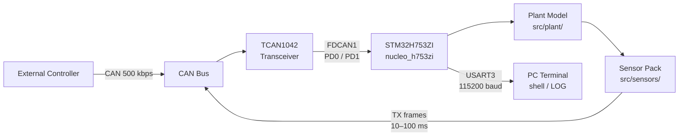
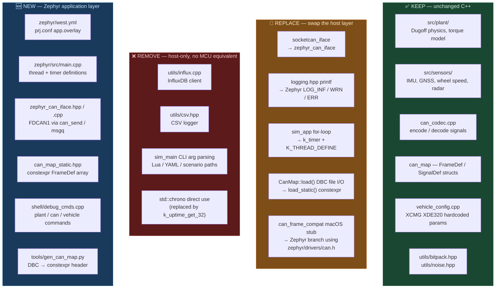
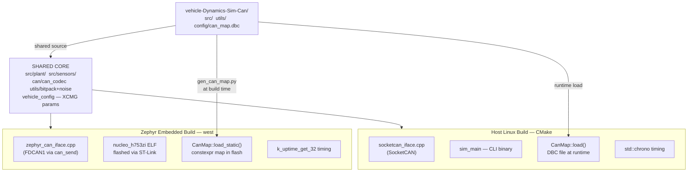
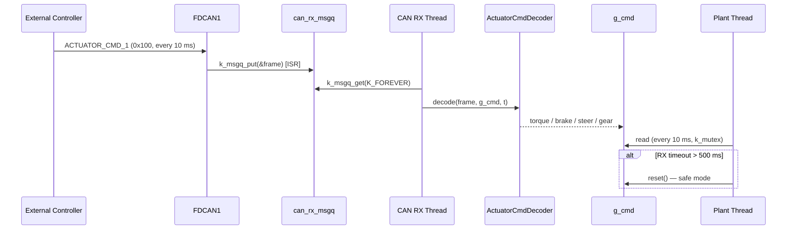
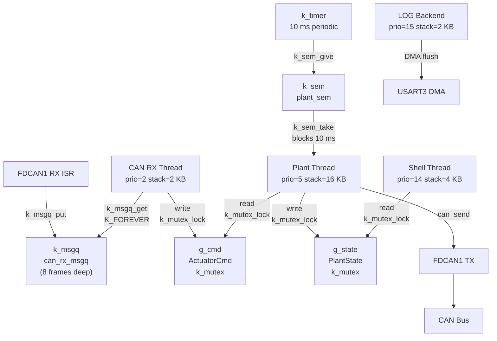
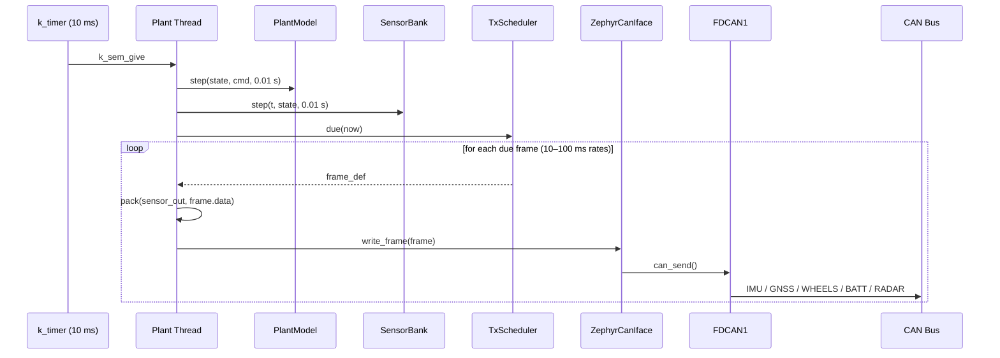
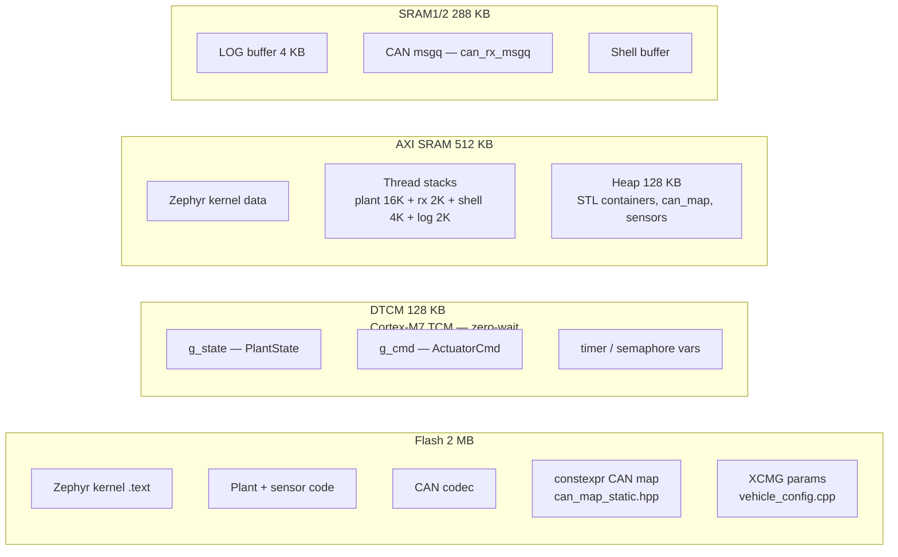

# Zephyr RTOS Port — XCMG XDE320 Plant Simulator

Porting the cleaned-up C++ plant simulator to run on the **STM32H753ZI** (Nucleo-H753ZI) under **Zephyr RTOS**, using the onboard FDCAN peripheral for closed-loop CAN control and UART shell for debugging.

---

## Hardware Target

| Property | Value |
|---|---|
| Board | ST Nucleo-H753ZI (Nucleo-144) |
| MCU | STM32H753ZI |
| Core | ARM Cortex-M7 @ 480 MHz |
| Flash | 2 MB |
| RAM | 1 MB (DTCM + ITCM + AXI SRAM) |
| CAN peripheral | 2× FDCAN (ISO 11898-1:2015) |
| Debug UART | USART3 → ST-Link virtual COM (USB, no extra cable) |
| Zephyr board target | `nucleo_h753zi` |

### FDCAN Pin Mapping (Nucleo-144 morpho connectors)

| Signal | STM32 Pin | Morpho |
|---|---|---|
| FDCAN1_RX | PD0 | CN9 pin 25 |
| FDCAN1_TX | PD1 | CN9 pin 27 |
| 3.3V | — | CN8 pin 7 |
| GND | — | any GND |

An external CAN transceiver is required (e.g. **TCAN1042** or **SN65HVD230** — both 3.3V compatible).
FDCAN2 (PB12/PB13) is available if a second bus is needed.

### System Context



---

## What Changes, What Stays



---

## Repository Layout (Option A — subdirectory)

The Zephyr application lives inside this repo as a `zephyr/` subdirectory.
West pulls Zephyr upstream as an external dependency.

```
vehicle-Dynamics-Sim-Can/
├── src/                        ← existing plant / can / sensors / config / sim
├── utils/
├── config/
│   └── can_map.dbc             ← source of truth for signal definitions
├── tools/
│   └── gen_can_map.py          ← NEW: generates can_map_static.hpp from DBC
├── docs/
│   └── ZEPHYR_PORT.md          ← this file
└── zephyr/                     ← NEW: west workspace root
    ├── west.yml                ← pulls zephyrproject-rtos/zephyr
    ├── CMakeLists.txt          ← app CMake, includes src/ and utils/
    ├── Kconfig                 ← app-level Kconfig
    ├── prj.conf                ← Zephyr configuration
    ├── app.overlay             ← devicetree overlay (FDCAN1 + USART3)
    └── src/
        ├── main.cpp            ← Zephyr entry point, thread definitions
        ├── can/
        │   ├── zephyr_can_iface.hpp/cpp   ← replaces socketcan_iface
        │   └── can_map_static.hpp         ← generated from can_map.dbc
        └── shell/
            └── debug_cmds.cpp  ← shell command registrations
```

### Dual Build Paths

Both the host simulator and the embedded firmware compile from the **same** `src/` and `utils/` source tree. Only the platform layer differs.



---

## Phase 0 — West Workspace + Board Skeleton

**Goal:** Board boots and prints a startup message over USB-UART.

### Files to create

**`zephyr/west.yml`**
```yaml
manifest:
  projects:
    - name: zephyr
      url: https://github.com/zephyrproject-rtos/zephyr
      revision: v3.7.0          # pin to a stable release
      import: true
  self:
    path: xcmg-sim
```

**`zephyr/prj.conf`**
```kconfig
# RTOS
CONFIG_MAIN_STACK_SIZE=8192

# FDCAN
CONFIG_CAN=y
CONFIG_CAN_AUTO_BUS_OFF_RECOVERY=y

# Logging
CONFIG_LOG=y
CONFIG_LOG_DEFAULT_LEVEL=3       # INFO
CONFIG_LOG_BACKEND_UART=y
CONFIG_LOG_BUFFER_SIZE=4096

# Interactive shell
CONFIG_SHELL=y
CONFIG_SHELL_BACKEND_SERIAL=y
CONFIG_SHELL_STACK_SIZE=4096

# C++ support
CONFIG_CPP=y
CONFIG_STD_CPP17=y
CONFIG_LIBCPP_EXCEPTIONS=n       # save flash
CONFIG_NEWLIB_LIBC=y             # for std::normal_distribution, sqrt, etc.

# Heap for STL containers (can_map, sensors)
CONFIG_HEAP_MEM_POOL_SIZE=131072  # 128 KB — tune after Phase 5 RAM audit
```

**`zephyr/app.overlay`**
```dts
/ {
    chosen {
        zephyr,canbus     = &fdcan1;
        zephyr,console    = &usart3;
        zephyr,shell-uart = &usart3;
    };
};

&fdcan1 {
    status = "okay";
    bus-speed = <500000>;     /* 500 kbps — matches can_map.dbc */
    sample-point = <875>;
};

&usart3 {
    status = "okay";
    current-speed = <115200>;
};
```

**Build command:**
```bash
cd zephyr
west init -l .
west update
west build -b nucleo_h753zi . -- -DBOARD_ROOT=..
west flash
```

**Verification:** `minicom -D /dev/ttyACM0 -b 115200` shows `[INF] XCMG sim booting...`

---

## Phase 1 — Zephyr Logging + UART Shell

**Goal:** All plant/CAN log output routes through Zephyr LOG. Shell commands let you inspect the running system without a debugger.

### Logging migration

Replace `utils/logging.hpp` macros with a thin shim that maps onto Zephyr's LOG API:

```cpp
// utils/logging.hpp (Zephyr branch, inside #ifdef CONFIG_ZEPHYR)
#include <zephyr/logging/log.h>
LOG_MODULE_REGISTER(xcmg_sim, LOG_LEVEL_INF);

#define LOG_INFO(fmt, ...)  LOG_INF(fmt, ##__VA_ARGS__)
#define LOG_WARN(fmt, ...)  LOG_WRN(fmt, ##__VA_ARGS__)
#define LOG_ERROR(fmt, ...) LOG_ERR(fmt, ##__VA_ARGS__)
#define LOG_DEBUG(fmt, ...) LOG_DBG(fmt, ##__VA_ARGS__)
```

No changes needed in any call sites — all `LOG_INFO(...)` calls in the plant code work as-is.

### Shell commands

Registered in `zephyr/src/shell/debug_cmds.cpp`:

| Command | Description |
|---|---|
| `plant state` | Dump all PlantState fields (v, x, y, yaw, soc, omega_fl/fr/rl/rr, Fx/Fy, etc.) |
| `plant mu <val>` | Change surface friction coefficient at runtime |
| `plant reset` | Zero the plant state |
| `can stats` | TX frame count, RX frame count, timeout count, last RX time |
| `can rx_frame` | Print last decoded ACTUATOR_CMD_1 fields |
| `vehicle info` | Print XCMG param summary (mass, torque, battery, etc.) |

**Verification:** `plant state` over serial prints all state fields. `plant mu 0.30` changes surface to wet.

---

## Phase 2 — Static CAN Map

**Goal:** No file I/O on the MCU. CAN signal definitions compiled into flash as `constexpr` data.

### Generator script

`tools/gen_can_map.py` reads `config/can_map.dbc` and outputs `zephyr/src/can/can_map_static.hpp`:

```cpp
// AUTO-GENERATED — do not edit. Run: python tools/gen_can_map.py
#pragma once
#include "can/can_map.hpp"

namespace can {

inline const std::array<SignalDef, 4> ACTUATOR_CMD_1_SIGNALS = {{
    {"system_enable",        0,  1, 1.0,  0.0,  0.0,   1.0},
    {"gear_position",        1,  2, 1.0,  0.0,  0.0,   2.0},
    {"steer_cmd_deg",        8, 16, 0.1,  0.0, -360.0, 360.0},
    {"drive_torque_cmd_nm", 24, 16, 10.0, 0.0, -300000.0, 300000.0},
    // ...
}};

inline const FrameDef FRAME_ACTUATOR_CMD_1 = {
    0x100, "ACTUATOR_CMD_1", {ACTUATOR_CMD_1_SIGNALS.begin(), ...}, 10, 8
};

// ... all TX frames ...

} // namespace can
```

`CanMap::load_static()` returns these pre-built definitions. `CanMap::load(path)` remains for host builds.

**Verification:** `can stats` shows the correct number of TX frames registered (matches `can_map.dbc`).

---

## Phase 3 — Zephyr CAN Transport

**Goal:** FDCAN1 opens, ACTUATOR_CMD_1 frames received and decoded, sensor frames transmitted.

### `zephyr_can_iface.hpp` interface

Same public interface as `SocketCanIface` — drop-in replacement:

```cpp
class ZephyrCanIface {
public:
    bool open(const char* devname);       // DEVICE_DT_GET(DT_CHOSEN(zephyr_canbus))
    bool write_frame(const struct can_frame&);   // can_send()
    bool read_nonblocking(struct can_frame&);     // k_msgq_get(K_NO_WAIT)
    bool is_open() const;
};
```

### CAN RX thread

```cpp
// High-priority thread — drains CAN RX message queue
K_THREAD_DEFINE(can_rx_tid, 2048, can_rx_thread, NULL, NULL, NULL, 2, 0, 0);

static void can_rx_thread(void*, void*, void*) {
    struct can_frame frame;
    while (true) {
        k_msgq_get(&can_rx_msgq, &frame, K_FOREVER);
        actuator_decoder.decode(frame, g_cmd, k_uptime_get_32() / 1000.0);
    }
}
```

### CAN RX Message Flow



### `can_frame_compat.hpp` — Zephyr branch

```cpp
#ifdef __ZEPHYR__
#  include <zephyr/drivers/can.h>
// struct can_frame is provided by Zephyr — no stub needed
#elif defined(__linux__)
#  include <linux/can.h>
#else
// macOS / Windows stub (existing)
#endif
```

**Verification:** Send a CAN frame from a USB CAN adapter (e.g. Peak PCAN, Kvaser) → `can rx_frame` shell command shows decoded values.

---

## Phase 4 — Plant Loop + CAN TX

**Goal:** Full 10 ms plant step running on-MCU, sensor frames broadcasting on FDCAN1.

### Timer-driven plant thread

```cpp
// Plant runs at exactly 10 ms via Zephyr timer
K_TIMER_DEFINE(plant_timer, plant_timer_expiry, NULL);
K_SEM_DEFINE(plant_sem, 0, 1);

static void plant_timer_expiry(struct k_timer*) {
    k_sem_give(&plant_sem);  // wake plant thread
}

K_THREAD_DEFINE(plant_tid, 16384, plant_thread, NULL, NULL, NULL, 5, 0, 0);

static void plant_thread(void*, void*, void*) {
    k_timer_start(&plant_timer, K_MSEC(10), K_MSEC(10));
    while (true) {
        k_sem_take(&plant_sem, K_FOREVER);
        double t = k_uptime_get_32() / 1000.0;

        // CAN RX timeout check
        if ((t - g_last_rx_t) > CAN_RX_TIMEOUT_S) {
            g_cmd.reset();
        }

        plant_model.step(g_state, g_cmd, 0.01);
        sensor_bank.step(t, g_state, 0.01);
        can_tx_pack_and_send(t, g_state, sensor_bank.get_output(t));
    }
}
```

### Thread Architecture



### CAN TX Message Flow



### Timing — replacing `std::chrono`

| Linux | Zephyr |
|---|---|
| `steady_clock::now()` | `k_uptime_get_32()` (ms) |
| `duration_cast<microseconds>` | `k_cycle_get_32()` + `k_cyc_to_us_ceil32()` |
| `sleep_for(10ms)` | `k_msleep(10)` |

**Verification:** CAN analyzer on bus shows IMU/GNSS/WHEEL/BATT frames at correct rates (10–100 ms). `plant state` updates every time you run it.

---

## Phase 5 — RAM / Flash Audit

**Goal:** Confirm the full build fits comfortably and heap is not exhausted at runtime.

### Expected sizes (STM32H753ZI)

| Region | Budget | Expected |
|---|---|---|
| Flash (.text + .rodata) | 2 MB | ~300–400 KB |
| SRAM (.bss + .data) | 1 MB | ~200–350 KB |
| Heap (STL + Zephyr) | 128 KB (configured) | ~50–100 KB |

### Audit commands

```bash
west build -t ram_report    # shows per-object RAM usage
west build -t rom_report    # shows per-object Flash usage
```

### Memory Map



### Potential hotspots

| Issue | Fix if needed |
|---|---|
| `std::unordered_map` in `can_codec.cpp` | Replace with `std::array` lookup or flat map |
| `std::string` in `FrameDef` / `SignalDef` | Replace with `const char*` for static names |
| `std::vector<SignalDef>` in CAN map | Replace with fixed-size `std::array` |
| `std::normal_distribution` in sensors | Keep — newlib supports it; only a few KB |

---

## Key API Mapping Reference

| Linux concept | Zephyr equivalent |
|---|---|
| `socket(PF_CAN, SOCK_RAW, CAN_RAW)` | `DEVICE_DT_GET(DT_CHOSEN(zephyr_canbus))` |
| `write(sock, &frame, sizeof(frame))` | `can_send(dev, &frame, K_FOREVER, NULL, NULL)` |
| `read_nonblocking()` polling | `can_add_rx_filter_msgq()` + `k_msgq_get(K_NO_WAIT)` |
| `std::chrono::steady_clock::now()` | `k_uptime_get_32()` |
| `std::this_thread::sleep_for(10ms)` | `k_msleep(10)` |
| `std::thread` + `std::mutex` | `K_THREAD_DEFINE` + `K_MUTEX_DEFINE` |
| `LOG_INFO(fmt, ...)` | `LOG_INF(fmt, ##__VA_ARGS__)` |
| `printf` debug | `printk()` or `LOG_DBG()` |
| main `for` loop | Zephyr thread blocked on `k_sem_take` |

---

## Execution Order Summary

```mermaid
flowchart TD
    P0["Phase 0\nWest workspace\nBoard boots"]
    G0{UART prints\nstartup message?}
    P1["Phase 1\nLogging + Shell\nUSART3 live"]
    G1{shell responds\nto commands?}
    P2["Phase 2\nStatic CAN Map\nDBC → constexpr"]
    G2{can stats shows\ncorrect frame count?}
    P3["Phase 3\nFDCAN1 open\nRX / TX verified"]
    G3{CAN analyzer\nsees frames?}
    P4["Phase 4\nPlant loop 10 ms\nSensor frames TX"]
    G4{plant state\nupdates live?}
    P5["Phase 5\nRAM / Flash audit\nHeap tuned"]
    G5{RAM report\ngreen?}
    DONE(["DONE\nDeployed on\nnucleo_h753zi"])

    P0 --> G0
    G0 -->|Yes| P1
    G0 -->|No — fix overlay / prj.conf| P0
    P1 --> G1
    G1 -->|Yes| P2
    G1 -->|No — check SHELL config| P1
    P2 --> G2
    G2 -->|Yes| P3
    G2 -->|No — rerun gen_can_map.py| P2
    P3 --> G3
    G3 -->|Yes| P4
    G3 -->|No — check transceiver wiring| P3
    P4 --> G4
    G4 -->|Yes| P5
    G4 -->|No — check thread priorities| P4
    P5 --> G5
    G5 -->|Yes| DONE
    G5 -->|No — replace STL containers| P5
```



---

## Dependencies / Tools Needed

| Tool | Purpose |
|---|---|
| [west](https://docs.zephyrproject.org/latest/develop/west/index.html) | Zephyr meta-tool (build, flash, update) |
| [Zephyr SDK](https://docs.zephyrproject.org/latest/develop/toolchains/zephyr_sdk.html) | ARM GCC cross-compiler toolchain |
| `arm-zephyr-eabi-gcc` | C++ compiler for Cortex-M7 |
| ST-Link (onboard) | Flash + debug over USB |
| External CAN transceiver | TCAN1042 or SN65HVD230 (3.3V) |
| USB-CAN adapter (optional) | PCAN-USB, Kvaser, or Canable for bus monitoring |
| `minicom` / `picocom` | Serial terminal for shell access |
| Python 3 | Run `tools/gen_can_map.py` at build time |
