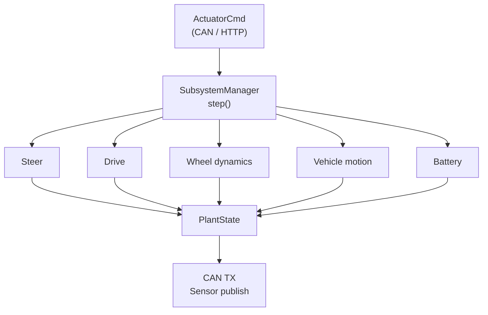

# Simulation Models

The simulator implements a layered physics stack, from low-level tyre contact forces up to full vehicle motion and energy management. Each layer is an independent, testable subsystem.

---

## 3-DOF Vehicle Dynamics

The core motion model integrates longitudinal velocity, lateral velocity, and yaw rate simultaneously, capturing the coupling effects that single-axis models miss.

**Key capabilities:**

- Full rigid-body dynamics with centripetal coupling terms
- Smooth kinematic-to-dynamic blending at low speeds
- Per-axle load transfer under acceleration and braking
- Four-wheel independent torque distribution
- Gear selector: Forward / Neutral / Reverse

**Validated against:** standard vehicle dynamics benchmarks, cusp manoeuvres, and step-steer responses.

---

## Dugoff Tyre Model

Tyre forces are computed using the Dugoff combined-slip formulation, which accounts for simultaneous longitudinal and lateral loading at each wheel.

**Key capabilities:**

- Physics-based longitudinal and lateral force generation
- Friction circle saturation — forces are automatically limited to the available friction budget
- First-order lag dynamics representing tyre relaxation
- Independent computation per wheel — supports asymmetric road surfaces

---

## Battery & Energy Model

An electro-thermal battery model tracks state-of-charge, regenerative braking energy recovery, and power limits.

**Key capabilities:**

- State-of-charge integration from net power flow
- Regenerative braking captured as negative drive torque
- Power ceiling enforcement under peak-demand conditions
- Continuous energy logging for post-run analysis

---

## Sensor Simulation

A realistic sensor pack sits on top of the plant model, producing measurements that match real-world hardware characteristics.

See [Sensor Suite](sensor_public.md) for the full sensor specification.

---

## Architecture

All subsystems follow a common visitor-pattern interface, registered with a central manager that calls each in priority order once per simulation step. This makes the stack straightforward to extend — new subsystems drop in without modifying existing code.

