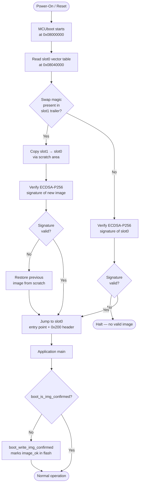
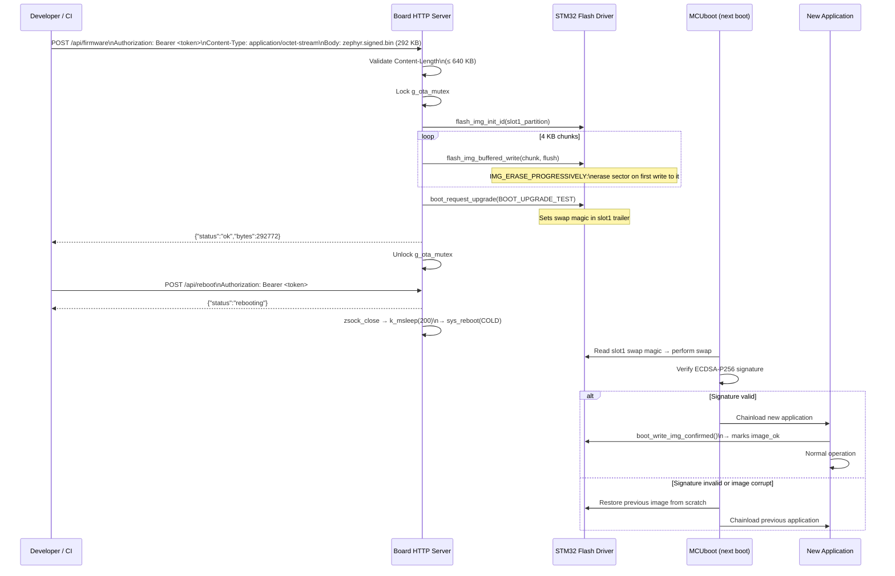

# MCUboot Secure Bootloader & OTA Firmware Update

**Phases 3a and 3b — STM32H753ZI / Nucleo-H753ZI**

---

## Overview

Phase 3a introduces MCUboot as a cryptographic gatekeeper: every firmware image is verified with an ECDSA-P256 signature before the CPU jumps to it. An unsigned or tampered image is rejected at boot — the board stays in MCUboot and does not execute the payload.

Phase 3b adds an authenticated HTTP endpoint that streams a new signed binary into the secondary flash slot. MCUboot performs a swap on the next reboot; if the new image fails to confirm itself, an automatic rollback restores the previous firmware.

---

## Flash Partition Layout

The STM32H753ZI has 2 MB of dual-bank flash with 128 KB sectors.
The board's default partition layout was overridden in `zephyr/app.overlay` and `zephyr/sysbuild/mcuboot.overlay`.

```
Flash address   Size      Partition          Description
─────────────────────────────────────────────────────────
0x08000000      128 KB    boot_partition     MCUboot bootloader (ECDSA-P256 verifier)
0x08020000      128 KB    storage_partition  Board default — left in place, unused
0x08040000      640 KB    slot0_partition    Active application (bank 1, sectors 2-6)
0x080E0000      128 KB    (unused)           Bank 1 sector 7
0x08100000      640 KB    slot1_partition    OTA staging area (bank 2, sectors 0-4)
0x081A0000      256 KB    (unused)           Bank 2 sectors 5-6
0x081E0000      128 KB    scratch_partition  MCUboot swap scratch area
─────────────────────────────────────────────────────────
Total: 2048 KB = 2 MB (fully mapped)
```

**Key constraint**: MCUboot occupies exactly one 128 KB sector. The app at slot0 starts on sector 2 (0x08040000), a different sector from MCUboot — flashing the app cannot accidentally erase the bootloader.

---

## Boot Flow



---

## ECDSA-P256 Signing Chain

```
Build time:
  imgtool keygen -k mcuboot_signing_key.pem -t ecdsa-p256
        │
        ▼
  Private key  ──────────────────────────────────────────────────
  (gitignored)                                                    │
        │                                                         │
        ▼                                                  Public key
  west build --sysbuild                              embedded in MCUboot
        │                                              at build time
        ├─ MCUboot image (verifier embeds public key)
        │
        └─ App image → imgtool sign → zephyr.signed.bin
               • Adds 512-byte header (magic, version, slot size)
               • SHA-256 hash over firmware region
               • ECDSA-P256 signature over hash
               • TLV trailer appended

Runtime (every boot):
  MCUboot reads TLV → extracts signature → verifies against
  embedded public key → SHA-256 hash matches → chainload
```

**Key file locations:**

| File | Location | Purpose |
|------|----------|---------|
| `mcuboot_signing_key.pem` | `zephyr/` (gitignored) | ECDSA-P256 private key — sign images |
| Public key | Embedded in MCUboot binary | Verify signatures at boot |
| `sysbuild/mcuboot.conf` | `zephyr/sysbuild/` | MCUboot Kconfig: `BOOT_SIGNATURE_TYPE_ECDSA_P256=y` |
| `CMakeLists.txt` | `zephyr/` | `set(MCUBOOT_SIGNING_KEY_FILE ...)` — tells west which key to use |

---

## OTA Update Flow



---

## Rollback Mechanism

MCUboot uses **test-mode swap** (`BOOT_UPGRADE_TEST`):

1. After upload, the slot1 trailer contains a swap magic marker but `image_ok = 0`.
2. On the next boot, MCUboot sees the magic, swaps slot1 → slot0, then boots the new image.
3. The new image must call `boot_write_img_confirmed()` before the watchdog fires.
4. If the new image crashes before confirming (hard fault, stack overflow, watchdog reset), MCUboot sees `image_ok = 0` on the subsequent boot and **automatically swaps back** to the previous image.

This means a corrupt or incompatible OTA binary cannot permanently brick the board.

---

## DTS Overlay Design

### Why we override partitions

The board's default `nucleo_h753zi.dts` defines slot0 as 256 KB — smaller than our 286 KB app binary. The overlay expands slots to 640 KB each while preserving the original node names to avoid DTS unit-address warnings.

### Key lesson: MCUboot needs `chosen` override

The board DTS has `zephyr,code-partition = &slot0_partition` in the chosen node. Without an explicit override in `sysbuild/mcuboot.overlay`, MCUboot links itself to slot0 (0x08040000) — and the app write overwrites the bootloader.

**Fix in `sysbuild/mcuboot.overlay`:**
```dts
/ {
    chosen {
        zephyr,code-partition = &boot_partition;
    };
};
```

This forces MCUboot to link to boot_partition (0x08000000, 128 KB), not slot0.

---

## Kconfig Summary

| Option | Value | Purpose |
|--------|-------|---------|
| `CONFIG_BOOTLOADER_MCUBOOT` | `y` | App linked to slot0, includes MCUboot header |
| `CONFIG_IMG_MANAGER` | `y` | `boot_request_upgrade()`, `boot_write_img_confirmed()` |
| `CONFIG_FLASH_MAP` | `y` | Flash area abstraction |
| `CONFIG_STREAM_FLASH` | `y` | Streaming write API for OTA |
| `CONFIG_IMG_ERASE_PROGRESSIVELY` | `y` | Sector erased on first write — no full pre-erase needed |
| `CONFIG_BOOT_SIGNATURE_TYPE_ECDSA_P256` | `y` (MCUboot) | Signature algorithm |
| `CONFIG_BOOT_MAX_IMG_SECTORS` | `512` | Max sectors per slot MCUboot manages |

---

## Build & Flash Commands

**Initial flash (JTAG, both MCUboot + app):**
```bash
cd /home/baloo/zephyrproject
rm -rf build
west build -b nucleo_h753zi /path/to/zephyr --sysbuild
west flash
```

**Subsequent updates (OTA, no JTAG needed):**
```bash
# After building a new signed app:
TOKEN=$(grep -oP '(?<=")[0-9a-f]{64}' zephyr/src/http/http_auth.hpp)
curl -X POST http://192.168.1.80/api/firmware \
     -H "Authorization: Bearer $TOKEN" \
     -H "Content-Type: application/octet-stream" \
     --data-binary @build/zephyr/zephyr/zephyr.signed.bin
curl -X POST http://192.168.1.80/api/reboot -H "Authorization: Bearer $TOKEN"
```

**Verify OTA succeeded (UART):**
```
[MCUBOOT] Bootloader chainload address offset: 0x40000
[MCUBOOT] Jumping to the first image slot
[00:00:00.xxx] <inf> hdv_sim: Phase : 3b - OTA firmware update
[00:00:00.xxx] <inf> hdv_sim: BOOT: image confirmed OK
```

---

## Known Limitations

| Item | Detail |
|------|--------|
| MCUboot not updatable via OTA | MCUboot lives in boot_partition; OTA only writes to slot1 |
| Signing key not rotatable via OTA | The ECDSA public key is baked into the MCUboot binary |
| DTS warnings (cosmetic) | `partition@80000` and `partition@c0000` node names mismatch their overridden `reg` values; functional, not fixable without upstream board DTS changes |
| Scratch area unused | MCUboot is configured for overwrite mode; scratch is reserved but not used for swap |
