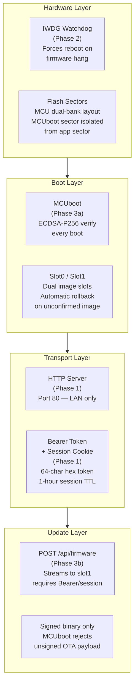
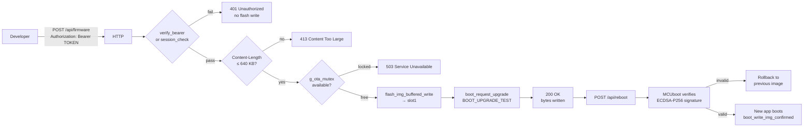

# Security Hardening — Implementation Reference

**STM32H753ZI / Nucleo-H753ZI — Phases 1 through 3b**

---

## Architecture Overview

The security model is layered: each phase adds a control that is independent of the others, so no single failure collapses the whole protection.



---

## Phase Summary

| Phase | Control | Threat Mitigated |
|-------|---------|-----------------|
| 1 | HTTP Bearer token (64-char hex) | Unauthenticated command injection via HTTP |
| 1 | Session cookie (32-char hex, 1h TTL) | Browser session hijack after login |
| 2 | IWDG hardware watchdog (1s timeout, 5s reset) | Firmware hang / infinite loop |
| 2 | SYS_INIT early kicks (PRE_KERNEL_1 → APPLICATION) | Watchdog firing during boot before threads start |
| 3a | MCUboot ECDSA-P256 signature check | Unsigned or tampered firmware execution |
| 3a | Dual-slot with test-mode swap | Bricking from failed OTA |
| 3b | OTA auth (Bearer required for `/api/firmware`) | Unauthenticated firmware replacement |
| 3b | Signed-binary-only OTA | Attacker pushing unsigned replacement via OTA |
| 4 (planned) | RDP Level 1 | Flash readback / firmware extraction via SWD |

---

## Phase 1 — HTTP Authentication

### Token model

```
Deployment time:
  scripts/gen_http_token.sh  →  http_auth.hpp (gitignored)
  Content: #define HTTP_BEARER_TOKEN "5f580d6c..."  (64 hex chars = 256-bit entropy)

Runtime:
  POST /login  body: token=<value>
       │
       ├─ verify_bearer() — constant-time strncmp + length check
       │        │
       │    success ──► session_create() → 32-char hex token → Set-Cookie: sid=...
       │    failure ──► send_login_page(bad_token=true) — no timing side-channel
       │
  GET /dash   Cookie: sid=<token>
       │
       └─ session_check() → scan 4-slot table, compare token, check TTL
```

### Session table

```
┌──────┬──────────────────────────────────┬─────────────┐
│ Slot │ Token (32 hex chars)             │ Expiry (ms) │
├──────┼──────────────────────────────────┼─────────────┤
│  0   │ a3f1...                          │ uptime+3600 │
│  1   │ (empty)                          │ —           │
│  2   │ (empty)                          │ —           │
│  3   │ (empty)                          │ —           │
└──────┴──────────────────────────────────┴─────────────┘
Max 4 concurrent sessions. FIFO eviction. Protected by K_MUTEX.
```

### Remaining exposure (HTTP, no TLS)

- Token and session cookie travel in plaintext → passive LAN observer can capture and replay
- **Mitigated by**: isolated lab/LAN environment; HTTPS (planned next) eliminates this

---

## Phase 2 — IWDG Hardware Watchdog

### Timeline

```
Power-on
  │
  ├─ PRE_KERNEL_1  iwdg_early_kick() ─ AAAAH kick (counter reset, no PR/RLR write)
  ├─ PRE_KERNEL_2  iwdg_early_kick() ─ AAAAH kick
  ├─ POST_KERNEL   iwdg_early_kick() ─ AAAAH kick
  ├─ APPLICATION   iwdg_early_kick() ─ AAAAH kick
  │
  ├─ watchdog_thread (priority 2) starts
  │     wdt_install_timeout(window.max=1000ms)
  │     wdt_setup(PAUSE_HALTED_BY_DBG)
  │     PR=6, RLR=624 → 5s hardware timeout programmed
  │
  │     ┌── Grace period (10 s): feed every 500 ms ─────────────────┐
  │     │   allows all threads to start and stabilise               │
  │     └────────────────────────────────────────────────────────────┘
  │
  └─ Monitoring phase: k_sem_take(g_wdt_sem, K_MSEC(500))
        ├─ sem given by plant_thread every step (10 ms)  → wdt_feed() → loop
        └─ sem NOT given within 500 ms → watchdog expires → SoC reset
```

### Why IWDG over WWDG

IWDG runs on LSI (independent clock — not affected by main clock failures). WWDG runs on PCLK1 (gated by the clock tree). A firmware hang that disrupts the main clock tree will stop WWDG but not IWDG.

### Root cause of original boot loop

At 52 ms boot time: IWDG was inherited from a previous session (not cleared by warm reset) with a short timeout. Early Zephyr boot phases have no thread scheduler, so `wdt_feed()` could not run. Fixed by direct register kicks (`0xAAAA` to KR) at each SYS_INIT level.

---

## Phase 3a — MCUboot Secure Bootloader

### Signature verification

```
MCUboot image layout (slot0 starting at 0x08040000):
┌─────────────────────────────────┐ ← 0x08040000
│  MCUboot image header  (512 B)  │  magic, version, img_size, flags
├─────────────────────────────────┤ ← 0x08040200
│                                 │
│  Application binary             │  Zephyr RTOS + all threads
│  (~285 KB)                      │
│                                 │
├─────────────────────────────────┤
│  TLV Info header                │  type=SHA256, type=ECDSA_SIG
├─────────────────────────────────┤
│  SHA-256 hash of image region   │  32 bytes
│  ECDSA-P256 signature           │  64 bytes (r, s)
│  Key hash                       │  32 bytes (SHA-256 of public key)
└─────────────────────────────────┘
```

### Partition isolation

MCUboot occupies sector 0 (0x08000000–0x0801FFFF). The app starts at sector 2 (0x08040000). Flashing slot0 erases sectors 2–6; it cannot reach sector 0. MCUboot survives an app flash.

---

## Phase 3b — OTA Firmware Update

### Auth chain for OTA



### What OTA can and cannot change

| Can update via OTA | Cannot update via OTA |
|--------------------|----------------------|
| Application logic (all threads) | MCUboot bootloader |
| Zephyr RTOS Kconfig | ECDSA public key in MCUboot |
| HTTP server routes and pages | Flash partition layout |
| Plant model, CAN drivers | Hardware fuses (RDP, option bytes) |
| Watchdog configuration | |

---

## Threat Model Summary

| Threat | Control | Residual Risk |
|--------|---------|---------------|
| Attacker injects HTTP command | Bearer token (256-bit) | Token on wire (no TLS — planned) |
| Attacker replays session | 1-hour TTL, 4-slot table | Cookie in plaintext (no TLS — planned) |
| Attacker pushes rogue firmware via OTA | ECDSA-P256 signature required | Attacker needs private key |
| Firmware extraction via JTAG/SWD | (planned) RDP Level 1 | Currently readable |
| Firmware hang / DoS | IWDG 1s timeout → reboot | Plant thread stall >500ms triggers reset |
| Power-loss during OTA swap | MCUboot test-mode rollback | None — automatic recovery |
| Board runs unconfirmed OTA image | boot_write_img_confirmed in main | Image must reach main() to confirm |

---

## File Map

```
zephyr/
├── app.overlay                    Flash partition layout (slot0 at 0x08040000)
├── sysbuild.conf                  SB_CONFIG_BOOTLOADER_MCUBOOT=y
├── sysbuild/
│   ├── mcuboot.conf               ECDSA-P256, 512 max sectors, INF log
│   └── mcuboot.overlay            Partition layout + chosen override for MCUboot
├── prj.conf                       IMG_MANAGER, STREAM_FLASH, FLASH_MAP, ...
├── CMakeLists.txt                 MCUBOOT_SIGNING_KEY_FILE
├── mcuboot_signing_key.pem        ECDSA-P256 private key (gitignored)
└── src/
    ├── main.cpp                   boot_write_img_confirmed() at startup
    ├── http/
    │   ├── http_server.cpp        Routes: /ota, /api/firmware, /api/reboot
    │   ├── http_ota.cpp           handle_ota_upload, handle_ota_page, handle_api_reboot
    │   ├── http_cmd.cpp           verify_bearer(), read_headers()
    │   ├── http_session.cpp       session_create(), session_check()
    │   └── http_auth.hpp          Bearer token (gitignored)
    └── watchdog/
        └── watchdog_thread.cpp    SYS_INIT kicks + wdt_feed() via semaphore

docs/zephyr/
├── MCUBOOT_OTA.md                 Boot flow, OTA flow, partition layout, signing chain
├── SECURITY_HARDENING.md          This file — architecture, threat model, phase summary
├── IWDG_BOOT_LOOP_POSTMORTEM.md   Root cause analysis of the 52ms boot loop
└── Security_Hardening.pdf         Full technical report (compiled from .tex)
```

---

## Phase 4 Preview — RDP Level 1

**Not yet applied. Applied as the absolute last step before production.**

RDP Level 1 sets STM32's `RDP` option byte to `0xBB`:
- SWD/JTAG can still halt the CPU and program flash — development workflow unchanged
- SWD/JTAG **cannot read back** flash contents — firmware extraction blocked
- ROM UART bootloader can write new firmware but cannot read back
- Downgrading to RDP Level 0 triggers a **full mass erase** — all flash wiped

After RDP Level 1, OTA (Phase 3b) becomes the primary in-field update mechanism.
