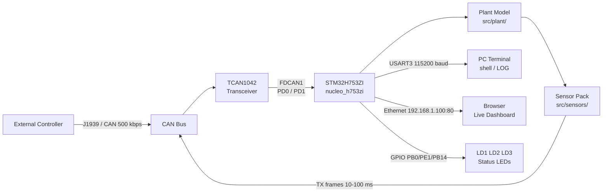
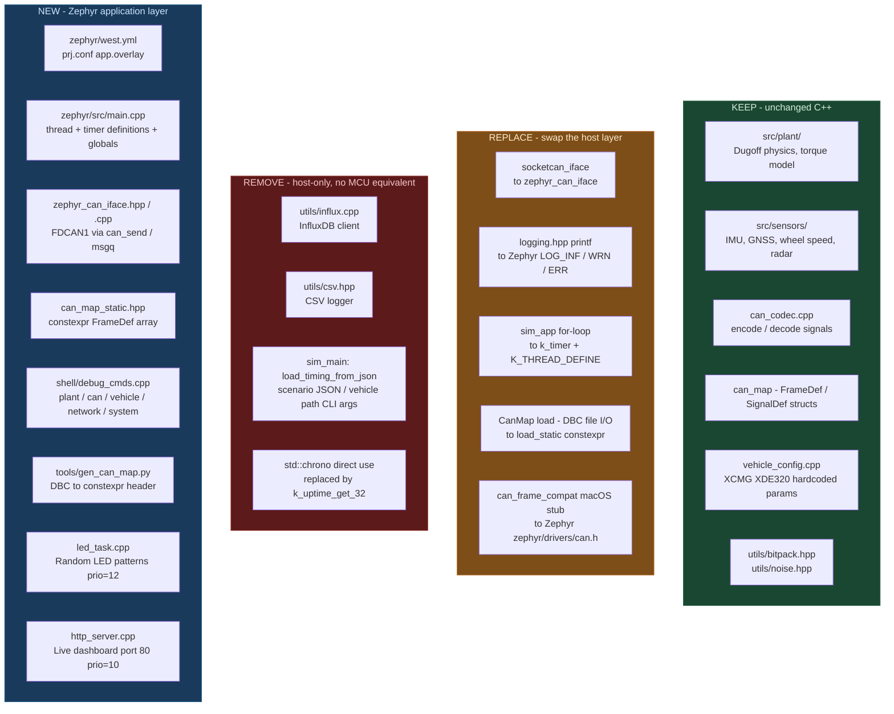
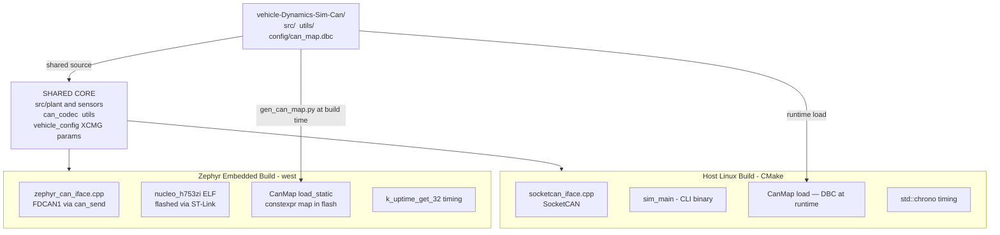
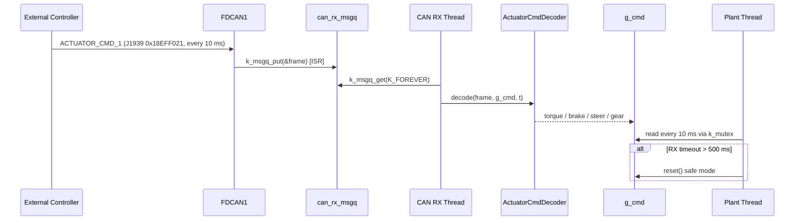
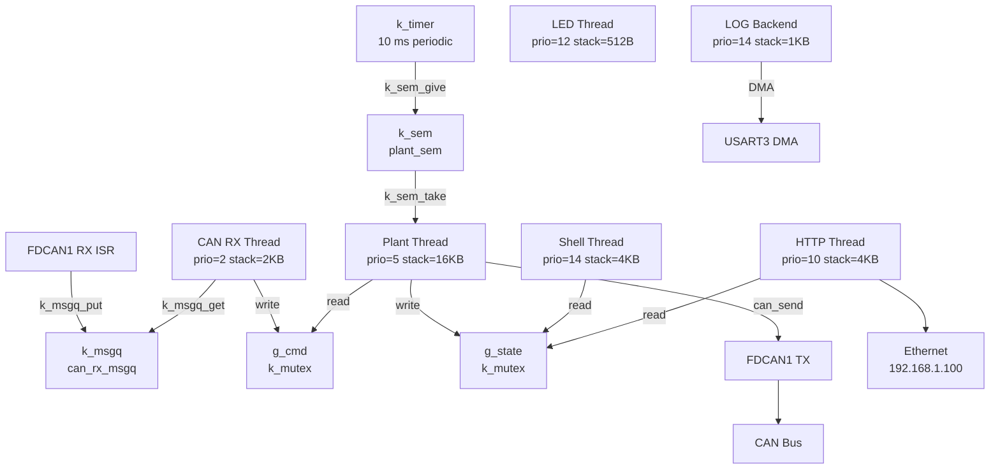
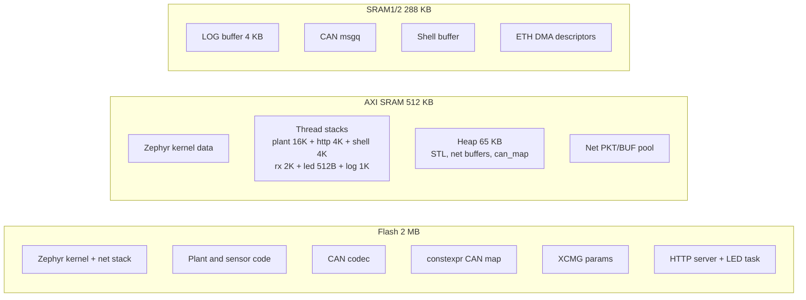
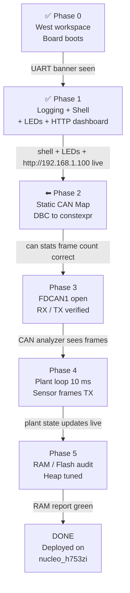

# Zephyr RTOS Port — XCMG XDE320 Plant Simulator

Porting the cleaned-up C++ plant simulator to run on the **STM32H753ZI** (Nucleo-H753ZI) under **Zephyr RTOS**, using the onboard FDCAN peripheral for closed-loop CAN control and UART shell for debugging.

---

## Hardware Target

| Property | Value |
|---|---|
| Board | ST Nucleo-H753ZI (Nucleo-144) |
| MCU | STM32H753ZI |
| Core | ARM Cortex-M7 @ 480 MHz |
| Flash | 2 MB |
| RAM | 1 MB (DTCM + ITCM + AXI SRAM) |
| CAN peripheral | 2× FDCAN (ISO 11898-1:2015) |
| Debug UART | USART3 → ST-Link virtual COM (USB, no extra cable) |
| Ethernet | 10/100 MAC + external PHY (RJ45 on board) |
| Zephyr board target | `nucleo_h753zi` |

### User LEDs

| LED | GPIO | Colour | Alias |
|-----|------|--------|-------|
| LD1 | PB0 | Green | `led0` (board DTS) |
| LD2 | PE1 | Yellow | `led1` (board DTS) |
| LD3 | PB14 | Red | `led2` (app.overlay — GPIO override of PWM node) |

### FDCAN Pin Mapping

The board silkscreen labels the CAN pins on the **CN11 morpho connector** (left header).
Both CN11 morpho and CN9 ZIO expose the same PD0/PD1 GPIOs — use whichever is more convenient for your transceiver wiring.

| Signal | STM32 Pin | CN11 (morpho) | CN9 (ZIO) |
| --- | --- | --- | --- |
| FDCAN1_RX | PD0 (AF3) | pin 57 | pin 25 (D67) |
| FDCAN1_TX | PD1 (AF3) | pin 55 | pin 27 (D66) |
| 3.3V | — | CN11 pin 64 | CN8 pin 7 |
| GND | — | CN11 pin 63 | any GND |

An external CAN transceiver is required (e.g. **TCAN1042** or **SN65HVD230** — both 3.3V compatible).
FDCAN2 (PB12/PB13) is available if a second bus is needed.

### System Context



---

## What Changes, What Stays



---

## Repository Layout

The Zephyr application lives inside this repo as a `zephyr/` subdirectory.
West pulls Zephyr upstream as an external dependency.

```
vehicle-Dynamics-Sim-Can/
├── src/                        ← existing plant / can / sensors / config / sim
├── utils/
│   └── logging.hpp             ← #ifdef __ZEPHYR__ shim added
├── config/
│   └── can_map.dbc             ← source of truth for signal definitions
├── tools/
│   └── gen_can_map.py          ← generates can_map_static.hpp from DBC (Phase 2)
├── docs/zephyr/
│   ├── ZEPHYR_PORT.md          ← this file
│   └── ZEPHYR_BUILD_FLASH_UART.md
└── zephyr/
    ├── west.yml                ← pulls zephyrproject-rtos/zephyr v3.7.0
    ├── CMakeLists.txt          ← app CMake, includes src/ and utils/
    ├── Kconfig
    ├── prj.conf                ← Zephyr configuration (logging, shell, net, C++)
    ├── app.overlay             ← USART3, led2 GPIO, &mac static MAC, FDCAN1 (Phase 3)
    └── src/
        ├── main.cpp            ← entry point, global state, mutexes, counters
        ├── led_task.cpp        ← LED thread (prio 12, 3 s random patterns) ✅
        ├── http_server.cpp     ← HTTP dashboard thread (prio 10, port 80) ✅
        ├── can/
        │   ├── zephyr_can_iface.hpp/cpp   ← replaces socketcan_iface (Phase 3)
        │   └── can_map_static.hpp         ← generated from can_map.dbc (Phase 2)
        └── shell/
            └── debug_cmds.cpp  ← all shell commands
```

### Dual Build Paths

Both the host simulator and the embedded firmware compile from the **same** `src/` and `utils/` source tree. Only the platform layer differs.



---

## Thread Priority Map (current state — end of Phase 1)

| Thread | Priority | Stack | Source |
|--------|----------|-------|--------|
| `stm_eth` | -14 | 1536 B | STM32 Ethernet HAL driver |
| `tcp_work` | -14 | 1024 B | Zephyr TCP stack |
| `rx_q[0]` | -1 | 1536 B | Network RX queue |
| `sysworkq` | -1 | 1024 B | Zephyr system workqueue |
| `net_mgmt` | -1 | 768 B | Network management |
| `main` | 0 | 4096 B | Boot + idle sleep |
| sim *(Phase 4)* | 5 | 16384 B | Plant loop — not yet |
| `http_tid` | **10** | 4096 B | `http_server.cpp` |
| `led_tid` | **12** | 512 B | `led_task.cpp` |
| `shell_uart` | 14 | 4096 B | UART shell |
| `logging` | 14 | 1024 B | LOG backend |
| `idle` | 15 | 320 B | Zephyr idle |

---

## Phase 0 — West Workspace + Board Skeleton ✅

**Goal:** Board boots and prints a startup message over USB-UART.

**Workspace init (one-time, done from RPi):**
```bash
mkdir -p ~/zephyrproject && cd ~/zephyrproject
python3 -m venv .venv && source .venv/bin/activate
pip install west
west init -m https://github.com/zephyrproject-rtos/zephyr --mr v3.7.0 .
west update
pip install -r ~/zephyrproject/zephyr/scripts/requirements.txt
```

**Build and flash:**
```bash
source ~/zephyrproject/.venv/bin/activate
cd ~/zephyrproject
rm -rf build   # always clean when overlay or prj.conf changes
west build -b nucleo_h753zi /path/to/repo/zephyr
west flash
```

**Serial monitor:**
```bash
picocom -b 115200 /dev/ttyACM0
# exit: Ctrl+A  Ctrl+X
```

**Verified output:**
```
*** Booting Zephyr OS build v3.7.0 ***
[INF] xcmg_sim: XCMG XDE320 Plant Simulator
[INF] xcmg_sim: Board : nucleo_h753zi (STM32H753ZI)
[INF] xcmg_sim: Phase : 1 - Logging + UART Shell
[INF] xcmg_sim: Shell ready on USART3 — type 'help' for commands
uart:~$
```

---

## Phase 1 — Logging + UART Shell + LED Task + HTTP Dashboard ✅

**Goal:** Zephyr LOG backend active, interactive shell on USART3, status LEDs cycling, live web dashboard over Ethernet.

### 1a — Logging shim (`utils/logging.hpp`)

The host `LOG_*` macros are mapped to Zephyr's structured log backend via a compile-time branch. The shared plant/CAN source files require zero changes.

```cpp
#ifdef __ZEPHYR__
#include <zephyr/logging/log.h>
// Each .cpp must have LOG_MODULE_REGISTER (one) or LOG_MODULE_DECLARE (others)
#define LOG_TRACE(...) LOG_DBG(__VA_ARGS__)
#define LOG_DEBUG(...) LOG_DBG(__VA_ARGS__)
#define LOG_INFO(...)  LOG_INF(__VA_ARGS__)
#define LOG_WARN(...)  LOG_WRN(__VA_ARGS__)
#define LOG_ERROR(...) LOG_ERR(__VA_ARGS__)
#else
// ... existing host implementation unchanged ...
#endif
```

**Pitfall:** `LOG_MODULE_REGISTER` must appear in exactly one `.cpp` per module (it is in `main.cpp`). Every other `.cpp` that uses the macros needs `LOG_MODULE_DECLARE(xcmg_sim, LOG_LEVEL_INF)`.

**Pitfall:** Zephyr compiles C++ with `-nostdinc++`. Use C headers (`<stdlib.h>`, `<stdio.h>`) not C++ wrappers (`<cstdlib>`, `<cstdio>`). Remove unused C++ stdlib includes from shared headers.

**Pitfall:** `nullptr` in Zephyr shell macros (`SHELL_CMD`, `SHELL_CMD_REGISTER`) causes a C++ type error — use `NULL` instead.

### 1b — UART Shell commands

All commands registered in `zephyr/src/shell/debug_cmds.cpp`:

| Command | Description |
|---|---|
| `plant state` | Dump all PlantState fields (v, yaw, SOC, wheel speeds, tire forces) |
| `plant mu <val>` | Set surface friction 0.1–1.0 (written to `g_surface_mu`, read by plant in Phase 4) |
| `plant reset` | Zero all PlantState fields |
| `can stats` | TX / RX frame counts, timeout count, last RX timestamp |
| `can rx_frame` | Last decoded ACTUATOR_CMD_1 fields |
| `vehicle info` | XCMG XDE320 parameter summary + live surface mu |
| `network mac` | Print MAC address and IP from `net_if_get_default()` |
| `system uptime` | Print uptime as HH:MM:SS and ms |

### 1c — LED task (`zephyr/src/led_task.cpp`)

A `K_THREAD_DEFINE` thread at **priority 12** drives LD1/LD2/LD3 with pseudo-random 3-bit patterns every 3 seconds.

- LD3 (red, PB14) is defined as PWM-only in the board DTS; overridden as plain GPIO in `app.overlay`
- XorShift32 seeded from `k_uptime_get_32()` — pattern differs after each reset
- 7 non-zero patterns (0b001–0b111); at least one LED always on

```cpp
K_THREAD_DEFINE(led_tid, 512, led_thread, NULL, NULL, NULL, 12, 0, 0);
```

### 1d — HTTP dashboard (`zephyr/src/http_server.cpp`)

A `K_THREAD_DEFINE` thread at **priority 10** serves a live HTML dashboard on port 80.

- Static IP `192.168.1.100`, MAC `02:00:5E:00:53:01` (locally administered, set in `app.overlay`)
- Single-threaded: `zsock_socket → bind → listen → accept → drain headers → send HTML → close`
- Uses Zephyr native socket API (`zsock_*`) — no `CONFIG_POSIX_API` required
- HTML built live with `snprintf` from `g_state`, `g_cmd`, CAN counters — chunks sent separately to stay within stack budget
- Auto-refresh every 2 s via `<meta http-equiv="refresh" content="2">`
- Dark + cards UI: background `#161b22`, cards `#21262d`, accent `#58a6ff`

```cpp
K_THREAD_DEFINE(http_tid, 4096, http_server_thread, NULL, NULL, NULL, 10, 0, 0);
```

**`prj.conf` additions for networking:**
```kconfig
CONFIG_NETWORKING=y
CONFIG_NET_L2_ETHERNET=y
CONFIG_NET_IPV4=y
CONFIG_NET_TCP=y
CONFIG_NET_SOCKETS=y
CONFIG_NET_SOCKETS_POSIX_NAMES=y
CONFIG_NET_CONFIG_SETTINGS=y
CONFIG_NET_CONFIG_NEED_IPV4=y
CONFIG_NET_CONFIG_MY_IPV4_ADDR="192.168.1.100"
CONFIG_NET_CONFIG_MY_IPV4_NETMASK="255.255.255.0"
CONFIG_NET_CONFIG_MY_IPV4_GW="192.168.1.1"
CONFIG_ETH_STM32_HAL=y
CONFIG_ETH_STM32_HAL_RX_THREAD_PRIO=2
CONFIG_ETH_STM32_HAL_RX_THREAD_STACK_SIZE=1500
```

**Flash footprint at end of Phase 1:**
```
FLASH:  ~99 KB used / 2 MB  (4.7%)
RAM:    ~11 KB static / 1 MB
```

**Verification:**
- UART: `network mac` → `MAC: 02:00:5E:00:53:01`, `IP: 192.168.1.100`
- Browser: `http://192.168.1.100` → dashboard auto-refreshing every 2 s
- `kernel threads` shows `http_tid` prio 10, `led_tid` prio 12
- All 3 LEDs changing pattern every 3 s

---

## Phase 2 — Static CAN Map ← NEXT

**Goal:** No file I/O on the MCU. CAN signal definitions compiled into flash as `constexpr` data.

### DBC format — J1939

`config/can_map.dbc` uses **J1939 29-bit extended IDs** stored in Vector EFF convention
(`0x80000000 | raw_29bit`). `can_map.cpp` extracts Priority, PGN, and SA from each ID
at parse time — no change needed for the Zephyr port since the same parser runs on host
and embedded.

| Frame | 29-bit ID | PGN | SA | Cycle |
| --- | --- | --- | --- | --- |
| ACTUATOR_CMD_1 | 0x18EFF021 | 0xEFF0 | 0x21 | 10 ms RX |
| IMU_ACC | 0x18FF5528 | 0xFF55 | 0x28 | 10 ms TX |
| GNSS_LL | 0x18FF5A49 | 0xFF5A | 0x49 | 100 ms TX |
| VEHICLE_STATE_1 | 0x18FF50F0 | 0xFF50 | 0xF0 | 20 ms TX |

### Generator script

`tools/gen_can_map.py` reads `config/can_map.dbc` and outputs `zephyr/src/can/can_map_static.hpp`:

```cpp
// AUTO-GENERATED — do not edit. Run: python tools/gen_can_map.py
#pragma once
#include "can/can_map.hpp"

namespace can {

inline const std::array<SignalDef, 4> ACTUATOR_CMD_1_SIGNALS = {{
    {"system_enable",        0,  1, 1.0,  0.0,  0.0,   1.0},
    {"gear_position",        1,  2, 1.0,  0.0,  0.0,   2.0},
    {"steer_cmd_deg",        8, 16, 0.1,  0.0, -360.0, 360.0},
    {"drive_torque_cmd_nm", 24, 16, 10.0, 0.0, -300000.0, 300000.0},
}};

inline const FrameDef FRAME_ACTUATOR_CMD_1 = {
    0x98EFF021UL,  // J1939 29-bit ID (0x18EFF021) | CAN_EFF_FLAG
    "ACTUATOR_CMD_1", {ACTUATOR_CMD_1_SIGNALS.begin(), ...}, 10, 8
};

} // namespace can
```

`CanMap::load_static()` returns these pre-built definitions. `CanMap::load(path)` remains for host builds.

**Verification:** `can stats` shows the correct number of TX frames registered (matches `can_map.dbc`).

---

## Phase 3 — Zephyr CAN Transport

**Goal:** FDCAN1 opens, ACTUATOR_CMD_1 frames received and decoded, sensor frames transmitted.

### `zephyr_can_iface.hpp` interface

Same public interface as `SocketCanIface` — drop-in replacement:

```cpp
class ZephyrCanIface {
public:
    bool open(const char* devname);             // DEVICE_DT_GET(DT_CHOSEN(zephyr_canbus))
    bool write_frame(const struct can_frame&);  // can_send()
    bool read_nonblocking(struct can_frame&);   // k_msgq_get(K_NO_WAIT)
    bool is_open() const;
};
```

### CAN RX thread

```cpp
K_THREAD_DEFINE(can_rx_tid, 2048, can_rx_thread, NULL, NULL, NULL, 2, 0, 0);

static void can_rx_thread(void*, void*, void*) {
    struct can_frame frame;
    while (true) {
        k_msgq_get(&can_rx_msgq, &frame, K_FOREVER);
        actuator_decoder.decode(frame, g_cmd, k_uptime_get_32() / 1000.0);
    }
}
```

### CAN RX Message Flow



### `can_frame_compat.hpp` — Zephyr branch

```cpp
#ifdef __ZEPHYR__
#  include <zephyr/drivers/can.h>
// struct can_frame is provided by Zephyr — no stub needed
#elif defined(__linux__)
#  include <linux/can.h>
#else
// macOS / Windows stub (existing)
#endif
```

**Verification:** Send a CAN frame from a USB CAN adapter (e.g. Peak PCAN, Kvaser) → `can rx_frame` shell command shows decoded values.

---

## Phase 4 — Plant Loop + CAN TX

**Goal:** Full 10 ms plant step running on-MCU, sensor frames broadcasting on FDCAN1.

### Timer-driven plant thread

```cpp
K_TIMER_DEFINE(plant_timer, plant_timer_expiry, NULL);
K_SEM_DEFINE(plant_sem, 0, 1);

static void plant_timer_expiry(struct k_timer*) { k_sem_give(&plant_sem); }

K_THREAD_DEFINE(plant_tid, 16384, plant_thread, NULL, NULL, NULL, 5, 0, 0);

static void plant_thread(void*, void*, void*) {
    k_timer_start(&plant_timer, K_MSEC(10), K_MSEC(10));
    while (true) {
        k_sem_take(&plant_sem, K_FOREVER);
        double t = k_uptime_get_32() / 1000.0;

        if ((t - g_last_rx_t) > CAN_RX_TIMEOUT_S) g_cmd.reset();

        plant_model.step(g_state, g_cmd, 0.01);
        sensor_bank.step(t, g_state, 0.01);
        can_tx_pack_and_send 3(t, g_state, sensor_bank.get_output(t));
    }
}
```

### Thread Architecture (Phase 4 complete)



### Timing — replacing `std::chrono`

| Linux | Zephyr |
|---|---|
| `steady_clock::now()` | `k_uptime_get_32()` (ms) |
| `duration_cast<microseconds>` | `k_cycle_get_32()` + `k_cyc_to_us_ceil32()` |
| `sleep_for(10ms)` | `k_msleep(10)` |

**Verification:** CAN analyzer on bus shows IMU/GNSS/WHEEL/BATT frames at correct rates (10–100 ms). `plant state` updates every call. Web dashboard shows live plant values.

---

## Phase 5 — RAM / Flash Audit

**Goal:** Confirm the full build fits comfortably and heap is not exhausted at runtime.

### Expected sizes (STM32H753ZI, Phase 4 complete)

| Region | Budget | Expected |
|---|---|---|
| Flash (.text + .rodata) | 2 MB | ~400–500 KB |
| SRAM (.bss + .data + stacks) | 1 MB | ~300–450 KB |
| Heap (STL + Zephyr + net) | 65 KB (configured) | ~30–50 KB |

### Audit commands

```bash
west build -t ram_report    # per-object RAM usage
west build -t rom_report    # per-object Flash usage
```

### Memory Map



### Potential hotspots

| Issue | Fix if needed |
|---|---|
| `std::unordered_map` in `can_codec.cpp` | Replace with `std::array` flat lookup |
| `std::string` in `FrameDef` / `SignalDef` | Replace with `const char*` |
| `std::vector<SignalDef>` in CAN map | Replace with fixed-size `std::array` |
| `std::normal_distribution` in sensors | Keep — newlib supports it |
| Net buffer pool exhaustion | Increase `CONFIG_NET_PKT_RX_COUNT` / `NET_BUF_RX_COUNT` |

---

## Key API Mapping Reference

| Linux concept | Zephyr equivalent |
|---|---|
| `socket(PF_CAN, SOCK_RAW, CAN_RAW)` | `DEVICE_DT_GET(DT_CHOSEN(zephyr_canbus))` |
| `write(sock, &frame, sizeof(frame))` | `can_send(dev, &frame, K_FOREVER, NULL, NULL)` |
| `read_nonblocking()` polling | `can_add_rx_filter_msgq()` + `k_msgq_get(K_NO_WAIT)` |
| `socket(AF_INET, SOCK_STREAM, ...)` | `zsock_socket(AF_INET, SOCK_STREAM, ...)` |
| `send()` / `recv()` | `zsock_send()` / `zsock_recv()` |
| `std::chrono::steady_clock::now()` | `k_uptime_get_32()` |
| `std::this_thread::sleep_for(10ms)` | `k_msleep(10)` |
| `std::thread` + `std::mutex` | `K_THREAD_DEFINE` + `K_MUTEX_DEFINE` |
| `LOG_INFO(fmt, ...)` | `LOG_INF(fmt, ##__VA_ARGS__)` |
| `printf` debug | `printk()` or `LOG_DBG()` |
| `#include <cstdlib>` | `#include <stdlib.h>` (Zephyr uses `-nostdinc++`) |
| `nullptr` in C macros | `NULL` (avoids `std::nullptr_t` vs `int` ternary error) |

---

## Execution Order Summary



---

## Dependencies / Tools Needed

| Tool | Purpose |
|---|---|
| [west](https://docs.zephyrproject.org/latest/develop/west/index.html) | Zephyr meta-tool (build, flash, update) |
| [Zephyr SDK 0.17.0](https://docs.zephyrproject.org/latest/develop/toolchains/zephyr_sdk.html) | ARM GCC cross-compiler (arm64 minimal tarball) |
| `arm-zephyr-eabi-gcc` | C++ compiler for Cortex-M7 |
| ST-Link (onboard, CN1 USB) | Flash + debug via OpenOCD |
| Ethernet cable | Connect Nucleo RJ45 to LAN (same subnet as RPi) |
| External CAN transceiver | TCAN1042 or SN65HVD230 (3.3V) — needed for Phase 3+ |
| USB-CAN adapter *(optional)* | PCAN-USB, Kvaser, or CANable for bus monitoring |
| `picocom` | Serial terminal (`picocom -b 115200 /dev/ttyACM0`) |
| Python 3 | Run `tools/gen_can_map.py` at build time |
