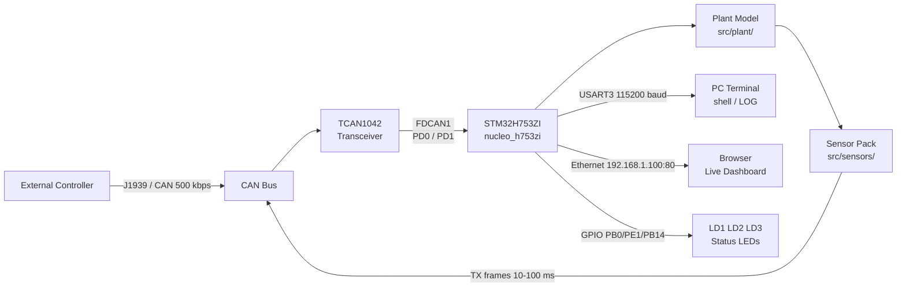
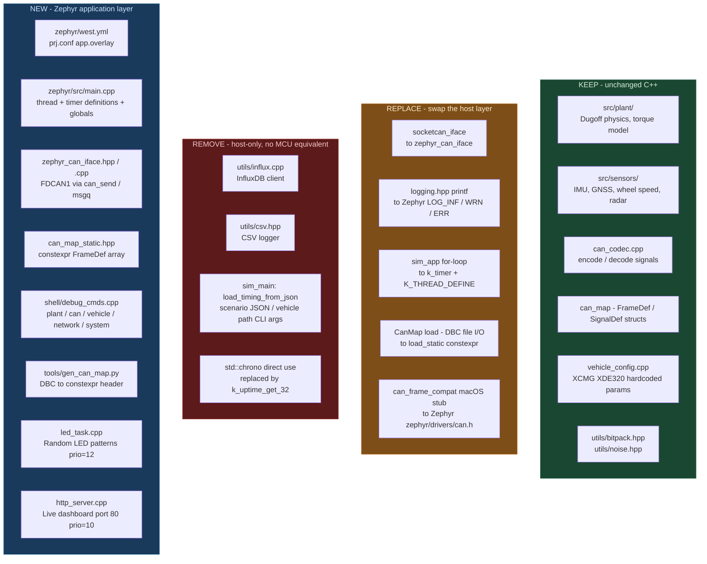
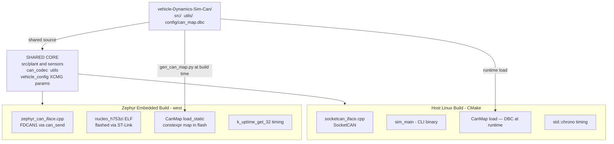
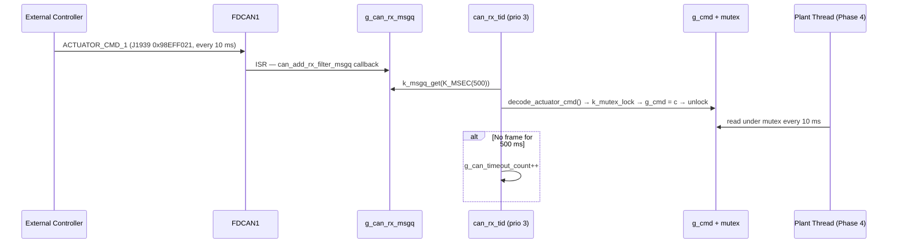
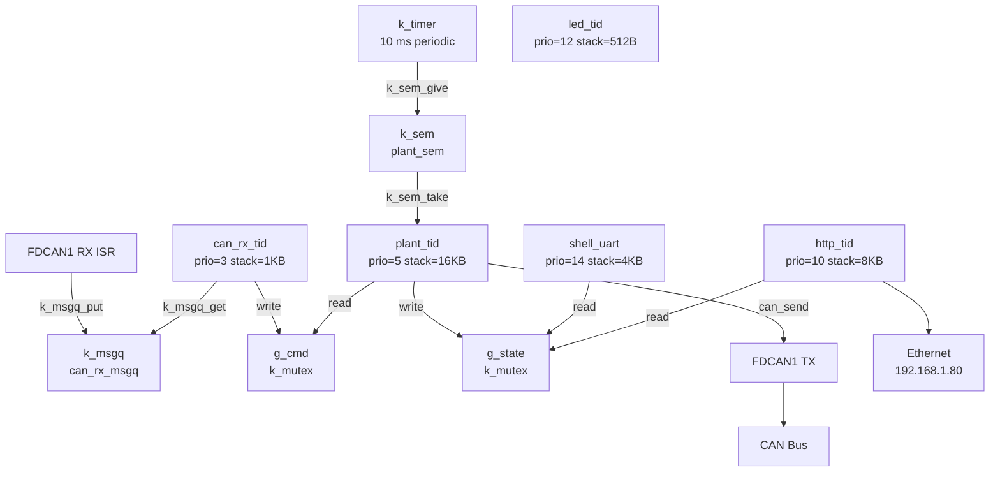
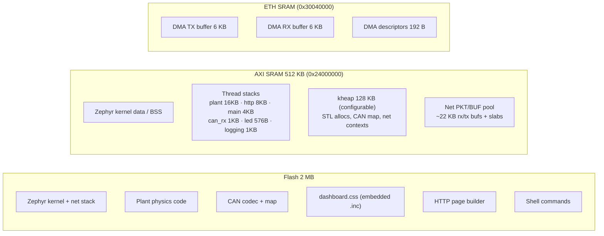
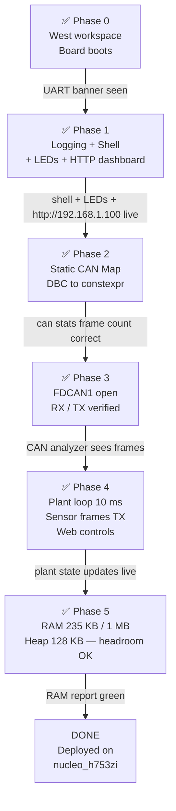

# Zephyr RTOS Port — XCMG XDE320 Plant Simulator

Porting the cleaned-up C++ plant simulator to run on the **STM32H753ZI** (Nucleo-H753ZI) under **Zephyr RTOS**, using the onboard FDCAN peripheral for closed-loop CAN control and UART shell for debugging.

---

## Hardware Target

| Property | Value |
|---|---|
| Board | ST Nucleo-H753ZI (Nucleo-144) |
| MCU | STM32H753ZI |
| Core | ARM Cortex-M7 @ 480 MHz |
| Flash | 2 MB |
| RAM | 1 MB (DTCM + ITCM + AXI SRAM) |
| CAN peripheral | 2× FDCAN (ISO 11898-1:2015) |
| Debug UART | USART3 → ST-Link virtual COM (USB, no extra cable) |
| Ethernet | 10/100 MAC + external PHY (RJ45 on board) |
| Zephyr board target | `nucleo_h753zi` |

### User LEDs

| LED | GPIO | Colour | Alias |
|-----|------|--------|-------|
| LD1 | PB0 | Green | `led0` (board DTS) |
| LD2 | PE1 | Yellow | `led1` (board DTS) |
| LD3 | PB14 | Red | `led2` (app.overlay — GPIO override of PWM node) |

### FDCAN Pin Mapping

The board silkscreen labels the CAN pins on the **CN11 morpho connector** (left header).
Both CN11 morpho and CN9 ZIO expose the same PD0/PD1 GPIOs — use whichever is more convenient for your transceiver wiring.

| Signal | STM32 Pin | CN11 (morpho) | CN9 (ZIO) |
| --- | --- | --- | --- |
| FDCAN1_RX | PD0 (AF3) | pin 57 | pin 25 (D67) |
| FDCAN1_TX | PD1 (AF3) | pin 55 | pin 27 (D66) |
| 3.3V | — | CN11 pin 64 | CN8 pin 7 |
| GND | — | CN11 pin 63 | any GND |

An external CAN transceiver is required (e.g. **TCAN1042** or **SN65HVD230** — both 3.3V compatible).
FDCAN2 (PB12/PB13) is available if a second bus is needed.

### System Context



---

## What Changes, What Stays



---

## Repository Layout

The Zephyr application lives inside this repo as a `zephyr/` subdirectory.
West pulls Zephyr upstream as an external dependency.

```
vehicle-Dynamics-Sim-Can/
├── src/                        ← existing plant / can / sensors / config / sim
├── utils/
│   └── logging.hpp             ← #ifdef __ZEPHYR__ shim added
├── config/
│   └── can_map.dbc             ← source of truth for signal definitions
├── tools/
│   └── gen_can_map.py          ← generates can_map_static.hpp from DBC (Phase 2)
├── docs/zephyr/
│   ├── ZEPHYR_PORT.md          ← this file
│   ├── RTOS_Implementation.tex ← in-depth RTOS architecture document
│   └── ZEPHYR_BUILD_FLASH_UART.md
└── zephyr/
    ├── west.yml                ← pulls zephyrproject-rtos/zephyr v3.7.0
    ├── CMakeLists.txt          ← app CMake, includes src/ and utils/
    ├── Kconfig
    ├── prj.conf                ← Zephyr configuration (logging, shell, net, CAN, C++)
    ├── app.overlay             ← USART3, led2 GPIO, static MAC, FDCAN1
    └── src/
        ├── main.cpp            ← entry point, global state, mutexes, counters
        ├── http/               ← HTTP module (Phase 1 + Phase 4 controls)
        │   ├── dashboard.css       ← all CSS rules (embedded at build time)
        │   ├── http_html.hpp       ← static HTML fragments (head, vehicle card)
        │   ├── http_internal.hpp   ← shared internal declarations
        │   ├── http_server.cpp     ← socket lifecycle + K_THREAD_DEFINE
        │   ├── http_cmd.cpp        ← request parsing + apply_web_cmd
        │   └── http_page.cpp       ← HTML builder + kernel-thread card
        ├── led/
        │   └── led_task.cpp    ← LED thread (prio 12, 3 s random patterns)
        ├── plant/              ← Physics loop (Phase 4)
        │   ├── plant_model_zephyr.cpp  ← PlantModel constructor (XCMG params)
        │   └── plant_thread.cpp        ← 10 ms timer-driven plant loop
        ├── can/
        │   ├── zephyr_can_iface.hpp/cpp   ← replaces socketcan_iface
        │   ├── can_map_static.hpp         ← generated from can_map.dbc
        │   ├── can_rx.cpp                 ← RX thread + ACTUATOR_CMD_1 decoder
        │   └── can_tx.cpp                 ← TX: pack + send all sensor frames
        └── shell/
            └── debug_cmds.cpp  ← all shell commands
```

### Dual Build Paths

Both the host simulator and the embedded firmware compile from the **same** `src/` and `utils/` source tree. Only the platform layer differs.



---

## Thread Priority Map (final state — end of Phase 4)

| Thread | Priority | Stack | Source |
|--------|----------|-------|--------|
| `stm_eth` | -14 | 1536 B | STM32 Ethernet HAL driver |
| `tcp_work` | -14 | 1024 B | Zephyr TCP stack |
| `rx_q[0]` | -1 | 1536 B | Network RX queue |
| `sysworkq` | -1 | 1024 B | Zephyr system workqueue |
| `net_mgmt` | -1 | 768 B | Network management |
| `main` | 0 | 4096 B | Boot + idle sleep |
| **`can_rx_tid`** | **3** | **1024 B** | **`can/can_rx.cpp`** |
| **`plant_tid`** | **5** | **16384 B** | **`plant/plant_thread.cpp`** |
| `http_tid` | **10** | 8192 B | `http/http_server.cpp` |
| `led_tid` | **12** | 512 B | `led/led_task.cpp` |
| `shell_uart` | 14 | 4096 B | UART shell |
| `logging` | 14 | 1024 B | LOG backend |
| `idle` | 15 | 320 B | Zephyr idle |

---

## Phase 0 — West Workspace + Board Skeleton ✅

**Goal:** Board boots and prints a startup message over USB-UART.

**Workspace init (one-time, done from RPi):**
```bash
mkdir -p ~/zephyrproject && cd ~/zephyrproject
python3 -m venv .venv && source .venv/bin/activate
pip install west
west init -m https://github.com/zephyrproject-rtos/zephyr --mr v3.7.0 .
west update
pip install -r ~/zephyrproject/zephyr/scripts/requirements.txt
```

**Build and flash:**
```bash
source ~/zephyrproject/.venv/bin/activate
cd ~/zephyrproject
rm -rf build   # always clean when overlay or prj.conf changes
west build -b nucleo_h753zi /path/to/repo/zephyr
west flash
```

**Serial monitor:**
```bash
picocom -b 115200 /dev/ttyACM0
# exit: Ctrl+A  Ctrl+X
```

**Verified output:**
```
*** Booting Zephyr OS build v3.7.0 ***
[INF] xcmg_sim: XCMG XDE320 Plant Simulator
[INF] xcmg_sim: Board : nucleo_h753zi (STM32H753ZI)
[INF] xcmg_sim: Phase : 1 - Logging + UART Shell
[INF] xcmg_sim: Shell ready on USART3 — type 'help' for commands
uart:~$
```

---

## Phase 1 — Logging + UART Shell + LED Task + HTTP Dashboard ✅

**Goal:** Zephyr LOG backend active, interactive shell on USART3, status LEDs cycling, live web dashboard over Ethernet.

### 1a — Logging shim (`utils/logging.hpp`)

The host `LOG_*` macros are mapped to Zephyr's structured log backend via a compile-time branch. The shared plant/CAN source files require zero changes.

```cpp
#ifdef __ZEPHYR__
#include <zephyr/logging/log.h>
// Each .cpp must have LOG_MODULE_REGISTER (one) or LOG_MODULE_DECLARE (others)
#define LOG_TRACE(...) LOG_DBG(__VA_ARGS__)
#define LOG_DEBUG(...) LOG_DBG(__VA_ARGS__)
#define LOG_INFO(...)  LOG_INF(__VA_ARGS__)
#define LOG_WARN(...)  LOG_WRN(__VA_ARGS__)
#define LOG_ERROR(...) LOG_ERR(__VA_ARGS__)
#else
// ... existing host implementation unchanged ...
#endif
```

**Pitfall:** `LOG_MODULE_REGISTER` must appear in exactly one `.cpp` per module (it is in `main.cpp`). Every other `.cpp` that uses the macros needs `LOG_MODULE_DECLARE(xcmg_sim, LOG_LEVEL_INF)`.

**Pitfall:** Zephyr compiles C++ with `-nostdinc++`. Use C headers (`<stdlib.h>`, `<stdio.h>`) not C++ wrappers (`<cstdlib>`, `<cstdio>`). Remove unused C++ stdlib includes from shared headers.

**Pitfall:** `nullptr` in Zephyr shell macros (`SHELL_CMD`, `SHELL_CMD_REGISTER`) causes a C++ type error — use `NULL` instead.

### 1b — UART Shell commands

All commands registered in `zephyr/src/shell/debug_cmds.cpp`:

| Command | Description |
|---|---|
| `plant state` | Dump all PlantState fields (v, yaw, SOC, wheel speeds, tire forces) |
| `plant mu <val>` | Set surface friction 0.1–1.0 (written to `g_surface_mu`, read by plant in Phase 4) |
| `plant reset` | Zero all PlantState fields |
| `can stats` | TX / RX frame counts, timeout count, last RX timestamp |
| `can rx_frame` | Last decoded ACTUATOR_CMD_1 fields |
| `vehicle info` | XCMG XDE320 parameter summary + live surface mu |
| `network mac` | Print MAC address and IP from `net_if_get_default()` |
| `system uptime` | Print uptime as HH:MM:SS and ms |

### 1c — LED task (`zephyr/src/led_task.cpp`)

A `K_THREAD_DEFINE` thread at **priority 12** drives LD1/LD2/LD3 with pseudo-random 3-bit patterns every 3 seconds.

- LD3 (red, PB14) is defined as PWM-only in the board DTS; overridden as plain GPIO in `app.overlay`
- XorShift32 seeded from `k_uptime_get_32()` — pattern differs after each reset
- 7 non-zero patterns (0b001–0b111); at least one LED always on

```cpp
K_THREAD_DEFINE(led_tid, 512, led_thread, NULL, NULL, NULL, 12, 0, 0);
```

### 1d — HTTP dashboard (`zephyr/src/http/`)

A `K_THREAD_DEFINE` thread at **priority 10** serves a live HTML dashboard on port 80. The HTTP module is split across three source files for maintainability, plus a real CSS file embedded at build time.

| File | Responsibility |
|------|---------------|
| `http_server.cpp` | Socket lifecycle: `socket → bind → listen → accept → close` loop |
| `http_cmd.cpp` | Request-line parsing, query-string decoder, `apply_web_cmd()` |
| `http_page.cpp` | HTML page builder — all `snprintf`/`send_str` calls |
| `http_html.hpp` | Static HTML fragments as `const char[]` (`kHtmlHead`, `kVehicleCard`, …) |
| `dashboard.css` | All CSS rules as a real `.css` file; embedded at build time via `generate_inc_file_for_target()` |
| `http_internal.hpp` | Shared internal declarations between the three `.cpp` files |

- Static IP **`192.168.1.80`**, MAC `02:00:5E:00:53:01` (locally administered, set in `app.overlay`)
- Uses Zephyr native socket API (`zsock_*`) — no `CONFIG_POSIX_API` required
- HTML built live with `snprintf` from `g_state`, `g_cmd`, CAN counters
- Auto-refresh every **30 s** via `<meta http-equiv="refresh" content="30">`
- Dark + cards UI: background `#161b22`, cards `#21262d`, accent `#58a6ff`
- CSS embedded via `generate_inc_file_for_target()` in `CMakeLists.txt`:

```cmake
generate_inc_file_for_target(app
    ${CMAKE_CURRENT_SOURCE_DIR}/src/http/dashboard.css
    ${CMAKE_CURRENT_BINARY_DIR}/dashboard.css.inc
)
```

```cpp
K_THREAD_DEFINE(http_tid, 8192, http_server_thread, NULL, NULL, NULL, 10, 0, 0);
```

**`prj.conf` additions for networking:**
```kconfig
CONFIG_NETWORKING=y
CONFIG_NET_L2_ETHERNET=y
CONFIG_NET_IPV4=y
CONFIG_NET_TCP=y
CONFIG_NET_SOCKETS=y
CONFIG_NET_SOCKETS_POSIX_NAMES=y
CONFIG_NET_CONFIG_SETTINGS=y
CONFIG_NET_CONFIG_NEED_IPV4=y
CONFIG_NET_CONFIG_MY_IPV4_ADDR="192.168.1.80"
CONFIG_NET_CONFIG_MY_IPV4_NETMASK="255.255.255.0"
CONFIG_NET_CONFIG_MY_IPV4_GW="192.168.1.1"
CONFIG_ETH_STM32_HAL=y
CONFIG_ETH_STM32_HAL_RX_THREAD_PRIO=2
CONFIG_ETH_STM32_HAL_RX_THREAD_STACK_SIZE=1500
```

**Flash footprint at end of Phase 1:**
```
FLASH:  ~99 KB used / 2 MB  (4.7%)
RAM:    ~11 KB static / 1 MB
```

**Verification:**
- UART: `network mac` → `MAC: 02:00:5E:00:53:01`, `IP: 192.168.1.80`
- Browser: `http://192.168.1.80` → dashboard auto-refreshing every 30 s
- `kernel threads` shows `http_tid` prio 10, `led_tid` prio 12
- All 3 LEDs changing pattern every 3 s

---

## Phase 2 — Static CAN Map ✅

**Goal:** No file I/O on the MCU. CAN signal definitions compiled into flash as `constexpr` data.

### Generator script

`tools/gen_can_map.py` reads `config/can_map.dbc` and outputs `zephyr/src/can/can_map_static.hpp`:

```python
# Usage (from repo root):
python3 tools/gen_can_map.py
# → writes zephyr/src/can/can_map_static.hpp
```

The generated header defines two plain structs and flat `static const` arrays — no heap, no `std::string`:

```cpp
namespace can_static {
struct SigDef  { const char* name; int16_t start_bit; uint8_t bit_len;
                 bool little_endian; bool is_signed; float factor; float offset; };
struct FrameDef{ uint32_t id; bool is_extended; bool is_rx; uint16_t cycle_ms;
                 uint8_t dlc; const char* name; const SigDef* sigs; uint8_t sig_count; };

static const FrameDef k_frames[16] = { /* 1 RX + 15 TX, all 65 signals */ };

inline const FrameDef* find_rx_frame(uint32_t id);   // linear search < 1 µs on M7
inline const FrameDef* find_tx_frame(uint32_t id);
inline const FrameDef* tx_frame_at(uint8_t idx);
} // namespace can_static
```

Frame table (1 RX, 15 TX, 65 signals):

| Dir | 29-bit ID | Frame | Signals | Cycle |
|-----|-----------|-------|---------|-------|
| RX | 0x98EFF021 | ACTUATOR_CMD_1 | 6 | 10 ms |
| TX | 0x8CFF0028 | IMU_ACC | 4 | 5 ms |
| TX | 0x98FF1029 | GNSS_LL | 2 | 100 ms |
| TX | 0x98FF50F0 | VEHICLE_STATE_1 | 4 | 10 ms |
| TX | … | 11 more | … | … |

**`can map` shell command** — dumps the full frame table at runtime (self-verification):
```
uart:~$ can map
--- Static CAN Map (16 frames, 1 RX, 15 TX) ---
  [RX] 0x98EFF021  ACTUATOR_CMD_1          6 sig(s)   10 ms
  [TX] 0x8CFF0028  IMU_ACC                 4 sig(s)    5 ms
  ...
```

**Flash cost:** header-only include — negligible (< 2 KB in `.rodata`).

---

## Phase 3 — Zephyr CAN Transport ✅

**Goal:** FDCAN1 opens, ACTUATOR_CMD_1 frames received and decoded. Loopback self-test without transceiver.

### What was implemented

| File | Role |
|------|------|
| `zephyr/src/can/can_rx.cpp` | CAN RX thread + inline ACTUATOR_CMD_1 decoder |
| `zephyr/app.overlay` | FDCAN1 enabled at 500 kbps, `zephyr,canbus = &fdcan1` |
| `zephyr/prj.conf` | `CONFIG_CAN=y`, `CONFIG_XCMG_CAN_LOOPBACK=y` |
| `zephyr/Kconfig` | `XCMG_CAN_LOOPBACK` option added |
| `zephyr/src/shell/debug_cmds.cpp` | `can tx_test` command added |

**No `std::string`, no heap** — the decoder reads directly from `zf.data[]` using the bit layout from the DBC.

### ACTUATOR_CMD_1 inline decoder

```cpp
// Intel byte order (LSB-first), signal positions from can_map.dbc:
c.system_enable       = (d[0] >> 0) & 0x01;
c.gear_position       = static_cast<GearPosition>((d[0] >> 1) & 0x03);
c.steer_cmd_deg       = (int16_t)(d[1] | (d[2] << 8)) * 0.1;
c.drive_torque_cmd_nm = (int16_t)(d[3] | (d[4] << 8)) * 10.0;
c.brake_cmd_pct       = d[5] * 1.0;
```

### CAN RX thread

```cpp
// can_rx.cpp — priority 3, stack 1024 B
K_MSGQ_DEFINE(g_can_rx_msgq, sizeof(struct can_frame), 8, 4);

// Thread: opens FDCAN1, registers filter for 0x98EFF021, loops on k_msgq_get(500 ms)
// On frame: decode → g_cmd under g_cmd_mutex, g_can_rx_count++, g_last_rx_t = t
// On timeout: g_can_timeout_count++  (plant thread checks this for safe-mode in Phase 4)
K_THREAD_DEFINE(can_rx_tid, 1024, can_rx_thread, NULL, NULL, NULL, 3, 0, 0);
```

### CAN RX message flow



### DeviceTree — FDCAN1 @ 500 kbps

```dts
/ { chosen { zephyr,canbus = &fdcan1; }; };

&fdcan1 {
    status = "okay";
    pinctrl-0 = <&fdcan1_rx_pd0 &fdcan1_tx_pd1>;  /* PD0/PD1 */
    pinctrl-names = "default";
    bitrate = <500000>;
    sample-point = <875>;                           /* 87.5% */
};
```

### Loopback self-test (no transceiver required)

`CONFIG_XCMG_CAN_LOOPBACK=y` in `prj.conf` calls `can_set_mode(CAN_MODE_LOOPBACK)` before `can_start()`. Any transmitted frame is echoed back to the RX filter internally.

```
uart:~$ can tx_test 10.0 50000 0
Sending ACTUATOR_CMD_1: steer=10.0 deg  torque=50000 Nm  brake=0.0 %
Sent OK. Check 'can rx_frame' in ~10 ms.
uart:~$ can rx_frame
--- Last ACTUATOR_CMD_1 ---
  system_enable   = 1
  gear_position   = 1  (FORWARD)
  drive_torque_nm = 50000.0
  brake_pct       = 0.00
  steer_deg       = 10.00
uart:~$ can stats
--- CAN Stats ---
  TX frames  : 0       ← incremented in Phase 4 by plant TX
  RX frames  : 1
  RX timeouts: 0
  Last RX    : 2.341 s
```

Set `CONFIG_XCMG_CAN_LOOPBACK=n` and connect a **TCAN1042** or **SN65HVD230** transceiver on PD0/PD1 (CN11 pin 57/55) for real-bus operation.

### `cbprintf` float fix

`shell_print` uses Zephyr's `cbprintf` backend which has floating-point support disabled by default (saves ~4 KB flash). Without `CONFIG_CBPRINTF_FP_SUPPORT=y`, `%f` format specifiers print literally instead of the value. Added to `prj.conf`.

### Updated thread table (end of Phase 3)

| Thread | Priority | Stack | Source |
|--------|----------|-------|--------|
| `stm_eth` | -14 | 1536 B | STM32 Ethernet HAL |
| `tcp_work` | -14 | 1024 B | Zephyr TCP stack |
| `rx_q[0]` | -1 | 1536 B | Network RX queue |
| `sysworkq` | -1 | 1024 B | System workqueue |
| `main` | 0 | 4096 B | Boot + idle sleep |
| **`can_rx_tid`** | **3** | **1024 B** | **`can/can_rx.cpp`** |
| `plant_tid` *(Phase 4)* | 5 | 16384 B | Plant loop — added in Phase 4 |
| `http_tid` | 10 | 8192 B | `http/http_server.cpp` |
| `led_tid` | 12 | 512 B | `led/led_task.cpp` |
| `shell_uart` | 14 | 4096 B | UART shell |
| `logging` | 14 | 1024 B | LOG backend |
| `idle` | 15 | 320 B | Zephyr idle |

---

## Phase 4 — Plant Loop + CAN TX ✅

**Goal:** Full 10 ms plant step running on-MCU, sensor frames broadcasting on FDCAN1, web dashboard with live controls.

### What was implemented

| File | Role |
|------|------|
| `zephyr/src/plant/plant_thread.cpp` | 10 ms timer-driven plant loop + CAN watchdog + brake diagnostics |
| `zephyr/src/plant/plant_model_zephyr.cpp` | `PlantModel` constructor: XCMG XDE320 parameters, Dugoff tyre config |
| `zephyr/src/can/can_tx.cpp` | Pack all 15 TX frames from `PlantState` and call `can_send()` |
| `zephyr/src/http/http_cmd.cpp` | Added web command injection (query-string → `g_cmd`) |
| `zephyr/src/http/http_page.cpp` | Added Controls card, Kernel Threads panel, live plant values |
| `zephyr/src/shell/debug_cmds.cpp` | Added `plant inject <steer> <torque> <brake>` shell command |

### Timer-driven plant thread

```cpp
// plant/plant_thread.cpp — prio 5, 16384 B stack
K_SEM_DEFINE(plant_sem, 0, 1);
static void plant_timer_expiry(struct k_timer*) { k_sem_give(&plant_sem); }
K_TIMER_DEFINE(plant_timer, plant_timer_expiry, NULL);
K_THREAD_DEFINE(plant_tid, 16384, plant_thread, NULL, NULL, NULL, 5, 0, 0);

static void plant_thread(void*, void*, void*) {
    LOG_INF("[plant] XCMG XDE320 plant thread started (dt=10 ms, prio=5)");
    k_timer_start(&plant_timer, K_MSEC(10), K_MSEC(10));

    while (true) {
        k_sem_take(&plant_sem, K_FOREVER);
        const double t_s = k_uptime_get_32() / 1000.0;

        // CAN watchdog: zero command if no RX for 500 ms
        sim::ActuatorCmd cmd;
        k_mutex_lock(&g_cmd_mutex, K_FOREVER);
        cmd = g_cmd;
        k_mutex_unlock(&g_cmd_mutex);
        if ((t_s - g_last_rx_t) > 0.5) {
            cmd = sim::ActuatorCmd{};   // safe-mode: coast with no drive/brake
        }

        // Step physics (10 ms)
        plant::PlantState local_state;
        k_mutex_lock(&g_state_mutex, K_FOREVER);
        local_state = g_state;
        k_mutex_unlock(&g_state_mutex);

        s_plant.step(local_state, cmd, DT_S);

        k_mutex_lock(&g_state_mutex, K_FOREVER);
        g_state = local_state;
        k_mutex_unlock(&g_state_mutex);

        // Brake diagnostics: log every 100 ms while brake > 1%
        if (cmd.brake_cmd_pct > 1.0) { /* LOG_INF("[brk] ... "); */ }

        // CAN TX: pack all sensor frames
        can_tx_send_all(local_state, t_s, loop_us);
    }
}
```

### XCMG XDE320 plant parameters

```cpp
// plant/plant_model_zephyr.cpp
p.drive.mass_kg              = 218000.0;      // 218 t
p.drive.wheel_radius_m       = 1.93;
p.drive.motor_torque_max_nm  = 145000.0;
p.drive.motor_power_max_w    = 2013000.0;
p.drive.gear_ratio           = 28.0;
p.drive.drivetrain_eff       = 0.92;
p.drive.brake_torque_max_nm  = 2500000.0;    // 2.5 MNm → ~0.6 g at full load
p.drive.drag_c               = 1.85;
p.drive.roll_c               = 9500.0;
p.drive.v_max_mps            = 17.78;        // 64 km/h
p.dynamic_config.enabled     = true;
p.dynamic_config.surface_mu  = 0.72;         // compact gravel (default)
```

### Thread architecture (Phase 4 complete)



### Timing — replacing `std::chrono`

| Linux | Zephyr |
|---|---|
| `steady_clock::now()` | `k_uptime_get_32()` (ms) |
| `duration_cast<microseconds>` | `k_cycle_get_32()` + `k_cyc_to_us_ceil32()` |
| `sleep_for(10ms)` | `k_msleep(10)` (not used — timer-driven) |

### Web dashboard — Phase 4 additions

The HTTP dashboard was extended with two new cards:

**Controls card** — one-click quick actions and a manual inject form (no JavaScript):
- `■ STOP` — sets `brake=100`, `gear=N`, `torque=0`
- `▶ Drive FWD` / `◀ Drive REV` — 50 000 Nm traction
- `← -5°` / `+5° →` — incremental steer (clamped ±45°)
- Manual form: steer, torque, brake, gear, enable; submitted via HTTP GET

**Kernel Threads card** — uses `k_thread_foreach()` to display all threads with stack usage:
```cpp
k_thread_foreach(collect_thread_cb, nullptr);  // fills s_threads[]
```

### CAN watchdog / safe-mode

If no `ACTUATOR_CMD_1` is received for **500 ms**, the plant thread substitutes a zeroed `ActuatorCmd` (no torque, no brake, neutral gear). This prevents the vehicle from running away if the controller disconnects. The `g_can_timeout_count` counter is visible on the dashboard under _CAN Stats_.

### Brake diagnostics logging

Every 100 ms while braking (`brake_cmd_pct > 1`), the plant thread emits:
```
[brk] t=12.34 vx=8.320 a=-5.91 Fx=-1291kN tau=-2500kNm mode=dyn
[brk] omega FL=4.31 FR=4.31 RL=4.31 RR=4.31 ref=4.31 rad/s
```
This lets you verify that the Dugoff model is building slip correctly and that `a_long` matches the expected `~0.6 g` braking.

### Updated thread table (end of Phase 4)

| Thread | Priority | Stack | Source |
|--------|----------|-------|--------|
| `stm_eth` | -14 | 1536 B | STM32 Ethernet HAL |
| `tcp_work` | -14 | 1024 B | Zephyr TCP stack |
| `rx_q[0]` | -1 | 1536 B | Network RX queue |
| `sysworkq` | -1 | 1024 B | System workqueue |
| `main` | 0 | 4096 B | Boot + idle sleep |
| **`can_rx_tid`** | **3** | **1024 B** | **`can/can_rx.cpp`** |
| **`plant_tid`** | **5** | **16384 B** | **`plant/plant_thread.cpp`** |
| `http_tid` | 10 | 8192 B | `http/http_server.cpp` |
| `led_tid` | 12 | 512 B | `led/led_task.cpp` |
| `shell_uart` | 14 | 4096 B | UART shell |
| `logging` | 14 | 1024 B | LOG backend |
| `idle` | 15 | 320 B | Zephyr idle |

**Verification:**
- `plant state` shell command shows live `vx`, `yaw`, `SOC`, wheel speeds, Fx
- CAN analyzer on bus shows IMU/GNSS/WHEEL/BATT/VEHICLE frames at 5–100 ms rates
- Dashboard at `http://192.168.1.80` updates plant values; STOP/FWD/REV buttons work
- Brake logging on UART: `a ≈ -5.9 m/s²` (≈ 0.6 g) when `brake=100` at speed

---

## Phase 5 — RAM / Flash Audit ✅

**Goal:** Confirm the full build fits comfortably and heap is not exhausted at runtime.

### Measured Flash footprint (`west build -t rom_report`)

Total Flash: **236,957 B ≈ 231.4 KB** — 11.3 % of the 2 MB Flash budget.

| Region | Budget | Measured | Notes |
|---|---|---|---|
| Total Flash | 2 MB | **231.4 KB** (236,957 B) | 11.3 % utilised, 1.77 MB free |
| App (`zephyr/src/`) | — | **12.7 KB** (12,958 B) | threads, HTTP, CAN TX/RX, shell |
| Shared plant physics | — | **12.8 KB** | subsystems compiled from `src/plant/` |
| Zephyr RTOS | — | **121.1 KB** | kernel 10 KB + subsys 76 KB + drivers 19 KB |
| Newlib / no-path symbols | — | **61.5 KB** | math (`__kernel_sin/cos/tan`), C stdlib |

#### App Flash by source file

| Source file | Flash | Dominant symbol |
|---|---|---|
| `can/can_tx.cpp` | 3,416 B | `can_tx_send_all()` 3,356 B |
| `can/can_rx.cpp` | 1,000 B | `can_rx_thread()` + test frame |
| `plant/plant_model_zephyr.cpp` | 1,046 B | constructor + `set_params()` |
| `plant/plant_thread.cpp` | 1,488 B | `plant_thread()` 1,348 B |
| `http/http_page.cpp` | 1,642 B | `send_page()` 1,456 B |
| `http/http_cmd.cpp` | 602 B | `apply_web_cmd()` 324 B |
| `http/http_server.cpp` | 320 B | socket loop 272 B |
| `shell/debug_cmds.cpp` | 2,372 B | 11 shell command handlers |
| `main.cpp` | 828 B | `main()` 168 B + rodata/datas |
| `led/led_task.cpp` | 244 B | `led_thread()` 196 B |
| **Embedded CSS** (`kDashboardCss`) | **1,758 B** | `.rodata` |

### Measured RAM footprint (`west build -t ram_report`)

Total static RAM: **241,075 B ≈ 235 KB** — 22.9 % of the 1 MB SRAM budget.

| Region | Budget | Measured | Notes |
|---|---|---|---|
| Total SRAM | 1 MB | **235 KB** (241,075 B) | 22.9 % utilised |
| App code | — | **27.4 KB** (28,100 B) | plant + HTTP + CAN + main + LED |
| Zephyr kernel | — | **133.6 KB** | incl. 128 KB configurable `kheap` |
| Networking subsystem | — | **34.0 KB** | TCP slab, net_pkt/buf pools, ARP |
| ETH driver | — | **14.5 KB** | DMA RX+TX buffers in `eth_stm32` region |
| Logging subsystem | — | **5.5 KB** | ring buffer + processing thread |

#### App RAM breakdown

| Source file | RAM | Dominant item |
|---|---|---|
| `plant/plant_thread.cpp` | 16,760 B | stack 16,448 B (16 KB) |
| `http/http_server.cpp` | 8,488 B | stack 8,256 B (8 KB) |
| `can/can_rx.cpp` | 1,372 B | stack 1,088 B + msgq 52 B |
| `led/led_task.cpp` | 808 B | stack 576 B |
| `main.cpp` | 672 B | `g_state` 560 B + `g_cmd` 40 B |

#### Thread stack allocation (actual, post-alignment)

| Thread | Configured | Actual (aligned) | Location |
|---|---|---|---|
| `plant_tid` | 16,384 B | **16,448 B** | `noinit` @ 0x24008080 |
| `http_tid` | 8,192 B | **8,256 B** | `noinit` @ 0x24005c00 |
| `z_main_stack` | 4,096 B | **4,160 B** | `noinit` @ 0x2400ecc0 |
| `sys_work_q` | 1,024 B | **1,088 B** | `noinit` @ 0x2400fd00 |
| `logging` | 1,024 B | **1,088 B** | `noinit` @ 0x2400c0c0 |
| `can_rx_tid` | 1,024 B | **1,088 B** | `noinit` @ 0x24007c40 |
| `led_tid` | 512 B | **576 B** | `noinit` @ 0x240059c0 |
| `z_idle_stacks` | 320 B | **384 B** | `noinit` @ 0x2400eb40 |
| `z_interrupt_stacks` | 2,048 B | **2,112 B** | `noinit` @ 0x2400e300 |

> **Heap:** `kheap__system_heap` = 128 KB (131,072 B) — this is the *configured* pool size.
> Runtime peak usage is visible via `kernel heap` shell command.

### Audit commands

```bash
west build -t ram_report    # per-object RAM usage (static only)
west build -t rom_report    # per-object Flash usage
kernel heap                  # runtime heap peak (via Zephyr shell)
```

### Memory Map



### Observations

- **Ample headroom:** 235 KB used of 1 MB — 765 KB free. No trimming required.
- **128 KB heap dominates** the Zephyr kernel entry. If RAM needs saving, reduce `CONFIG_HEAP_MEM_POOL_SIZE` in `prj.conf` (e.g. to 64 KB); the TCP + STL allocators will still fit.
- **Net buffers are the next cost** at ~22 KB. Can be reduced by lowering `CONFIG_NET_PKT_RX_COUNT` / `CONFIG_NET_BUF_RX_COUNT` if the HTTP server is the only consumer.
- **ETH DMA lives in dedicated SRAM** (0x30040000) — not counted against the main AXI budget.
- **`g_state` (560 B)** is the largest single application object; its layout is fixed by the physics model struct.

### Potential optimisations (if ever needed)

| Item | Potential saving | Action |
|---|---|---|
| `kheap` 128 KB → 64 KB | −64 KB | Lower `CONFIG_HEAP_MEM_POOL_SIZE` |
| Net buf pool halved | −11 KB | `CONFIG_NET_PKT_RX_COUNT=8` etc. |
| `plant_tid` stack 16K → 12K | −4 KB | Profile deepest call and tighten |
| `std::unordered_map` in CAN codec | variable | Replace with `std::array` flat lookup |
| `std::string` in `FrameDef` | variable | Replace with `const char*` |

---

## Key API Mapping Reference

| Linux concept | Zephyr equivalent |
|---|---|
| `socket(PF_CAN, SOCK_RAW, CAN_RAW)` | `DEVICE_DT_GET(DT_CHOSEN(zephyr_canbus))` |
| `write(sock, &frame, sizeof(frame))` | `can_send(dev, &frame, K_FOREVER, NULL, NULL)` |
| `read_nonblocking()` polling | `can_add_rx_filter_msgq()` + `k_msgq_get(K_NO_WAIT)` |
| `socket(AF_INET, SOCK_STREAM, ...)` | `zsock_socket(AF_INET, SOCK_STREAM, ...)` |
| `send()` / `recv()` | `zsock_send()` / `zsock_recv()` |
| `std::chrono::steady_clock::now()` | `k_uptime_get_32()` |
| `std::this_thread::sleep_for(10ms)` | `k_msleep(10)` |
| `std::thread` + `std::mutex` | `K_THREAD_DEFINE` + `K_MUTEX_DEFINE` |
| `LOG_INFO(fmt, ...)` | `LOG_INF(fmt, ##__VA_ARGS__)` |
| `printf` debug | `printk()` or `LOG_DBG()` |
| `#include <cstdlib>` | `#include <stdlib.h>` (Zephyr uses `-nostdinc++`) |
| `nullptr` in C macros | `NULL` (avoids `std::nullptr_t` vs `int` ternary error) |

---

## Execution Order Summary



---

## Dependencies / Tools Needed

| Tool | Purpose |
|---|---|
| [west](https://docs.zephyrproject.org/latest/develop/west/index.html) | Zephyr meta-tool (build, flash, update) |
| [Zephyr SDK 0.17.0](https://docs.zephyrproject.org/latest/develop/toolchains/zephyr_sdk.html) | ARM GCC cross-compiler (arm64 minimal tarball) |
| `arm-zephyr-eabi-gcc` | C++ compiler for Cortex-M7 |
| ST-Link (onboard, CN1 USB) | Flash + debug via OpenOCD |
| Ethernet cable | Connect Nucleo RJ45 to LAN (same subnet as RPi) |
| External CAN transceiver | TCAN1042 or SN65HVD230 (3.3V) — needed for Phase 3+ |
| USB-CAN adapter *(optional)* | PCAN-USB, Kvaser, or CANable for bus monitoring |
| `picocom` | Serial terminal (`picocom -b 115200 /dev/ttyACM0`) |
| Python 3 | Run `tools/gen_can_map.py` at build time |
