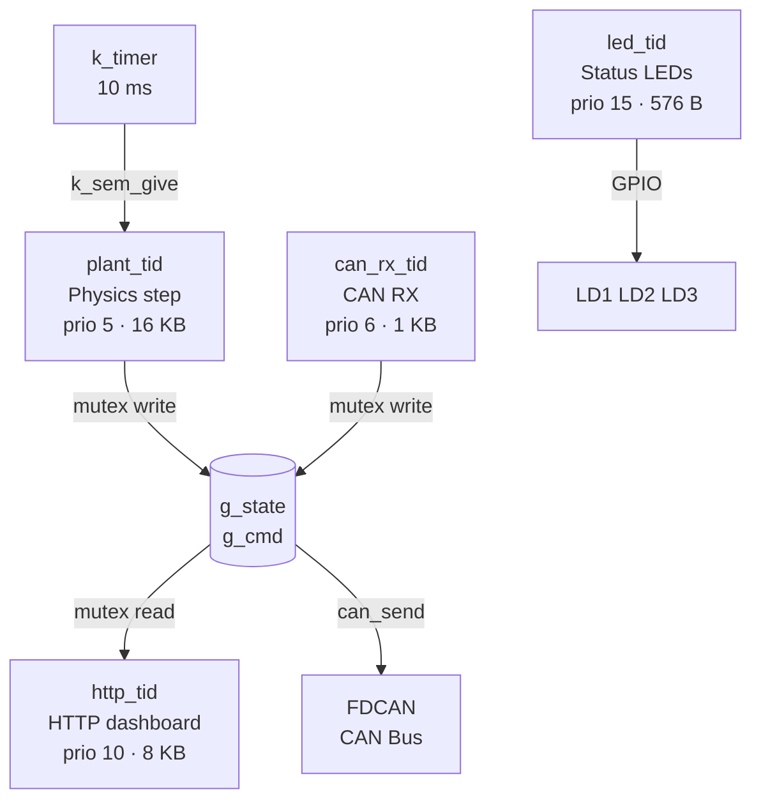
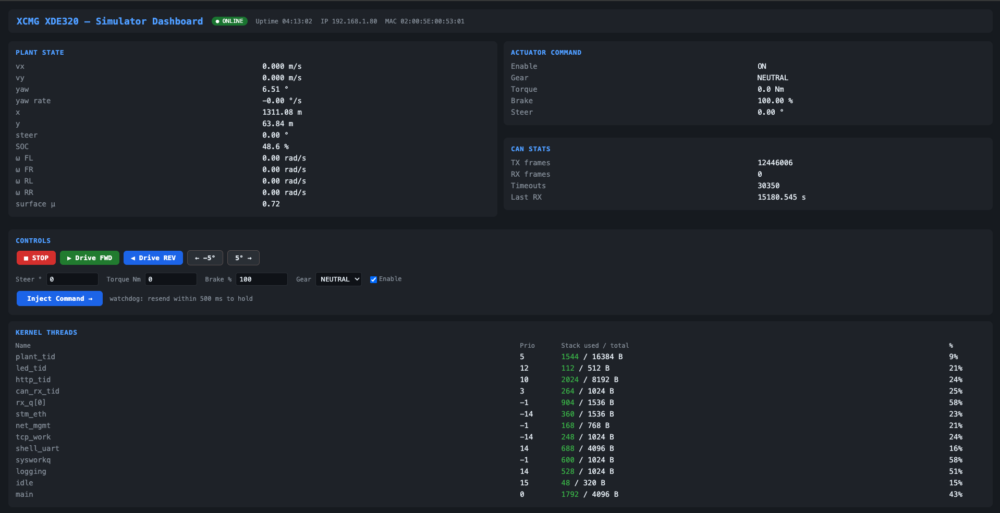

# Zephyr RTOS — Hardware-in-the-Loop Port

The simulator runs natively on an ARM Cortex-M7 microcontroller under Zephyr RTOS, turning the software model into a physical HIL node on a real CAN bus.

---

## Hardware Target

| Property | Value |
|---|---|
| Board | ST Nucleo-H753ZI |
| MCU | STM32H753ZI — Cortex-M7 @ 480 MHz |
| Flash | 2 MB |
| RAM | 1 MB |
| CAN | FDCAN (ISO 11898) |
| Ethernet | 10/100 RMII |

---

## Thread Architecture

Four concurrent threads, each with a fixed priority and stack:

---

## Key Capabilities

**Deterministic 10 ms plant loop**
A hardware timer fires every 10 ms and releases the physics thread via semaphore. The full subsystem stack — steer, drive, wheel dynamics, vehicle motion, battery — executes and completes within the budget.

**Real CAN bus integration**
Sensor frames are transmitted over physical FDCAN at up to 100 Hz. Actuator commands are received from an external controller (or the host simulator) and decoded in real time. A 500 ms watchdog reverts to safe state if CAN traffic stops.

**Live HTTP dashboard**
A built-in TCP server streams a self-refreshing HTML page showing current vehicle state, CAN statistics, and thread health. Controls (drive/brake/steer/gear) are accepted via HTTP query parameters from any browser on the same network.

**Shared C++ physics core**
The plant model (`src/plant/`) compiles for both Linux (SocketCAN) and Zephyr (FDCAN) from the same source. Only the platform adapter differs.

---

## Memory Footprint

| Region | Budget | Used |
|---|---|---|
| Flash | 2 MB | 231 KB (11 %) |
| RAM | 1 MB | 235 KB (23 %) |

Ample headroom for additional subsystems or logging.

---

## Live HTTP Dashboard

A self-refreshing web dashboard is served directly from the MCU over Ethernet. No external server required — connect a browser to the board's IP and the page updates automatically.

The dashboard shows plant state (velocity, position, yaw, wheel speeds, SOC), actuator commands, CAN frame counters, and kernel thread health — all live from the running firmware.

---

## Shell Interface

An interactive UART shell (115200 baud) provides runtime inspection:

| Command | What it shows |
|---|---|
| `vehicle info` | XCMG XDE320 parameters |
| `plant state` | Full physics state vector |
| `plant mu <val>` | Set road surface friction coefficient |
| `plant reset` | Reset simulator to standstill |
| `can stats` | RX/TX frame counters |
| `system uptime` | MCU uptime in ms |
